<!-- SPDX-License-Identifier: AGPL-3.0-only -->
<!-- Copyright (C) 2026 RS-Key contributors -->

# Trusted display

**Experimental.** An RS-Key variant for a screen-and-touch RP2350 board (the
reference target is the **Waveshare RP2350-Touch-LCD-2.8**). The screen turns the
key into a *trusted display*: the operations that matter (approving a sign-in,
typing a PIN) happen on the device's own glass, not on the host. A compromised or
phishing host cannot fake what you see or capture what you type. Concretely:

- An **Approve / Deny** prompt paints the *real* relying party for every
  signature. A signature cannot be obtained without a physical tap on a screen
  showing the true `rpId`.
- **PINs are entered on-screen** (a FIDO `clientPIN`/UV, a device PIN, and the
  OpenPGP / PIV PINs over CCID) and never cross USB.
- An on-device browser lets you **inspect and prune** credentials (delete a
  passkey, read the applet state) without a host.

The whole feature is `dep:`-gated. A standard key without a screen compiles
**none** of the UI or driver code (the gate asserts the `rsk-ui` crate is absent
from the default firmware image), so an ordinary build is byte-for-byte
unaffected.

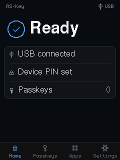

The full GUI uses always-on antialiasing. Text uses four-bit IBM Plex Sans and
Mono coverage data. Icons, circles, status rings, rounded cards, and controls
blend their edges into the surface below them. The device does this with integer
math and retained panel writes. It does not use a framebuffer or a heap. A full
page is recorded once as compact drawing commands. The firmware compares keyed
128-bit tags for 32×32 visual-state tiles and merges the changed tiles. Typed UI
components can provide smaller exact damage before composition. Each changed
rectangle uses two 8-row RGB565 buffers while SPI DMA sends the other buffer.
The buffers use the active stack and do not reduce permanent RAM. RLE checkpoints
and a vertical command index let each band start at its own data. One panel
address window stays open for each rectangle. Small animations still use direct
partial redraws, and there is no antialiasing setting to manage. A scene or SPI
failure stops UI input before an incomplete prompt can stay active.

The board limit is 62.5 MHz. The RP2350 PL022 divider uses 37.5 MHz with the
current 150 MHz peripheral clock; its next setting is 75 MHz, above that limit.
This gives a 32.8 ms wire-time floor for a complete 240×320 RGB565 transfer.

## Try it without a board

The screens on this page are not photographs — they are what `rsk_ui::render`
draws, at the panel's own 240×320. The same renderer runs in a window:

```sh
cargo run --manifest-path tools/emu/Cargo.toml --target "$HOST" -- --display
```

That is the whole flow, not a viewer. The ambient loop, the Approve/Deny hold,
the on-screen PIN pad and the Settings menu are the code the board runs
(`crates/rsk-display`); a mouse held on a button enters it through the same
`TouchPad` a finger does, and the power button is the space bar. So the ceremony
this page is about — *a signature cannot be had without a tap on a screen naming
the true relying party* — can be tried before deciding whether to buy the
hardware.

`--taps <file>` replaces the mouse with a script — one contact per line,
`x,y[,hold_ms[,gap_ms]]` in panel pixels, `#` for a comment — so a sequence that
takes six taps to reach can be replayed instead of performed:

```text
# Settings → Security → FIDO PIN
209,301
119,123
119,123
```

The images themselves are regenerated with `rsk-emu --screenshots docs/images`
when a screen changes.

## Building and flashing

The panel takes over the addressable-LED pin, so the display flavor is built
`LED_KIND=none` (a compile-time guard enforces this) with the larger flash the UI
assets want:

```sh
env LED_KIND=none FLASH_SIZE=16M cargo build --release -p firmware --features display
# or the hermetic package:
nix build .#firmware-display        # → result/firmware.uf2
```

`GPIO16` (the WS2812 pin on a standard board) drives the backlight here.
`WAKE_PIN` (default `25`, the board's BAT_PWR button) both wakes the panel from
display sleep and, while awake, sleeps it on demand from *any* screen. A press
blanks the panel and (when a device PIN is set) locks the on-device UI, aborting
any host prompt it interrupts. See the full knob table in [build.md](../build.md);
the `display`-only knobs are `WAKE_PIN` / `WAKE_ACTIVE_HIGH`.

Flash it like any other image (BOOTSEL → `picotool load`, [hardware.md](../hardware.md)).
Two notes:

- The build output is **unsigned**. On a secure-boot device you still
  `picotool seal --sign` it before loading ([signing-keys.md](../signing-keys.md),
  [anti-rollback.md](../anti-rollback.md)). The RP2350 boot ROM verifies the
  signature on boot.
- You can reach BOOTSEL from the panel itself: **Settings → Firmware → reboot to
  BOOTSEL** (a deliberate hold). The reboot routes through the worker so live RAM
  secrets are scrubbed first.

## What's on screen

A bottom **navigation bar** carries four peer tabs, each captioned:

| Tab | What it shows |
|---|---|
| **Home** | A calm "Ready" and a status card: USB, whether a device PIN is set, and the resident-passkey count (cached, refreshed only at modal boundaries). |
| **Passkeys** | The resident credentials, one row per relying party. |
| **Apps** | A read-only browser for the OpenPGP / PIV / OATH applets. |
| **Settings** | Display, Security, Firmware, Audit log, Backup, Factory reset. |

## Approve / Deny — the anti-phishing core

Any operation that needs user presence paints a **trusted prompt** naming the
operation and the **real relying party**, and waits for a deliberate action:

- A WebAuthn **registration** shows a *Save new passkey?* card (relying party +
  account, **Cancel / Save**).
- A **sign-in** and the generic OpenPGP / PIV touch prompts share an **approve**
  screen (shield + relying party + a hold-to-approve button). **Deny** refuses
  with `OPERATION_DENIED`.


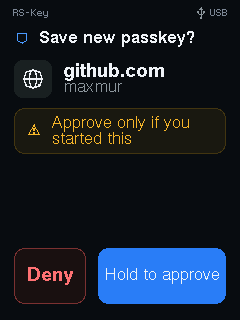

Every prompt waits for the previous finger to lift before it will accept a tap,
and a prompt that runs out of time is denied rather than approved — a finger
resting on *Save* when the window expires cancels the registration, it does not
confirm it. The release wait has a floor of its own, so shortening the presence
timeout in the device config cannot shrink it away.

Because the device only knows the relying-party *string* (and its hash), it
shows that string verbatim, never a host-supplied brand logo. A relying-party id
too long for the box is **clipped with a truncation marker**, and the clip keeps
the **registrable-domain suffix** (a leading `…` ellipsis) rather than the head.
So a padded look-alike such as `accounts.google.com.attacker.com` can never hide
its real domain (`…attacker.com`) behind the cut.


 This holds on every screen that
shows an attacker-chosen `rpId`: the approve and enrollment prompts and the
Passkeys manager's list, service-detail title and Confirm-Delete card. A
device-local nickname (which you set, not the host) keeps its head instead.

## Entering a PIN on the trusted screen

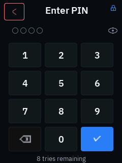

The panel has an on-screen numeric **PIN pad**: digits are masked, an **eye
toggle** reveals them briefly so you can check before committing, and the minimum
length shows as placeholder dots. Every PIN screen **names which credential it is
collecting** in the header (**Device PIN**, **FIDO PIN**, **PIV PIN** / **PIV
PUK**, or the OpenPGP PINs), so the independent PINs are never confused. The
New / Confirm / current step rides in the caption beneath. The PIN never leaves
the device.

Whichever way the PIN arrives — typed on the pad or sent by the host — the panel asks
before a `pinUvAuthToken` is issued (CTAP 2.1 §6.5.5.7 requires the consent on any
authenticator with a display). Declining ends the operation with `OPERATION_DENIED`
and costs no PIN retry, since the question comes before the PIN is checked. So
`ykman fido` and anything else needing a token waits on a tap here.

This backs four things:

- **Built-in user verification.** getInfo advertises `options.uv`. A PIN typed on
  the pad mints a `pinUvAuthToken` via `clientPIN` (`getPinUvAuthTokenUsingUvWithPermissions`),
  checked against the same `EF_PIN` the host `clientPIN` path uses. A platform can
  also skip the token: `makeCredential` / `getAssertion` carrying `options: {uv:
  true}` collect the PIN on the pad directly (CTAP 2.1 §6.1.2 step 11.2), and that
  entry counts as the ceremony's user presence, so the response sets `up` without
  the spec requiring a second gesture. The panel still asks: pad first, then the
  Approve / Deny card, because that card is the only screen naming the relying
  party — the pad carries a trusted, firmware-supplied title and never
  relying-party text.
  With `alwaysUv` on, a request that brings no `pinUvAuthParam` takes the same
  route instead of being refused with `PUAT_REQUIRED`. Declining on the pad ends
  the operation with `OPERATION_DENIED` — deliberately, since the code CTAP would
  have the device send instead (`PUAT_REQUIRED`) asks the host to prompt for the
  same PIN, which would make the refusal meaningless. A wrong PIN still falls back
  to the host path.
- **CCID secure PIN entry (pinpad).** A display build advertises `bPINSupport`
  and handles `PC_to_RDR_Secure`, so GnuPG (OpenPGP PW1/PW3) and OpenSC (PIV PIN)
  collect the PIN on the trusted screen. The PIN never crosses USB in pinpad
  mode. Details and host-driver caveats: [protocol.md §1.3](../protocol.md).
- **U2F under alwaysUv.** A screenless key has to switch CTAP1/U2F off once
  `alwaysUv` is on, since a touch proves no verification. A pad with a PIN set is the
  exception CTAP 2.1 §7.2.4 allows, so U2F keeps working here — each register and
  authenticate names itself on screen (*Register key?* / *Sign in?*) and then collects
  the PIN on the panel. Turning `alwaysUv` on before setting a PIN still disables it;
  there would be nothing to verify against.
- **First-run onboarding.** A fresh, PIN-less device offers a *Set a PIN?* screen
  at first run. Declining is remembered (a flag in `EF_DISPLAY`) so the offer
  isn't repeated until a factory reset.

## Passkeys

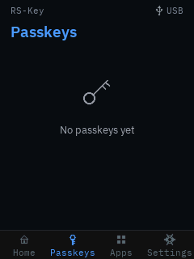

The Passkeys tab lists resident credentials by relying party (real `rpId` +
account count) and drills into a per-account detail where a passkey can be
**deleted** on-device (gated by the device PIN, then a hold), decrypted on the
device, never on the host. The detail's pencil opens a character-wheel **rename**
that sets a short **device-local nickname** for the relying party, shown in place
of its `rpId`. The nickname is sealed at rest (a dedicated `EF_RPNICK` region),
wiped by a reset, and (unlike a host `updateUserInformation`) never re-seals the
credential, so the passkey keeps working. The trade-off: the nickname is
device-local and not seen by host credential managers.

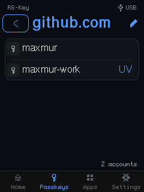

## Apps — a read-only credential browser

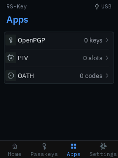

The Apps tab reads applet state **without a PIN**. No key material, PIN or public
point is ever shown, and no OATH code is computed (the device has no clock).

- **OpenPGP**: the Signature / Encryption / Authentication slots with each one's
  algorithm, the signature counter and PW1/PW3 attempts; a per-slot detail with
  the SHA-1 fingerprint and touch policy; and a **Card holder** row (name / login
  / URL / language).
- **PIV**: the 9A/9C/9D/9E slots with algorithm and PIN/PUK attempts, a per-slot
  detail (PIN/touch policy, key origin, cert presence), and a **Retired & F9** row
  listing the *populated* retired key-management slots (82–95) and F9. From it,
  **Generate key** creates a key (EC P-256/P-384, Ed25519, X25519, or RSA
  2048/3072/4096) into the next *free* retired slot, gated by the device PIN and
  a hold, restricted to empty slots (add-only, never overwrite). There is no
  management-key auth: physical presence at the panel *is* the authorisation.
- **OATH**: the stored credentials (label, TOTP/HOTP, a padlock when
  touch-gated), each with a detail (type, HMAC algorithm, digits, TOTP step).

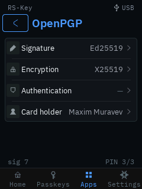
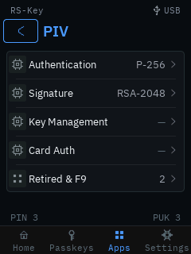
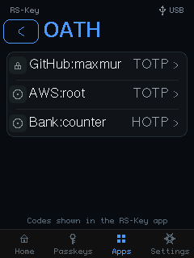

## Settings

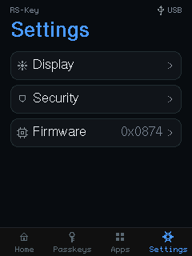

Grouped into three domains, plus the journal / backup / reset actions:

- **Display**: backlight brightness (PWM), the display-sleep timeout, and the
  touch timeout, each adjusted live. All three **persist across reboots**:
  brightness and sleep in an `EF_DISPLAY` flash record; the touch timeout in
  `EF_PHY`'s `PresenceTimeout`, the same field `rsk hw --touch-timeout` writes,
  so the panel and the host tool stay in sync.
- **Security**: set / change the **device PIN** and the **FIDO clientPIN** (each
  chosen entirely on the panel). Changing the clientPIN asks for the current one
  first, and that prompt *is* the card's `changePIN` check: a **wrong** entry
  spends a retry **and** ends any `pinUvAuthToken` a plugged-in platform holds,
  exactly as a wrong old PIN sent over USB does — the platform just asks for the
  PIN again. Then a **PIV PIN** sub-menu: change the PIV PIN,
  change the PUK, unblock a blocked PIN with the PUK, or **protect the management
  key**. *Protect mgmt key* generates a random AES-256 management key, seals it
  and marks it PIN-protected, the ykman `--protect` scheme, so a host then uses
  the management key with just the PIV PIN (which alone grants management access,
  a trade-off the panel states and gates behind the device PIN and a hold). Any
  existing host `PivmanData` (its PIN-change timestamp and other flags) is
  preserved (the obsolete derived-key salt is dropped, exactly as ykman does).
  Last on the page, **Scramble PIN pad** — a toggle, **off by default**. On, the
  ten digit keys are laid out afresh at random for every PIN entry (and again
  between the "New PIN" and "Confirm PIN" steps), so a fingerprint trail, a worn
  patch of glass, or an onlooker who sees your hand but not the panel learns
  nothing from *where* you tapped. It buys nothing against anyone who can see the
  screen — they read the digits off it — and it costs muscle memory: entry is
  slower and mistyping is likelier, against a limit of three wrong PINs per power
  cycle. That trade is the owner's to make, which is why it ships off.
- **Firmware**: the installed `bcdDevice` build and chip serial, the real OTP
  secure-boot fuse state (it warns when secure boot is off rather than claiming a
  check it isn't doing), and the hold-to-**reboot into BOOTSEL** for an over-USB
  update.

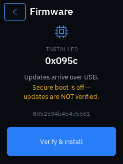
- **Audit log**: the most recent device-journal events (sign-ins, passkeys
  added, PIN changes, lockouts, resets, power cycles), colour-coded, newest first.

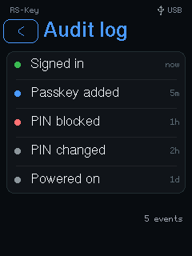
- **Backup**. An honest view of the recovery-seed export **window**: whether a
  seed is present and whether its one-time export has been **sealed**. While the
  window is open, **Show recovery** (gated by the device PIN) paints a 24-word
  **BIP-39** phrase or a `T`-of-`N` **SLIP-39** share set **on the trusted
  screen**, derived on the device, never crossing USB, behind a hold + warning,
  wiped the instant they're shown. **Seal backup** closes the window for good
  (until a factory reset). See [seed-backup.md](seed-backup.md).

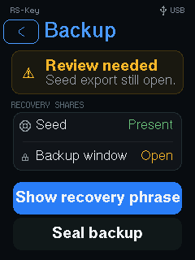
- **Factory reset**: erases every applet's data (FIDO, PIV, OpenPGP, OATH),
  scrubs the flash, and reboots to a blank device (gated by the device PIN, then
  a hold). Only the org attestation and the fused OTP / secure-boot state survive.

A display build is also exempt from the [power-up window](fido2.md#factory-reset)
that makes a screenless key refuse a host `authenticatorReset` more than ten
seconds after it was plugged in. That window exists to stop a wipe being approved
by a press collected under some other pretext; here the panel names the operation,
so a host reset is accepted whenever you confirm it on screen — no replug.

## Security model

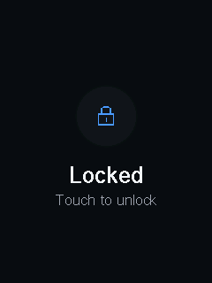

The device PIN (`EF_DEVICE_PIN`, its own sealed record + retry counter) gates the
on-device UI (unlock, on-device delete, factory reset) independently of FIDO.
The device **boot-locks** when a device PIN is set. A *forgotten* device PIN is
cleared only by a host `authenticatorReset` (the sole recovery, since the lock
gates on-device Settings). Every device-driven ceremony (a granted Approve, an
on-device delete, a factory wipe) ends on a brief success confirmation.

This is an experimental variant. Read [threat-model.md](../threat-model.md) and
[limitations.md](../limitations.md) for what the trusted display does and does not
defend against.

## See also

- [Build options](../build.md): the `display` feature and its knobs.
- [Hardware](../hardware.md): boards and flashing.
- [Host protocol §1.3](../protocol.md): CCID pinpad secure PIN entry.
- [FIDO2 / WebAuthn](fido2.md) · [PIV](piv.md) · [OpenPGP](openpgp.md) · [Seed backup](seed-backup.md).
