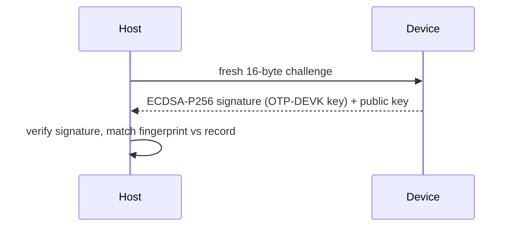

# Fleet tooling

Inventory, identity verification, and offboarding for a fleet of RS-Keys.
Three commands cover the lifecycle:

| Command | Question it answers | Gates |
|---|---|---|
| `rsk inventory list` | *what is this key?* | none — touch-free, PIN-free |
| `rsk inventory verify` | *is this the key we enrolled?* | touch; `--pin` if set |
| `rsk offboard` | *wipe a returned key, keep proof* | typed confirmation, up to 3 touches |

`list` reads only ungated state, so it is safe against a whole hub of keys.
`verify` is the enrollment anchor. `offboard` is destructive and is the only
one of the three that changes the device.

## Inventory

```sh
rsk inventory list          # human-readable, one block per key
rsk inventory list --json   # one JSON object per line, for scripting
```

Walks every connected key over both transports. Prints one record per
device with serial, firmware version, bcdDevice (the build counter),
secure-boot state, flash usage, FIDO options, backup/soft-lock state,
org-attestation state:

```
device 37bebfdca282523b  (ccid+hid)
  firmware   : 5.7.4  bcdDevice 0x0748  sdk 8.6
  secure boot: LOCKED  (bootkey 0x0)
  flash      : 16711/1572864 B used, 469 files
  fido       : U2F_V2, FIDO_2_0  clientPin=True
  backup     : sealed=False has_seed=True  seed lock: off
  org attest : installed  chain sha256 74d9f98c3fb0bb5c…
```

The serial is the RP2350's OTP chip id, read from the rescue applet's SELECT
response. It is unique per chip, unlike the USB descriptor serial (identical
across devices). Everything `list` reads is gate-free: no PIN, no touch, safe
to run against a hub full of keys.

`secure boot` decodes to one of three states: `not enabled` (a blank dev
board), `ENABLED` (the `SECURE_BOOT_ENABLE` fuse is set but the key pages are
not yet locked), `LOCKED` (fully sealed). The `bootkey` index is the active
key slot. See [otp-fuses.md](../otp-fuses.md) for what those fuses mean and
[production.md](../production.md) for how they get burned.

With several keys connected the CCID and HID transports cannot be matched to
one another, so the records stay separate (tagged `ccid` / `hid`). The output
ends with a `note:` saying so. Plug keys in one at a time when you want a
single merged `ccid+hid` record per device.

### The `--json` records

`--json` prints one object per line (JSON Lines, pipe it to `jq`, not
`json.load`). The fields present depend on which applets answered. A merged
record carries all of them:

| Field | Meaning |
|---|---|
| `transport` | `ccid`, `hid`, or `ccid+hid` (merged) |
| `serial` | RP2350 OTP chip id (CCID only) |
| `sdk` | RS-Key `rsk-sdk` framework version (major.minor) from the rescue SELECT |
| `secure_boot` | `{enabled, locked, bootkey}` |
| `flash` | `{free, used, kv_total, files, chip}` (bytes) |
| `fw`, `bcd_device` | firmware version string, build counter (HID) |
| `versions`, `client_pin` | FIDO CTAP versions, PIN-set flag |
| `aaguid` | the device AAGUID (hex) |
| `backup` | `{sealed, has_seed}` — seed-export lifecycle |
| `lock` | `{locked, unlocked}` — [soft-lock](soft-lock.md) state |
| `org_attestation` | `{installed, chain_sha256}` |
| `error` | populated if an applet threw mid-read |

A foreign PC/SC reader that does not answer the rescue SELECT is skipped, not
reported. `list` only emits records for things that identify as RS-Keys.

Dump a fleet sweep to a ledger keyed by serial:

```sh
rsk inventory list --json | jq -s '
  map(select(.serial)) | INDEX(.serial)' > fleet-$(date +%F).json
```

Flag any key not on the current firmware (replace with your floor):

```sh
rsk inventory list --json \
  | jq -r 'select(.bcd_device and (.bcd_device < "0x0759"))
           | "\(.serial // .product)\tstale \(.bcd_device)"'
```

## Identity verification

```sh
rsk inventory verify                            # print the fingerprint (touch)
rsk inventory verify --expect-key 66573f74ca06359a   # pin it (--pin if set)
rsk inventory verify --expect-key 04ab…   # or the full 65-byte SEC1 pubkey
```

Challenge-response against the device's attestation key: the host sends a
fresh 16-byte challenge, the device signs it (vendor `AUDIT_CHECKPOINT`) with
the ECDSA P-256 key derived from its OTP DEVK, and the host verifies the
signature. The printed fingerprint (SHA-256 of the public key, first 16 hex
digits) is the same one `rsk audit verify` prints. One identity anchor for
both workflows.



`--expect-key` accepts either form printed by a prior run: the 16-hex
`fingerprint` or the full hex `att key` (65-byte uncompressed SEC1 point).
Either matches. The full key is the stronger pin since the fingerprint is a
truncated hash.

This only proves identity once the device has a provisioned OTP DEVK. On an
unprovisioned dev board there is no device-bound key and `verify` is refused.
The error messages map to the vendor status:

| Symptom | Status | Meaning |
|---|---|---|
| `device requires a PIN — pass --pin` | `0x36` | a FIDO PIN is set; add `--pin` |
| `refused — no OTP DEVK provisioned` | `0x30` | blank board, no device key ([production.md](../production.md)) |
| `denied — no touch within 30 s` | `0x27` | press the button when the LED blinks |
| `attestation key MISMATCH` | — | not the enrolled device (or a clone without the OTP DEVK) |
| `SIGNATURE INVALID` | — | the device could not prove identity at all |

**Enrollment:** when you hand a key out, run `rsk inventory verify` once and
record `serial + fingerprint` (or the full `att key`). Any later verify with
`--expect-key <fingerprint>` (or the full SEC1 public key) proves you are
talking to that physical chip. A clone without the OTP DEVK cannot answer.
Every verify is itself journaled as a `CHECKPOINT` event, so the device's
[audit log](audit.md) shows each time it was checked.

`verify` has no `--json` (only `inventory list` does), so at provisioning time
capture the two lines from its plain output, or just paste them into your
record by hand:

```sh
rsk inventory verify | sed -n 's/^\(serial\|fingerprint\) *: //p'
```

## Offboarding

```sh
rsk offboard                       # guided, typed confirmation, a replug, ~3 touches
rsk offboard --report ret-42.json  # choose the receipt path
rsk offboard --no-receipt          # wipe only — no preflight, no receipt file
rsk offboard --verify ret-42.json  # re-check a saved receipt, no device
```

Decommissions a returned key: wipes the OTP slots, OATH credentials, PIV
(block PIN+PUK, then factory reset), OpenPGP (block PWs, then factory reset),
the FIDO seed/passkeys/PIN, and the [org attestation](attestation.md), then
signs a final audit checkpoint over the post-wipe journal window and saves it
as a JSON receipt. It needs **both interfaces** (CCID for the applet wipes,
FIDO HID for the reset and the signature). If either is missing it refuses
before touching anything.

**The receipt needs the audit journal, which is off by default.** The `RESET`
event that makes the receipt mean anything is a journal entry, so on a device
where [journalling](audit.md) was never enabled there is nothing to sign — and
after the wipe there is no way back. `rsk offboard` therefore probes the journal
state *before* the confirmation prompt and refuses, pointing at `rsk audit
enable`. Enable it at provisioning time, or pass `--no-receipt` to wipe with no
attestation at all — that flag skips the preflight, the checkpoint touch and the
receipt file, so the run leaves no record of any kind.

**The wipe is interrupted once, on purpose.** The FIDO reset is only accepted
within ten seconds of a power-up ([fido2.md](fido2.md#factory-reset)), and by the
time the four CCID applets are wiped the key has been plugged in for far longer. So
`rsk offboard` sends the reset, and when the device refuses it prints an
unplug/replug prompt and retries in the fresh window:

```text
the key refuses a reset this long after power-up (CTAP 2.1 §6.6):
UNPLUG it now and plug it straight back in — it must be the only
FIDO key attached, and the reset lands within 10s of
power-up. Waiting up to 60s…
```

Plug the same key back in and nothing else. `rsk offboard` refuses to start with
more than one FIDO device attached, because the USB serial is a constant and it
cannot tell two RS-Keys apart: the applet wipes go to the card it picked by reader
name, and the FIDO reset would go to whichever HID device enumerated first. A
trusted-display key never sees the replug prompt — it is exempt from the window —
and neither does firmware older than `0x0854`.

The order is fixed and each step reports its own result:

| Step | What it does | Records on success |
|---|---|---|
| OTP | writes an all-zero config to slots 1–4 (the protocol's "delete") | `ok` |
| OATH | sends the OATH RESET command | `ok` |
| PIV | exhausts PIN + PUK retry counters with two distinct wrong values, then factory RESET | `ok` |
| OpenPGP | `rsk openpgp reset` (TERMINATE + ACTIVATE) | `ok` |
| FIDO | CTAP `authenticatorReset` — **replug, then touch** | `ok` |
| org attestation | clears the chain if one was installed — **touch** | `cleared` / `none` |
| receipt | signs a checkpoint over the post-wipe journal — **touch** | signed |

The PIV step blocks the PIN and PUK with *two different* wrong values
(`00000000` then `11111111`, eight tries each) before the reset, so even a
device whose real PIN happened to be one of those still ends up with a dead
retry counter. The reset then always succeeds regardless of the original
credentials.

The receipt is a cryptographic statement that **this** device (attestation
fingerprint) had its FIDO applet factory-reset (the signed window contains the
`RESET` event). It is split along that trust boundary: `attested` is what the
device signed plus the inputs needed to re-derive it, `host_observations` is
what the tool saw and the device never vouched for.

```json
{
  "receipt_version": 2,
  "signed": true,
  "reset_attested": true,
  "notes": [],
  "attested": {
    "signed_head": "…", "seq": 414, "signature": "…",
    "attestation_pubkey": "04…", "fingerprint": "66573f74ca06359a",
    "challenge": "…", "epoch": "…", "entries": "…"
  },
  "host_observations": {
    "device": "37bebfdca282523b",
    "timestamp": "2026-06-13T14:22:09-04:00",
    "steps": {"otp": "ok", "oath": "ok", "piv": "ok", "openpgp": "ok",
              "fido_reset": "ok", "org_attestation": "cleared"},
    "journal_window": [{"seq": 412, "event": "RESET", "...": "..."}]
  }
}
```

`attested.epoch` and `attested.entries` are the raw journal window the signature
covers. Without them a reader can check the signature but cannot tie it to any
particular window, so the `RESET` claim would rest on a decoded list anyone could
hand-edit. Receipts written before this format (`receipt_version` absent) dropped
them, which is why `--verify` refuses those outright rather than pretending to
check them.

The default receipt path is `offboard-<serial>-<YYYYMMDD-HHMMSS>.json` in the
working directory. `--report` overrides it. The file is always written, even on a
partial failure or when a post-wipe check fails: a failed step leaves its error
string in `steps`, a failed check appends a `{"code", "detail"}` entry to `notes`
and clears `reset_attested`, the report still saves, and `rsk offboard` then exits
non-zero so a script notices.

### Re-checking a receipt

```sh
rsk offboard --verify ret-42.json --expect-key <fingerprint-from-enrollment>
```

Offline, no device: it re-folds `entries` from `epoch`, requires the result to
equal the signed head, requires that bound window to contain the `RESET` event,
then checks the ECDSA P-256 signature over
`"RSK-AUDIT-CKPT-v1" ‖ signed_head ‖ seq (LE32) ‖ challenge`. `--expect-key`
takes the 16-hex fingerprint or the full SEC1 point; without it the run still
verifies the chain and the signature but says so — the key comes from the receipt
itself, so an unpinned check cannot tell you *which* device signed.

**Pin the fingerprint you recorded at enrollment**, from your inventory record —
not the one printed in the receipt you are checking. Pinning a receipt's own
`attested.fingerprint` compares it against itself and proves nothing. `rsk
offboard` says as much when it prints the re-check line at the end of a wipe.

The `steps` are host observations. The journal has no event type for PIV, OATH,
OpenPGP or OTP, so four of the five wipe steps are not attestable in principle;
only the FIDO reset is. `--verify` prints that caveat on every run.

### Why it needs no PIN

No PIN is needed anywhere in the flow. Every wipe path is deliberately
reachable without credentials (the PIV/OpenPGP paths block the PINs first,
which is the spec's own anyone-can-reset design; OATH and FIDO have resetting
paths of their own), so a key that comes back with unknown PINs can still be
offboarded. What it *cannot* do is impersonate: nothing in the wipe path can
read or export secrets, and the receipt's signature still requires the
device's own OTP DEVK. A wipe tool cannot forge it.

### Footguns and partial wipes

- **OTP slots protected by an access code** are the one exception. They
  refuse the PIN-free delete (`SW 6982`), and the receipt's
  `host_observations.steps.otp`
  records exactly which slots stayed (e.g. `slots [2] protected by access
  codes — NOT wiped`). A follow-up `rsk offboard` after recovering the code,
  or a full [`rsk-wipe`](https://github.com/TheMaxMur/RS-Key/blob/main/rsk-wipe/README.md)
  flash nuke, covers that case.
- **The CCID wipes are idempotent.** A failed FIDO reset is recorded in `steps`
  and the run still writes the receipt for what *was* destroyed, then exits
  non-zero. Re-run `rsk offboard`; the applet wipes already done are harmless to
  repeat.
- **`no-session` in `notes`** means the key was never replugged (or never came
  back) within the timeout, so there was no FIDO session left to sign with. The
  receipt is written anyway, unsigned, with the CCID steps that did complete and
  `fido_reset` recording the abort — the applets are gone either way, and an
  irreversible step must not end with no artifact. Re-run to finish the FIDO half.
- **Unsigned receipt.** On a board with no OTP DEVK the wipes still happen but
  the checkpoint is refused (`0x30`). The report saves with `"signed": false`
  and a `no-devk` note. That is expected on dev boards, not a fault.
- **`no-reset-event` in `notes`** means the signed window did not contain the
  `RESET`, so the receipt does not certify a wipe (`reset_attested` is false and
  the command exits non-zero). The wipe still happened and re-running cannot
  produce the missing event. The usual cause is journalling being off, which the
  preflight now catches before anything is destroyed; the other is the journal
  ring having evicted the `RESET` past the export window.
- **`head-mismatch` in `notes`** means the signed head did not fold from the
  window the device exported. Treat that as tampering or a broken device, not as
  a retryable error.

## See also

- [audit.md](audit.md): the journal and `rsk audit verify`; same attestation
  key and fingerprint as `inventory verify`.
- [attestation.md](attestation.md): the org-attestation chain that `offboard`
  clears and `list` reports.
- [seed-backup.md](seed-backup.md) / [backup-key.md](backup-key.md): back up
  *before* you offboard if the key holds a recoverable seed.
- [production.md](../production.md), [otp-fuses.md](../otp-fuses.md): burning
  the OTP DEVK that makes `verify` and the signed receipt possible.
- [linux.md](../linux.md): `pcscd` / `scdaemon` setup so the CCID interface
  is visible to the inventory and offboard flows.
