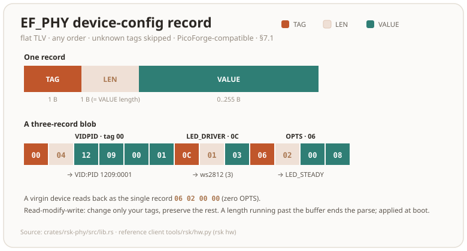

# RS-Key host protocol reference

This document specifies the **host-facing protocol** of the RS-Key firmware: how a
configuration/management tool talks to the device, what commands exist, the exact
byte layout of each request and response, and what authenticates each one.

It exists so that third-party tooling (e.g. **PicoForge**) can configure and
manage RS-Key devices without reverse-engineering the firmware. The canonical,
runnable reference client is the `rsk` Python CLI. Every command
below is implemented there; file/line pointers are given throughout.

> **Audience & scope.** This is a wire spec, not a tutorial. It documents the
> commands a host sends and the bytes it gets back. It does **not** cover the
> on-device storage format, the crypto internals, or the build system. Those live
> in [architecture.md](architecture.md) and the crate sources.

> **Licensing.** RS-Key firmware is AGPL-3.0-only. This protocol description is
> published as part of the same repository; you are free to implement a client
> against it under any license. Interop implementations do not inherit AGPL by
> talking to the device.

> **Stability.** The two transports and the **standard** applets (FIDO2, U2F, PIV,
> OATH, OTP, OpenPGP, Yubico Management) are stable. They follow public specs.
> The **RS-Key-specific** surface (Rescue applet, Vendor/LED applet, CTAPHID
> `authenticatorVendor 0x41`) is versioned by `bcdDevice` and may grow; new
> tags/subcommands are added, existing ones are not silently repurposed. Probe the
> version handshakes (§3, §6.1) and treat unknown tags as skippable.

---

## 1. Transports

RS-Key is a USB composite device exposing two host-reachable transports:

| Transport | Carries | Host API |
|---|---|---|
| **CTAPHID** (FIDO HID, usage page `0xF1D0`) | CTAP1/U2F, CTAP2, and the `authenticatorVendor 0x41` vendor command | `hidapi` |
| **CCID** (PC/SC smart-card) | All ISO-7816 applets, selected by AID | `pyscard` / PC/SC |

A keyboard (HID) interface also exists for Yubico OTP. On the default build it
also carries the ykman OTP-HID admin writes (SET_DEVICE_INFO `0x15`,
DEVICE_CONFIG `0x11`, SCAN_MAP `0x12`, NDEF `0x08`/`0x09`) — ungated, like a stock
YubiKey; `strict-config` refuses them. SET_DEVICE_INFO shares the same
`EF_DEV_CONF` DeviceInfo store as the CCID WRITE CONFIG (§6); the rest are inert
on this USB-only board except SCAN_MAP (it remaps typed OTP output). Each admin
write **advances the status frame's program-sequence byte** — that increment is
how ykman/yubikit confirm it (a write that left the sequence unchanged reports
`CommandRejectedError: No data`, which is what blocked `ykman config usb` over
this transport before). The frame codec itself is otherwise out of scope here.

The interfaces are presented in the stock YubiKey order — **keyboard/OTP, FIDO
HID, CCID** — because some hosts address the OTP interface by index instead of
by descriptor: the libusb backend `ykpers`/`ykcore` ships (KeePassXC,
`ykchalresp`, `pam_yubico`) claims interface 0 and sends the OTP frame reports
there whatever the descriptors say. An interface switched off in
`ENABLED_USB_ITF` (§7) is omitted and the rest keep that relative order, so a
host that assumes a fixed index only holds where the same interface set is
enabled.

The OTP frame protocol answers a HID feature GET/SET_REPORT on the **keyboard
interface only**. The keyboard interface being first (index 0) is what those
index-addressing hosts need; serving the frames on the FIDO interface too was
tried but reverted (audit run-30) — it gained no host that the keyboard interface
does not already serve, and on macOS it removed a real privilege boundary (IOKit
gates a keyboard-usage HID nub behind Input Monitoring while the `0xF1D0` FIDO nub
opens to any console-user process). The FIDO interrupt endpoints carry CTAPHID and
nothing else, and its report descriptor declares no feature report.

A slot programmed to require a touch answers its challenge only after a button
press, and reports the wait in the status byte (`0x20`) meanwhile. Two things end
that wait early, both matching a YubiKey: the host's **dummy write** — a report
whose sequence byte is out of range, `0x8f`, which also resets the read mode after
a response — and **any new frame**, which supersedes the pending challenge. A host
that does neither waits out the touch timeout (§7 `PRESENCE_TIMEOUT`), during
which the transport reports only that it is waiting.

Once announced, `0x20` holds for the rest of the command — the press itself does
not clear it, only the response frame or the idle status frame does. ykpers reads
a byte carrying neither the pending nor the waiting bit as a touch timeout, so a
device that dropped the wait between the press and its answer would lose
challenges it had in fact completed.

### 1.1 CCID APDU framing

Standard ISO-7816 short APDUs. SELECT is always `00 A4 04 00 Lc <AID> 00`; the
selected applet then receives `CLA INS P1 P2 [Lc <data>] [Le]`. There is no ISO
master file, so the master-file SELECT (`00 A4 00 0C …`, GnuPG's `3F00` probe)
answers `6D00` like a YubiKey. The power-on ATR is T=1, its historical bytes labelled
`YubiKey` on a Yubico-identity build and `RS-Key` on the default build (identical
card capabilities). The reference transport is `tools/rsk/ccid.py`:

```python
def select(conn, aid):
    return transmit(conn, [0x00, 0xA4, 0x04, 0x00, len(aid)] + list(aid) + [0x00])
```

The class byte is judged before the command, for every applet and for SELECT
itself. Bit `0x10` marks a **command-chaining** segment and is looked at first, so
`10`, `1C`, `90` and `FF` are all ordinary segments. Otherwise a class carrying a
secure-messaging indication (`CLA & 0x0C`: `04`, `0C`, `84`, `8C`, …) answers
`6E00` — **no applet here implements secure messaging**, and OpenPGP's Extended
Capabilities says so. Applets that additionally name a class of their own reject
anything else themselves (OATH, management, OTP and U2F want `00`; rescue wants
`80`).


A success body longer than the request's `Le` (including a Case-3 command that
carries no `Le` at all, capped at 256) is returned with ISO-7816 **response
chaining**: the first chunk ships with status `61 XX` (`XX` = further bytes
available, `00` = 256+), and the host issues `GET RESPONSE` (`00 C0 00 00 <Le>`)
until `9000`. Any `GET DATA` reading a certificate object over 256 bytes chains
this way, so a host that sends `GET DATA` without an `Le` must still follow `61xx`.

OATH `LIST` (`0xA1`) and `CALCULATE ALL` (`0xA4`) responses that outgrow one
frame chain the YubiKey-OATH way instead: `61 XX` followed by **SEND REMAINING**
(`00 A5 00 00`) rather than `GET RESPONSE`, matching what ykman / Yubico
Authenticator send. A host that stops at the first frame still sees a valid
(shorter) list.

Seven OATH rules a host has to expect, all matching a YubiKey 5.7.4. `PUT`
(`0x01`) is strict about the credential body — KEY TLV 16..=66 bytes, digits
6/7/8, type `0x10`/`0x20`, algorithm 1/2/3, name 1..=64 bytes, the initial moving
factor on HOTP only and exactly 4 bytes, the PROPERTY byte as the bare `78 vv`
pair, the four YKOATH tags in that order, no duplicate, no unknown tag and no
trailing byte. Anything else is `6A80` with **nothing stored**, so a rejected
`PUT` leaves an existing credential of that name working. (RS-Key also stores the
password-safe fields `0x83`/`0x84`/`0x85`, ≤255 bytes each, which may sit
anywhere in the body.) `SET CODE` (`0x03`) holds its key to the same measured
rule: the `73` TLV is one algorithm byte plus **14..=64 bytes** of key material,
or empty to remove the access code — anything else is `6A80` and whatever code
was installed is left exactly as it was. Its proof travels over an **exactly
8-byte** `74` challenge (`os.urandom(8)`, as ykman sends it); any other width is
`6A80`, and removing a code needs no challenge at all. `VALIDATE` (`0xA3`) then
refuses a proof that does not match with `6A80` as well; `6984` from it means
something else entirely — no access code is installed to match against. And
PROPERTIES bit 0, *only increasing*, is enforced: a TOTP credential carrying it
computes only for a challenge strictly greater than the highest one it has served,
comparing the raw challenge bytes zero-extended on the right — plain numeric `>`
for the usual 8-byte counter. A challenge at or below that mark is `6A80`, and
in `CALCULATE ALL` one such credential fails the whole command with an empty
body. The one exception is a credential a build before this rule stored: its
body can leave no room for the mark, and `CALCULATE ALL` then reports it with
`77` (no response) and computes the rest of the store rather than failing — its
own `CALCULATE` still answers `6A80`.

The fourth is the challenge itself. `CALCULATE` (`0xA2`) and `CALCULATE ALL`
(`0xA4`) take an opaque byte string of **0..=64 bytes** in the `74` TLV and HMAC
all of it; 65 or more is `6A80`, judged before the credential is looked up and
whatever the credential's type, so a `HOTP` account that ignores the challenge
refuses an over-wide one too. Both read paths therefore answer the same code for
the same challenge at every accepted width — including across a `SEND REMAINING`
page — and the usual 8-byte TOTP counter is simply the common case.

The fifth is how the bodies are read. `CALCULATE`, `VALIDATE` and `SET CODE`
are parsed **by position**: exactly the documented TLVs, in the documented
order, with nothing before, between or after them — `71` then `74` for
`CALCULATE`, **`75` then `74`** for `VALIDATE` (the response comes first, as
ykman sends it), `73` then `74` then `75` for `SET CODE`, or a lone `73 00` to
remove the code — that spelling and no other, so a `SET CODE` carrying **no body
at all** is `6A80` and the standing code goes on opening the applet, as on a
YubiKey. A reordering, a repeated tag, an unknown tag or a trailing byte is
`6A80`, with nothing stored. `CALCULATE ALL` is the one exception the card
makes: its `74` must be the **first** TLV, and whatever follows it is ignored.

The sixth is what a truncated response carries. With `P2 = 0x01` the `76` TLV is
`[digits][code(4)]`, and the four bytes are the RFC 4226 dynamic truncation
**already reduced to that credential's digit count** — big-endian, so a 6-digit
account never exceeds `000F 423F`. A host must not reduce a second time expecting
a different answer, and `VERIFY CODE` (`0xB1`) compares exactly the value
`CALCULATE` sent. The untruncated form (`P2 = 0x00`, tag `75`) is unaffected: it
carries the whole HMAC.

The seventh runs across the whole table: the parameter bytes. Every OATH command
is sent `P1 = 00`, `P2 = 00`. The `01` that selects the truncated form belongs to
`CALCULATE` and `CALCULATE ALL` and to nothing else — on `PUT`, `DELETE`, `SET
CODE`, `RENAME` and `LIST` it is refused like any other stray byte. `RESET` alone
takes `DE AD`, and `VALIDATE` is the card's own exception: it refuses only when
**both** bytes are non-zero. Anything else is **`6B00`**, judged before the
command's body and before the access-code gate so nothing is written; an
instruction the applet does not implement still answers `6D00` first.

### 1.2 CTAPHID framing

64-byte HID reports. Init frame: `CID(4) | CMD(1) | BCNT_HI | BCNT_LO | data[:57]`;
continuation frames: `CID(4) | SEQ(1) | data[:59]`. `CTAPHID_INIT = 0x86`,
`CTAPHID_CBOR = 0x90`, `CTAPHID_KEEPALIVE = 0xBB`. A CTAP2 message is
`command_byte | CBOR_payload`. Reference: `tools/rsk/ctaphid.py`.

Take the channel id from the `CTAPHID_INIT` response and use that one: every INIT on
the broadcast CID allocates a fresh id, so an id hardcoded or cached across sessions
will not be yours. `CTAPHID_LOCK` is honoured for the 1–10 seconds it asks for, and
the INIT capability byte carries `CAPABILITY_LOCK` (`0x02`) to say so. Meanwhile
every other channel gets `ERR_CHANNEL_BUSY` — including one sending `CTAPHID_INIT`
to resynchronise itself. The exception is an INIT on the **broadcast** CID, which
still gets through: a client arriving mid-lock is given an id, then turned away on
it.


### 1.3 CCID secure PIN entry (pinpad) — **display builds only**

A trusted-display build advertises `bPINSupport = 0x01` (VERIFY) in its CCID class
descriptor (body byte 50 / full descriptor byte 52), so a host driver treats it as
a **pinpad reader** and sends `PC_to_RDR_Secure` (`0x69`) instead of a plaintext
VERIFY; the PIN is then typed **on the device's own screen**. A standard (no-screen)
build leaves `bPINSupport = 0x00` and rejects `0x69`. No control transfer is
involved. The host CCID driver reads `bPINSupport` straight from the descriptor;
the device only has to handle `0x69`. The validated trigger is **GnuPG's internal
CCID** driver (keys solely off `bPINSupport`); PC/SC + libccid and macOS
CryptoTokenKit also expose pinpad from the descriptor, but their `FEATURE_VERIFY_PIN_DIRECT`
coverage varies, so treat the GnuPG-internal path as the reliable one.

**Scope (honest):** this keeps the PIN off the wire **only when the host uses
pinpad mode**. The device still accepts a normal plaintext `XfrBlock` VERIFY
(`00 20 P1 P2 Lc <PIN>`), so a host that chooses to send one puts the PIN on the
wire. Standard pinpad *enables* on-device entry, it does not *enforce* it (a
device-enforced mode is a planned opt-in follow-up).

Whatever the host driver, the bytes on the wire follow the **CCID** structure
below, not the PC/SC v2 Part 10 IOCTL structure (the driver drops that structure's
`bTimeOut2` and `ulDataLength` when it builds the `0x69`), so the VERIFY template is
always at abData offset 15. The `0x69` payload is the CCID `abPINDataStructure` for
VERIFY:

```text
bPINOperation(1)=0x00 verify | bTimeOut(1) | bmFormatString(1) | bmPINBlockString(1) |
bmPINLengthFormat(1) | wPINMaxExtraDigit(2 LE) | bEntryValidationCondition(1) |
bNumberMessage(1) | wLangId(2 LE) | bMsgIndex(1) | bTeoPrologue(3) |
abPINApdu = CLA INS=0x20 P1 P2 …   (the VERIFY template, at offset 15)
```

The device reads the template's `P2` (OpenPGP `0x81`/`0x82`/`0x83` = PW1-sign /
PW1-other / PW3-admin; PIV `0x80` = application PIN), collects the PIN on the pad,
builds the real VERIFY APDU (`00 20 P1 P2 Lc <ASCII PIN>`; PIV pads with `0xFF` to
8 bytes), runs it through the selected applet, and replies with a normal
`RDR_to_PC_DataBlock` (`0x80`) carrying only the status word:

- **success** → `90 00`, `bStatus = 0`, `bError = 0`.
- **wrong PIN** → the card's real `63 Cx` (tries left, reported saturated at `x = F`
  so a larger configured retry total cannot wrap into `63 C0` = blocked) / `69 83`
  (blocked),
  `bStatus = 0`, `bError = 0` (the command succeeded; the card said wrong).
- **user cancel** → `bStatus = 0x40` (failed), `bError = 0xEF` → `SCARD_W_CANCELLED_BY_USER`.
- **pad timeout** → `bStatus = 0x40`, `bError = 0xF0` → `SCARD_E_TIMEOUT`.

The transport streams T=1 time-extensions for the whole on-screen entry, so the host
transaction does not time out. The device ignores the host's format/offset bits and
builds the APDU from its own buffers, so a crafted `0x69` can't index out of bounds.
Trigger from GnuPG: `gpg-connect-agent "scd checkpin OPENPGP.1" /bye` (internal CCID,
no host config). PIN parse + APDU assembly: `crates/rsk-usb/src/secure_pin.rs`.

---

## 2. Status words & error codes

### 2.1 CCID status words (ISO-7816 `SW1 SW2`)

Source: `crates/rsk-sdk/src/sw.rs`.

| SW | Name | Meaning |
|---|---|---|
| `9000` | OK | success |
| `6400` | EXEC_ERROR | execution error (internal) |
| `6581` | MEMORY_FAILURE | flash write failed |
| `6700` | WRONG_LENGTH | bad `Lc`/`Le` for this command |
| `6982` | SECURITY_STATUS_NOT_SATISFIED | auth/precondition missing |
| `6984` | DATA_INVALID | malformed payload (e.g. bad guard magic) |
| `6985` | CONDITIONS_NOT_SATISFIED | state precondition unmet (e.g. RTC unset) |
| `6A80` | INCORRECT_PARAMS | bad data field |
| `6A86` | INCORRECT_P1P2 | unsupported P1/P2 |
| `6B00` | WRONG_P1P2 | P1/P2 outside what this command takes |
| `6D00` | INS_NOT_SUPPORTED | unknown INS for this applet |
| `6E00` | CLA_NOT_SUPPORTED | wrong CLA for this applet |

### 2.2 CTAP2 errors

Standard CTAP2 status bytes (`0x00` = success), returned by CTAP2 and by the
`0x41` vendor command. Source: `crates/rsk-fido/src/error.rs`. The ones the vendor
surface returns:

| Byte | Name | Meaning here |
|---|---|---|
| `0x00` | OK | success |
| `0x02` | INVALID_PARAMETER | malformed param / bad key / wrong blob length |
| `0x12` | INVALID_CBOR | the body is not exactly one CBOR item (trailing bytes) |
| `0x14` | MISSING_PARAMETER | required field absent (e.g. blob/`pinUvAuthParam`) |
| `0x27` | OPERATION_DENIED | touch declined / timed out |
| `0x30` | NOT_ALLOWED | precondition unmet (no MSE channel, one already spent or owned by another CTAPHID channel, an `MSE` while one is live (§9.1), sealed, soft-locked, or an `authenticatorReset` outside the §5.1 power-up window) |
| `0x33` | PIN_AUTH_INVALID | `pinUvAuthParam` MAC or `acfg` permission wrong |
| `0x36` | PUAT_REQUIRED | a PIN is set but no `pinUvAuthToken` was supplied |
| `0x39` | REQUEST_TOO_LARGE | `subCommandParams` over the limit |
| `0x3D` | INTEGRITY_FAILURE | blob failed authenticated decryption |
| `0x3E` | INVALID_SUBCOMMAND | unknown `vendorCommandId` under `authenticatorConfig`'s `0xFF`. A `0x41` **subcommand** this build does not implement is `0x02`, matching a YubiKey |

---

## 3. Device identity & discovery

### 3.1 USB identity

The build picks a VID/PID preset (`firmware/build.rs`):

| Preset | VID:PID | Manufacturer / Product strings | Notes |
|---|---|---|---|
| `RSKey` (**default**) | `1209:0001` | `RS-Key` / `RS-Key Security Key` | pid.codes identity; not a masquerade |
| `Yubikey5` (opt-in interop) | `1050:0407` | `Yubico` / `YubiKey RSK OTP+FIDO+CCID` | so `ykman`/Yubico Authenticator derive PID from the PC/SC reader name |
| others | NitroHSM, NitroFIDO2, GnuPG, Pico, Dev | — | local interop only |

The VID/PID, the product string and the manufacturer string can all be overridden
at **runtime** via the phy record (§7), taking effect at the next boot: VID/PID
(tag `0x00`), product (tag `0x09`) and manufacturer (tag `0x0F`). If a runtime
product looks like a YubiKey (`yubikey`, any case) but omits the smartcard `CCID`
token, the firmware appends ` OTP+FIDO+CCID` before enumerating — a token-less
`Yubico YubiKey` reader name otherwise crashes `ykman` / Yubico Authenticator on
Windows (`_pid_from_name` → `PID.of` → `KeyError('YK4_')`, which aborts the whole
PC/SC scan). Source: `normalize_usb_product` in `phy.rs`.

Each string is resolved in precedence order: an **explicit phy tag** (`0x0F` /
`0x09`) wins; otherwise the **effective VID** picks a default — a Yubico VID
(`0x1050`) yields `Yubico` / `YubiKey RSK OTP+FIDO+CCID` plus the Yubico OpenPGP AID
vendor, so setting only the Yubico VID/PID makes the whole identity "just work" for
`ykman` / Yubico Authenticator; otherwise the **build const**. The OpenPGP AID
vendor id stays keyed on the effective VID (a registered number, not a free
string). ⚠️ so a phy-repointed default key can present a full Yubico identity at
runtime; the USB/smartcard identity is cosmetic and host-configurable, never a
security or anti-counterfeiting control (see docs/threat-model.md).

**Recognizing an RS-Key by PC/SC reader name:** the reader name contains `RS-Key`
(default build) or `RSK` (Yubico-interop build). Neither appears in a genuine
YubiKey's reader name. Reference: `RSK_READER_TOKENS` in
`tools/rsk/ccid.py`.

### 3.2 Firmware version & `bcdDevice`

| Field | Value | Where |
|---|---|---|
| firmwareVersion | `5.7.4` → `0x00050704` | CTAP getInfo `0x0E`; Management/OTP DeviceInfo `TAG_VERSION`; Management SELECT (`"5.7.4"` ASCII) |
| `bcdDevice` | `0x0780` (build counter, increments per firmware change) | USB device descriptor (`firmware/src/main.rs` `device_release`) |
| AAGUID | `2479c7bf-6b30-5683-9ec8-0e8171a918b7` | CTAP getInfo `0x03`; one value across every VID/PID flavor of a build, overridable at build time with `AAGUID=<uuid>` |

The firmware version is overridable at build time (`FW_VERSION=X.Y.Z`); `5.7.4`
mirrors a current YubiKey 5 so Yubico tooling is satisfied under the Yubico VID.

---

## 4. AID registry

SELECT an applet with `00 A4 04 00 Lc <AID> 00`.

**How an AID is matched** (RS-Key `0x088C`+): ISO 7816-4 truncated select — the
AID you send must be a **prefix of** a registered one, and the first applet it
matches wins. So a shortened AID selects (PIV answers to `A0 00 00 03 08`), an
AID with anything appended does **not** (earlier builds selected on
`registered AID ‖ junk`, which let PIV answer to `A0 00 00 03 08 00 00 00 00` —
the AID SP 800-85A-4 C.1.1.2 names as invalid), and an **empty** AID is refused
rather than treated as "select the default application". Two consequences worth
planning for: OpenPGP is selected by the 6-byte AID below, **not** by the 16-byte
value it reports in DO `4F` (that one carries the device serial and is longer, so
it is not a prefix — a real YubiKey refuses it too); and a prefix short enough to
match several applets resolves by registration order, which is the order of the
table below, so probe with the full AID unless you mean to.

**Where that SELECT works.** The recipe above is CCID's (§1.1), and three of the
ten rows below are not CCID applets: **FIDO2, the FIDO2 backup id and U2F answer
`6A82` (FILE_NOT_FOUND)**. CTAP1/U2F and CTAP2 ride CTAPHID and have no SELECT at
all (§1.2), so those three are registered identifiers rather than anything this
build dispatches to. The other transport is narrower still: `CTAPHID_MSG` offers
exactly one applet, the vendor one, and every other AID answers `6A82` there —
which is why a U2F command arriving after a vendor SELECT on the same session was
a real bug (`tests/15_u2f_vendor_msg_isolation.py`). Measured on both transports,
all ten AIDs, and recorded in the **Transport** column.

| Applet | AID | Transport | Spec status | Config-relevant? |
|---|---|---|---|---|
| FIDO2 | `A0 00 00 06 47 2F 00 01` | none — CTAPHID, no SELECT | Standard (CTAP2) | identity only |
| FIDO2 (backup id) | `B0 00 00 06 47 2F 00 01` | none — CTAPHID, no SELECT | RS-Key | — |
| U2F | `A0 00 00 05 27 10 02` | none — CTAPHID, no SELECT | Standard (CTAP1/U2F) | — |
| **Management** | `A0 00 00 05 27 47 11 17` | CCID | Yubico-compatible | **yes — §6** |
| OATH | `A0 00 00 05 27 21 01` | CCID | Yubico OATH | data only |
| OTP | `A0 00 00 05 27 20 01` | CCID | Yubico OTP | data only |
| PIV | `A0 00 00 03 08 00 00 10 00 01 00` | CCID | NIST SP 800-73 | data only |
| OpenPGP | `D2 76 00 01 24 01` | CCID | OpenPGP card 3.x | data only |
| **Rescue** | `A0 58 3F C1 9B 7E 4F 21` | CCID | **RS-Key-specific** | **yes — §7** |
| **Vendor / LED** | `F0 00 00 00 01` | CCID + `CTAPHID_MSG` | **RS-Key-specific** | **yes — §8** |

Sources: `crates/rsk-fido/src/consts.rs`,
`crates/rsk-mgmt`,
`crates/rsk-oath`,
`crates/rsk-otp`,
`crates/rsk-piv`,
`crates/rsk-openpgp/src/consts.rs`,
`crates/rsk-rescue`,
`firmware/src/vendor.rs`. Which AID each transport actually offers is not in any
of those: it is the applet list `crates/rsk-device/src/ccid.rs` builds for CCID
and the one-entry list in `crates/rsk-device/src/ctap.rs` for `CTAPHID_MSG`.

---

## 5. Standard interfaces (pointers, not re-specified)

These follow public specifications; a tool that already speaks YubiKey/FIDO2
needs only the identifiers above. RS-Key implements:

- **FIDO2 / CTAP 2.1** (`versions` advertises up to `FIDO_2_3`; never `FIDO_2_2`,
  which CTAP 2.3 §6.4 says was never defined): getInfo, makeCredential,
  getAssertion, getNextAssertion, clientPIN, reset, selection,
  credentialManagement, authenticatorConfig,
  largeBlobs (writable without a `pinUvAuthParam` until a PIN is set or `alwaysUv` is
  on, per §6.10.2 — a `--features largeblob-ext` build serves the CTAP 2.3 §12.4
  `largeBlob` **extension** in its place and answers `0x0C` with
  `CTAP1_ERR_INVALID_COMMAND`, because §12.4 forbids supporting both; detect it
  from getInfo, which drops `largeBlobs`, `maxSerializedLargeBlobArray` and the
  `largeBlobKey` extension in that build). `options.perCredMgmtRO` is true, so a tool may request the
  `pcmr` permission (`0x40`, alone) and get the **persistent** pinUvAuthToken: it
  drives getCredsMetadata / enumerateRPs / enumerateCredentials, never the two
  writers, and survives replugs until a PIN change or a reset — a credential list
  can be refreshed without re-prompting for the PIN. The enumerate *walk* it opens
  is not that durable: the cursor behind `getNextRP` / `getNextCredential` retires
  after **30 s** idle, and after any command that is not one of those two
  continuations (CTAP 2.3 §6), so draw a list in one uninterrupted pass and restart
  from the *Begin* if it stalls. The same 30 s applies **between the fragments of a
  `largeBlobs` set**; there an abandoned transfer answers `CTAP2_ERR_INVALID_SEQ`
  and the previously stored array is left intact. `maxMsgSize` = `7609`.
  Supported COSE algorithms:
  ES256 `-7`, ES384 `-35`, ES512 `-36`, ES256K `-47`, EdDSA `-8`,
  ML-DSA-44 `-48`, ML-DSA-65 `-49` (both negotiable via `pubKeyCredParams`;
  advertised in getInfo only under the `advertise-pqc` build). ML-DSA-87 `-50`
  is recognised but unsupported: its response overruns `maxMsgSize`. The
  curve-explicit ids ESP256 `-9`, Ed25519 `-19`, ESP384 `-51` and ESP512 `-52`
  are negotiable and unadvertised on the same terms, and the attested key
  carries the id the request selected rather than the classic spelling of the
  same curve.
  (`crates/rsk-fido/src/consts.rs`.)
- **CTAP1 / U2F 1.1/1.2.**
- **PIV**: NIST SP 800-73 (Yubico PIV extensions for metadata). `GET DATA` for
  the CHUID (`5FC102`) returns a synthesized default (non-federal FASC-N + a
  device-stable GUID = `sha256(serial)[..16]`) when the host has not written one,
  so the Windows minidriver can enumerate the card; a host-written CHUID overrides it.
- **OATH**: Yubico OATH (TOTP/HOTP).
- **OTP**: Yubico OTP / HOTP keyboard + CCID.
- **OpenPGP card 3.x.**

The only RS-Key-specific bytes a config tool needs are §6 (Management config),
§7 (Rescue), §8 (Vendor/LED) and §9 (CTAPHID `0x41`).

### 5.1 Where a standard command answers differently

Two places where a host that works against other authenticators sees a status
byte it may not expect. Both are spec-permitted strictness, not extensions.

**`authenticatorReset` has a power-up window.** CTAP 2.1 §6.6 lets an
authenticator with no display refuse a reset that does not follow a fresh
power-up. RS-Key does: more than **10 s** after the device attached, command
`0x07` answers `0x30 CTAP2_ERR_NOT_ALLOWED` *before* the touch prompt, so a host
waiting on a press gets an immediate refusal instead. Four properties a host
implementation has to plan for:

- **The origin is the USB attach**, not power-on. Boot spends seconds before the
  bus pull-up goes up (TRNG seeding, seal migrations, the one-shot at-rest
  hardening lap), and none of it is time a host could have used.
- **A warm reset closes the window, it does not reopen one.** The vendor REBOOT
  (§8 `INS 1F` P1=0), its rescue twin, and the auto-reboot after a phy
  `CONFIG_WRITE` are all host-requestable without a credential, so a window a host
  can restart at will would be no window at all. Only a real power cycle opens one.
- **Trusted-display builds are exempt.** Their prompt names the operation on
  screen, which is what the window substitutes for; a reset is accepted at any
  time there and still needs the on-screen confirmation.
- **The touch is unchanged.** Inside the window the reset still requires user
  presence, and a decline or timeout answers `0x27 OPERATION_DENIED`.

Practically: prompt the user to replug, then send the reset. `rsk offboard` does
exactly that — it sends the reset, and only on `0x30` prints the unplug/replug
prompt and retries in the new window (`tools/rsk/offboard.py`), so it stays
correct against a display build and against pre-`0x0854` firmware, which both
accept the first attempt.

**U2F AUTHENTICATE rejects a reserved P1.** U2F Raw Message Formats §7.2 assigns
three control bytes; RS-Key accepts exactly those and answers `6A86`
(`INCORRECT_P1P2`) to anything else, before parsing the request body.

| P1 | Name | Behaviour |
|---|---|---|
| `03` | enforce-user-presence-and-sign | touch required; TUP flag set in the response |
| `07` | check-only | valid handle → `6985`, unknown handle → `6A80`; never touches |
| `08` | don't-enforce-user-presence-and-sign | signs with no touch, TUP flag clear; **rejected with `6A86` under `--features strict-up`**, which promises a touch on every assertion |

---

## 6. Management applet (Yubico-compatible) — applet enable/disable

**AID `A0 00 00 05 27 47 11 17`. CLA `00`.** This is what `ykman` / Yubico
Authenticator SELECT first to identify the key and to read/write which
applications are enabled. Source:
`crates/rsk-mgmt/src/lib.rs`.

**SELECT** returns the firmware version as an ASCII string, e.g. `35 2E 37 2E 34`
(`"5.7.4"`).

| INS | Name | Request | Response |
|---|---|---|---|
| `1D` | READ CONFIG | — | DeviceInfo TLV (see below) |
| `1C` | WRITE CONFIG | `data[0]` = inner length `n`, then `n` bytes of enabled-apps TLV (`n ≤ 64`) | — (ungated by default; presence-gated under `strict-config`) |
| `1E` / `1F` | RESET / DEVICE RESET | — | device-wide factory reset (presence-gated) on the default build; `6D00` under `strict-config` |

### 6.1 DeviceInfo TLV (READ CONFIG `0x1D`)

Response = one **leading overall-length byte**, then concatenated `TAG LEN VALUE`:

| Tag | Name | Len | Value |
|---|---|---|---|
| `01` | USB_SUPPORTED | 2 | capability bitmask (BE16) of applications the firmware implements |
| `02` | SERIAL | 4 | 8-digit serial (chip-id\[0..4], MSB masked `& 0x03`) |
| `04` | FORM_FACTOR | 1 | `01` = USB-A keychain |
| `05` | VERSION | 3 | `major, minor, patch` (`05 07 04`) |
| `03` | USB_ENABLED | 2 | currently-enabled capability bitmask (BE16) |
| `08` | DEVICE_FLAGS | 1 | `80` = eject |
| `0A` | CONFIG_LOCK | 1 | `00` = unlocked |

When no host config has been written, the device returns the **defaults**:
`USB_ENABLED` = all-supported, `DEVICE_FLAGS = 80`, `CONFIG_LOCK = 00`. Once
WRITE CONFIG has stored a blob, READ CONFIG echoes that blob after the fixed
`USB_SUPPORTED/SERIAL/FORM_FACTOR/VERSION` prefix, then always appends
`CONFIG_LOCK = 00`.

A stored blob is echoed **only if it still satisfies the WRITE CONFIG rules** —
each tag at most once, `USB_ENABLED` exactly two bytes. One that does not (a record
an older, laxer build accepted) is not echoed verbatim; the response instead
carries a synthesised `USB_ENABLED` equal to the mask the device actually enforces.
So READ CONFIG is always parseable and never contradicts enforcement, whatever is
in flash (audit run-34 #25). The config-lock tags (`0A` set-code, `0B` unlock) are **write-
only on real hardware**; RS-Key does not implement the lock, so it strips them on
write and never stores or echoes a lock code (audit run-30) — `0A` on read is
always the 1-byte `00`.

**Capability bits** (`USB_SUPPORTED` / `USB_ENABLED`):

| Bit | Application |
|---|---|
| `0x0001` | OTP |
| `0x0002` | U2F |
| `0x0008` | OpenPGP |
| `0x0010` | PIV |
| `0x0020` | OATH |
| `0x0200` | FIDO2 |

`USB_SUPPORTED` is fixed at `0x023B` (all six). To **enable/disable applications**,
WRITE CONFIG a `TAG_USB_ENABLED(03)` TLV with the desired mask, e.g. enable only
FIDO2+U2F → inner blob `03 02 02 02`, full APDU
`00 1C 00 00 05 04 03 02 02 02`.

`USB_ENABLED` is **enforced**, not merely reported: a cleared bit makes that
application's applet stop answering — PIV/OpenPGP/OATH/OTP return `6A82` on
CCID SELECT, FIDO2 (CBOR) and U2F (MSG) are refused over CTAPHID, and the OTP
keyboard goes inert. The change is live (next command; no replug). Its ceiling
is `USB_SUPPORTED`, so a wider host-written mask is clamped. The re-enable path
is never gated — the Management applet (§6), the FIDO vendor `CONFIG_WRITE`
(§9) and the OTP-HID identify/config slots stay reachable — so a disable is
always reversible. Building `--features strict-config` gates the *write* on
operator presence; the enforcement of a persisted mask is the same on both
builds.

> WRITE CONFIG validates the inner blob (`6A80` otherwise): it must be well-formed
> TLV, carry only tags a host may write (`03`, `06`, `07`, `08`, `0A`, `0B`, `0C`,
> `0E`, `17` — ykman's `DeviceConfig` set), and fit the smallest transport's
> response buffer. The device-owned identity tags (`01` supported, `02` serial,
> `04` form factor, `05` version) are emitted by the card and refused on write:
> READ CONFIG echoes the stored blob *after* them, and host parsers take the last
> occurrence, so a stored duplicate would override the real identity and a
> malformed one would make the whole DeviceInfo unparseable — permanently, since
> this record survives `authenticatorReset`. **On the default build the write is
> ungated** (full
> ykman parity — any USB host can rewrite the reported config, matching a stock
> YubiKey with no config-lock code). Building `--features strict-config` restores
> an **on-device user-presence confirmation** (Approve on the trusted-display
> build, a BOOTSEL press otherwise), so a hostile host cannot rewrite it
> unattended (declined/timed-out → `6985`). RESET (`1E`/`1F`) is a device-wide
> factory reset on the default build — presence-gated even there, since an
> ungated one-APDU wipe would be a footgun — and `6D00` under `strict-config`.
> Either way the identity is cosmetic, never an authenticity signal (see
> docs/threat-model.md §1/§3).

---

## 7. Rescue applet (RS-Key configuration conduit)

**AID `A0 58 3F C1 9B 7E 4F 21`. CLA `80`** for every INS below (SELECT itself is
the standard `00 A4 …`). This applet carries the **phy device-config record**
(USB identity + LED hardware), RTC, flash/secure-boot status, the device
attestation key, and the one-way OTP fuses. Source:
`crates/rsk-rescue/src/lib.rs`.

**SELECT response** (identity): `MCU(1) | PRODUCT(1) | SDK_MAJOR(1) | SDK_MINOR(1) | serial(8)`
= `01 02 08 06 <8-byte chip serial>`. (`MCU 1` = RP2350, `PRODUCT 2` = FIDO,
`SDK 8.6` is the applet SDK version, distinct from the `5.7.4` firmware version.)
Use this as the **capability/version handshake**: a non-`9000` here means the
firmware predates the rescue applet.

| INS | P1 | P2 | Request data | Response | Purpose |
|---|---|---|---|---|---|
| `10` | `01` | `00` | 32-byte SHA-256 digest | 64-byte secp256k1 signature | KEYDEV: sign a digest with the device attestation key |
| `10` | `02` | `00` | — | 65-byte uncompressed pubkey (`04 ‖ X ‖ Y`) | KEYDEV: read the device attestation pubkey |
| `10` | `03` | `00` | X.509 DER cert | — | KEYDEV: store the device end-entity cert |
| `1C` | `01` | `00` | phy TLV blob (§7.1) | — | WRITE phy record |
| `1C` | `02` | `01` | `YYYY(BE2) Mon Day Wday Hour Min Sec` (8 B) | — | SET RTC (civil; Wday ignored) |
| `1C` | `02` | `02` | epoch seconds (BE4) | — | SET RTC (Unix) |
| `1E` | `01` | `00` | — | phy TLV blob (§7.1) | READ phy record |
| `1E` | `02` | `00` | — | `free ‖ used ‖ kv_total ‖ nfiles ‖ flash_size` (5×BE4 = 20 B) | READ flash usage |
| `1E` | `03` | `00` | — | `enabled(1) ‖ locked(1) ‖ bootkey_slot(1)` (`FF` = none) | READ secure-boot status |
| `1E` | `04` | `01` | — | `YYYY(BE2) Mon Day Wday Hour Min Sec` (8 B) | READ RTC (civil); `6985` if unset |
| `1E` | `04` | `02` | — | epoch seconds (BE4) | READ RTC (Unix); `6985` if unset |
| `1E` | `06` | `00` | — | `required(1) ‖ version(1) ‖ capacity(1)` | READ anti-rollback state |
| `1B` | `58` | `00` | `"LOCK58"` | — | ⚠️ **IRREVERSIBLE** — burn page-58 access lock (user-presence-gated) |
| `1B` | `48` | `00` | `"ROLLBK"` | — | ⚠️ **IRREVERSIBLE** — set ROLLBACK_REQUIRED fuse (user-presence-gated) |
| `1F` | `00` | `00` | — | — | REBOOT (warm; device drops off bus) |
| `1F` | `01` | `00` | — | — | REBOOT to BOOTSEL bootloader |

Every P1 this applet implements is in that table. **A P1 outside it answers
`6A86`** (RS-Key `0x088E`+; earlier builds answered `9000` to an unimplemented
`1C` selector without writing anything, so a newer client could not tell a
too-old firmware from a completed write). Use that, and the SELECT handshake
above, to detect a firmware that predates a selector you send.

> ### ⚠️ Irreversible operations — handle with explicit confirmation
> `1B/58` (`"LOCK58"`) permanently locks OTP page-58; `1B/48` (`"ROLLBK"`)
> permanently sets the anti-rollback-required fuse. **Both are one-way fuse burns
> that cannot be undone and can brick a device if misapplied.** The firmware
> triple-guards each (exact P1, exact magic payload, and a provisioning
> precondition), both are idempotent, and the firmware now also requires an
> **on-device user-presence confirmation** before the burn (the magic payload is
> a source-visible constant, not authentication). A config tool **must** still put
> these behind an explicit, clearly-worded user confirmation: never a default
> action, never a bulk "apply". Most management tools should not expose them at all.
> `1F/01` (BOOTSEL) drops the device into the bootloader for reflashing; also
> confirm.

> ### In BOOTSEL, the KV store is fenced off
> Since `bcdDevice 0x0871` the image carries an RP2350 partition table: the
> bootloader is denied read **and** write over the KV store, so `picotool save`,
> `load` and `erase` across that range answer `permission failure`. A tool that
> offers "back up / restore the device's flash" must expect that and must not
> present the failure as a device fault. Whole-image flashing is unaffected — the
> firmware partition stays bootloader-writable. Rationale, and why this is not a
> substitute for secure boot:
> [threat-model.md](threat-model.md#flash-snapshot-rollback-the-pin-counter-reset).

> ### User-presence gate (runtime)
> The runtime-reachable privileged commands require an **on-device user-presence
> confirmation** (a button touch, or an Approve on the trusted-display build)
> before the firmware acts, and return `6985` (CONDITIONS_NOT_SATISFIED) if the
> operator declines or the wait times out. This gates `10/01` (attestation
> sign), `10/03` (store cert), `1C/01` (WRITE phy record), the irreversible OTP
> fuse burns `1B/58` and `1B/48`, and `1F/01` (reboot to BOOTSEL) against a
> hostile USB host. Read-only status (`1E/*`), the pubkey read (`10/02`), SET RTC
> (`1C/02`) and a warm reboot (`1F/00`) stay ungated.
>
> The **Management** applet's WRITE CONFIG (`§6`, INS `1C`) is gated the same way
> **only under `strict-config`**; the default build ungates it (§6). The rescue
> phy WRITE (`1C/01`), OTP-fuse burns and BOOTSEL reboot above stay gated in both
> builds — they are not part of the ykman admin-write flip.
>
> The **vendor** applet (§8) exposes the same reboot verb, reachable over both the
> CCID and CTAPHID transports; its `1F/01` (BOOTSEL) is gated identically, so the
> gate cannot be bypassed via the vendor AID. Its warm reboot (`1F/00`) is ungated.
> Its test-counter write (`01`) is gated in **every** build — see §8.

### 7.1 The phy record (`EF_PHY`) — **PicoForge-compatible**

The phy record is the device-config TLV blob. **It is the same format PicoForge
already writes**, so an existing PicoForge config path largely works
as-is. Source: `crates/rsk-rescue/src/phy.rs`.

Wire format: a flat sequence of `TAG(1) LEN(1) VALUE(LEN)` records, any order, all
optional. An unknown tag is skipped; a record whose length runs past the buffer
ends the parse. The firmware applies the record at **boot** (USB identity + LED
hardware).

A **write** (CCID `WRITE 0x1C` §6, or FIDO `CONFIG_WRITE 0x0C` target `1` §9) is a
**read-modify-write merge**: only the tags the blob carries are updated; every
untouched tag keeps its stored value. So a host may send just the fields it
changed without wiping the rest, and a tag is cleared only by an explicit
zero/empty TLV. (A host may still do a full read-modify-write for clarity.)



| Tag | Name | Len | Value |
|---|---|---|---|
| `00` | VIDPID | 4 | `VID(BE2) ‖ PID(BE2)` |
| `04` | LED_GPIO | 1 | data-pin GPIO `0..=29` |
| `05` | LED_BRIGHTNESS | 1 | global channel max `0..=255` |
| `06` | OPTS | 2 | flags (BE16): `WCID 0x1`, `DIMM 0x2`, `DISABLE_POWER_RESET 0x4`, `LED_STEADY 0x8` |
| `08` | PRESENCE_TIMEOUT | 1 | touch-wait timeout in **seconds**, bounding the whole ceremony on a button build — the press wait and the release debounce that follows a confirm share it; a trusted-display ceremony may add up to 3 s absorbing a resting finger (`0`/absent ⇒ firmware default 30 s; a non-zero value below `10` is raised to `10`). Matches PicoForge `PresenceTimeout`. |
| `09` | USB_PRODUCT | 1..33 | product string + trailing `NUL` (length **includes** the NUL). A 33-byte value with no terminating NUL is malformed and leaves the stored string **unchanged**; an empty value is the explicit clear |
| `0A` | ENABLED_CURVES | 4 | FIDO curve bitmask (BE32) |
| `0B` | ENABLED_USB_ITF | 1 | interface mask: `CCID 0x1`, `WCID 0x2`, `HID 0x4`, `KB 0x8`, `LWIP 0x10` |
| `0C` | LED_DRIVER | 1 | `1` = gpio, `2` = pimoroni, `3` = ws2812 (follows PicoForge `LedDriverType`) |
| `0D` | LED_ORDER | 1 | **RS-Key extension** — WS2812 wire order: `0` = rgb, `1` = grb |
| `0E` | LED_NUM | 1 | **RS-Key extension** — addressable LEDs actually connected (`1..=255`; `0`/absent = the build's `MAX_LEDS`). Firmware saturates a value above its compiled `MAX_LEDS` ceiling. |
| `0F` | USB_MANUFACTURER | 1..33 | **RS-Key extension** — iManufacturer string + trailing `NUL` (length **includes** the NUL). Absent ⇒ the VID-derived default, then the build const. |

Notes for a host implementation:
- **Read-modify-write.** READ the record, change only your tags, WRITE it back.
  This is exactly what `rsk hw` does (`tools/rsk/hw.py`).
  Preserving tags you don't recognize costs you nothing, but note the **device** does
  not: `merge_save` overlays your blob onto the parsed record and re-serializes only the
  tags this firmware knows, so a tag it does not recognize is dropped at the first write
  whatever the host sends.
- **RS-Key-specific tags** PicoForge skips as unknown: `0x0B` (ENABLED_USB_ITF),
  `0x0E` (LED_NUM) and `0x0F` (USB_MANUFACTURER). RS-Key's own tools preserve them
  across a RMW; LED_NUM sets how many daisy-chained addressable LEDs are lit (the
  binary carries a compile-time `MAX_LEDS` ceiling and drives the first LED_NUM of
  it). The rest, including `0x08` (PRESENCE_TIMEOUT) and `0x0D` (LED_ORDER), is
  shared with PicoForge.
- **`PRESENCE_TIMEOUT` has a floor.** The record is host-writable and the touch
  wait reads it live, so a one-second window could expire in the middle of a press
  and let the next queued request inherit that same hold. The firmware raises any
  non-zero value below **10 seconds**. The floor is applied at boot, on the way to
  the wait. The stored record keeps the value as written, so a read-modify-write
  round-trip is lossless; `CONFIG_READ`'s effective map (§9) reports the floored
  value, because that is the window the device actually waits.
- **`ENABLED_USB_ITF`**: absent ⇒ ALL. A mask that would disable every interface
  the firmware actually builds (`CCID | HID | KB`) is rejected and falls back to
  ALL. Otherwise CCID would vanish and the rescue applet that could fix it would
  be unreachable. **Never write a mask without CCID** unless you intend that.
- A never-written record reads back as the single zero-OPTS TLV `06 02 00 00`.

---

## 8. Vendor / LED applet — per-status LED color & effects

**AID `F0 00 00 00 01`. CLA `00`.** Live LED customization (color/brightness/effect
per device status), persisted in flash and applied immediately. Source:
`crates/rsk-vendor/src/lib.rs`,
`firmware/src/led.rs`. Reference client:
`tools/rsk/led.py`.

| INS | P1 | P2 | Request | Response | Purpose |
|---|---|---|---|---|---|
| `01` | — | — | — | counter (BE4) | INCREMENT test counter, return new value. User-presence-gated (`6985` if declined) |
| `02` | — | — | — | counter (BE4) | GET test counter |
| `10` | brightness `0..255` | `color \| steady \| status<<4` | `[effect[, speed]]` opt. | — | SET LED for one status |
| `11` | `00` | `00` | — | 17-byte config block | GET LED config |
| `1F` | `00`/`01` | `00` | — | — | REBOOT (warm / BOOTSEL). `01` is user-presence-gated (`6985` if declined; see §7) |

`INS 12` (CORE1_STATS) and `INS 13` (KEYGEN_BENCH) exist only in the measurement
builds that ask for them (`--features core1-stats` / `keygen-bench`); a shipped
image answers `6D00`, and neither is part of the stable surface.

**SET LED `0x10` gating:** ungated by default (like the rest of the config surface),
**user-presence-gated under `strict-config`** — the FIDO twin
(`CONFIG_WRITE`/`CONFIG_TARGET_LED`) is gated there too, so the vendor AID cannot be
used to bypass it.

**INCREMENT `0x01` gating:** user-presence-gated in every build. The applet answers
on both CCID and CTAPHID, so ungated this was a flash-write primitive for anything
that can open either interface — measured at ~390 writes/s, 16 bytes of the counter
partition each. A test hook with no product function should not offer one; the
config-surface writes next to it (`SET LED`, and the FIDO `CONFIG_WRITE` twin) stay
ungated by default on purpose, which is a separate decision (§9, `strict-config`).
`GET 0x02` reads and stays ungated. A no-touch build confirms without a button, which
is what `tests/01_flash_persistence.py` and `tests/30_ccid_transport.py` run against;
on a button build the CTAPHID caller sees `KEEPALIVE(UPNEEDED)` until the touch lands.

**Touch-status normalization.** The awaiting-touch indicator is the only consent
signal on a build without the trusted display, so the `EF_LED_CONF` codec — not any
one command handler — normalizes it on **every** decode: the vendor `SET LED`, the
FIDO `CONFIG_WRITE` LED target (§9), and the boot reload of the stored record
alike. Four rules, in that order:

- `color 0` (off) on the touch status becomes the default touch colour (yellow).
- its `brightness` is raised to `8`.
- a non-zero `speed` is raised to `2` (`speed 1` makes the breathing effect render
  an all-black frame every tick while the brightness byte still reads compliant).
- **the touch colour is the touch status's alone.** Any other status configured in
  that colour is reset to its own factory look — whatever its effect, brightness or
  speed. Uniqueness deliberately keys on colour rather than on the whole
  `(effect, color, brightness, speed)` quad: brightness and speed are continuous
  bytes, so a one-unit nudge is byte-unequal and eye-identical; steady mode renders
  a solid frame for every effect; and on a one-LED board `bounce` and `flow` both
  collapse to the same solid frame, so the effect byte carries no signal there.

**The give-way case.** If the status wearing the touch colour has that colour as
its *factory* colour, resetting it would not resolve the clash, so the **touch**
status reverts to its factory look (bounce / yellow) instead. Only `boot` (red) and
`idle`/`processing` (green) can trigger this. A red touch status therefore sticks
only while `boot` is not red, and a green one only while neither `idle` nor
`processing` is green. Yellow is nobody else's factory colour, which is what makes
the fallback converge: enforcing twice is enforcing once.

**What this does not guarantee.** Two statuses in *different* colours can still be
hard to tell apart. The `gpio` backend has no hue at all — the indicator is lit or
unlit; red, green and yellow are mutually confusable under red-green colour
blindness; and on a one-LED board the effect adds nothing. What separates the
states there is the per-status blink *timing* (touch 1000/100 ms vs idle
500/500 ms), which is compile-time fixed and cannot be reconfigured — but the
global steady toggle suppresses blinking altogether, and on a single-colour backend
that leaves nothing at all to tell the states apart. A build with the trusted
display remains the strong answer for consent signalling.

So **the bytes you write are not always the bytes that render.** `SET LED 0x10`
normalizes before it persists, and `GET LED 0x11` always returns what is actually
showing. The FIDO `CONFIG_WRITE` LED target (§9) stores the block you sent
verbatim and `CONFIG_READ` echoes that, so after a `CONFIG_WRITE` read back with
`GET LED` to see the rendered values.

**SET LED `0x10` P2 layout:** bits `[2:0]` = color, bit `3` (`0x08`) = steady
(solid, no blink, a **global** toggle), bits `[5:4]` = status. P1 = per-channel
brightness. The command data field is optional: `data[0]` sets the status's
**effect**, `data[1]` its **speed** (`0` = the effect's built-in default). They
are independent: send no data to leave both unchanged, one byte to set only the
effect (the current speed is kept), two bytes to set both.

**GET LED `0x11` response** (`config_block`, 17 bytes):
`steady(1) | (effect, color, brightness, speed) × 4` for statuses **idle,
processing, touch, boot** in that order. (`block[0]` = steady; status *s* →
effect `block[1+4s]`, color `block[2+4s]`, brightness `block[3+4s]`, speed
`block[4+4s]`.) **Read the response length:** older firmware returns a 13-byte
(`effect, color, brightness`) or 9-byte (`color, brightness`) block. The stride
is `(len − 1) / 4`.

| Color | Code |  | Status | Code |
|---|---|---|---|---|
| off | 0 |  | idle | 0 |
| red | 1 |  | processing | 1 |
| green | 2 |  | touch | 2 |
| blue | 3 |  | boot | 3 |
| yellow | 4 |  | | |
| magenta | 5 |  | | |
| cyan | 6 |  | | |
| white | 7 |  | | |

**Effects** (the `effect` byte, `ws2812` backend only; `gpio`/`pimoroni` always
use the classic on/off blink). `legacy` reproduces the original blink; the rest
animate across the connected LEDs and reduce gracefully on a single LED:

| Effect | Code |  | Effect | Code |
|---|---|---|---|---|
| legacy (classic blink) | 0 |  | flow | 3 |
| vapor (breathing) | 1 |  | sparkle | 4 |
| bounce | 2 |  | | |

Example. Set the **idle** status to solid blue at brightness `0x20`:
P2 = `color 3 | steady 0x08 | status 0<<4` = `0x0B`, APDU `00 10 20 0B`.
Example. Set **touch** to yellow `bounce` at brightness `0x10`, speed `0x0F`:
P2 = `color 4 | status 2<<4` = `0x24`, data = `effect 2 ‖ speed 0x0F`,
APDU `00 10 10 24 02 02 0F`.

---

## 9. CTAPHID `authenticatorVendor` (`0x41`) — seed backup, attestation, audit

A CTAP2 vendor command (command byte `0x41`) carrying a CBOR map. This is the
**most security-sensitive** surface: it can export the device master seed. Source:
`crates/rsk-fido/src/vendor.rs`, constants in
`crates/rsk-fido/src/consts.rs`.

**Request map:** `{1: subcommand(uint), 2: subCommandParams(map), 3: pinUvAuthProtocol(uint), 4: pinUvAuthParam(bstr)}`.
Keys 3/4 are present only when a PIN is set (see gating).

| Sub | Name | Params (key 2) | Response | Gate |
|---|---|---|---|---|
| `01` | MSE | `{1: COSE_Key, 2: mlkem_ek?}` | `{1: COSE_Key, 2: ct?}` | none (establishes channel) |
| `02` | BACKUP_EXPORT | — | `{1: blob(60)}` | MSE + touch + PIN-token; refused if sealed |
| `03` | BACKUP_LOAD | `{1: blob(60)}` | — | MSE + touch + PIN-token; refused if soft-locked. With **no PIN set** it additionally takes a distinct "Replace device seed?" confirmation — the PIN-token half is waived in that state, and a LOAD re-keys every existing credential |
| `04` | BACKUP_FINALIZE | — | — | touch + PIN-token when a PIN is set (no MSE) |
| `05` | BACKUP_STATE | — | `{1: sealed, 2: has_seed, 3: locked, 4: unlocked}` | **ungated** |
| `06` | UNLOCK | `{1: blob(60)}` | — | MSE (the lock key *is* the auth) |
| `07` | AUDIT_READ | — | journal window | PIN-token; **touch** if no PIN |
| `08` | AUDIT_CHECKPOINT | `{1: nonce ≤32}` | DEVK signature over chain head ‖ nonce | PIN-token + touch |
| `09` | ATT_IMPORT | `{1: blob(60), 2: DER chain}` | — | MSE + touch + PIN-token. With **no PIN set** it additionally takes a distinct "Replace this identity?" confirmation — the PIN-token half is waived in that state, and an import replaces the identity every later U2F REGISTER signs with |
| `0A` | ATT_CLEAR | — | — | MSE + touch + PIN-token |
| `0B` | ATT_STATE | — | `{1: present, 2: sha256(chain)?}` | **ungated** |
| `0C` | CONFIG_WRITE | `{1: target(uint), 2: blob(bstr)}` — target `0`=DEV_CONF, `1`=PHY, `2`=LED | — | **ungated by default**; touch + PIN-token under `strict-config`; no MSE. A write that changes nothing is a no-op: no flash write, no journal entry, and for PHY no reboot latch |
| `0D` | CONFIG_READ | `{1: target(uint)}` — target `1`=PHY, `2`=LED | `{1: blob(bstr)[, 2: {phy_tag: uint}]}` | **ungated** |
| `0E` | AUDIT_CONFIG | `{1: op(uint)}` — `0`=disable, `1`=enable, `2`=status | `{1: enabled(bool)}` | set: PIN-token + touch; status (`2`): **ungated** |

> ### Device configuration over FIDO (`CONFIG_WRITE 0x0C`)
> The pcscd-free twin of the CCID device-config writes (§6 WRITE CONFIG and the
> `§7`/`§8` phy/LED records): a host that cannot reach the CCID interface writes
> the same config over CTAPHID. `target` selects the record: `0x00` = the
> management enabled-apps TLV (`EF_DEV_CONF`, the §6 blob, `≤ 64` bytes → the same
> `CTAP1_ERR_INVALID_LENGTH 0x03` cap); `0x01` = the phy record (`EF_PHY`, §7.1:
> VID/PID, USB interfaces, LED wiring, presence-timeout; a **read-modify-write
> merge** — only the TLV tags in the blob are updated, the rest preserved (the same
> `merge_save` the CCID path uses), effective on the next boot); `0x02` = the LED config block
> (`EF_LED_CONF`, §8, `CONF_LEN` bytes), persisted and then applied **live** by the
> firmware, which reloads the block after a `0x41` command (the LED atomics are
> firmware-side; `CONFIG_READ 0x02` returns the current block, seeded with the build
> defaults on first boot, so a host can read-modify-write it — **verbatim**, so it
> can differ from what renders once §8's touch normalization applies). No MSE
> channel. The config is not secret. **On the default build this write is ungated**
> (full ykman parity — any USB host process can rewrite it). Building `--features strict-config`
> gates it on a physical touch **and**, when a PIN is set, a `pinUvAuthToken` with
> the `acfg` permission (the MAC below): a **stronger** gate than the CCID path's
> presence-only, because CTAPHID is reachable by any unprivileged host process.
> The write lands in the same `EF_DEV_CONF`, so a later CCID READ CONFIG echoes it.
>
> **Replays and the audit journal.** A write whose result equals what is already
> stored returns `0x00` and does nothing at all — no flash write, no journal entry,
> and for `PHY` no auto-reboot latch. The comparison is against the *merged*
> record for `PHY`, so a partial blob that changes nothing is also a no-op; an
> absent or unreadable `EF_PHY` is never "unchanged", so a host writing the default
> values to repair one is not answered `0x00` with nothing stored.
>
> A write that *does* change something is journalled, and a **run** of them costs a
> single ring entry. `CONFIG_WRITE` is one of three journalled events an ungated host
> can drive on demand — the others are a `getAssertion` carrying `up:false` and a U2F
> `AUTHENTICATE` with `P1=0x08`, both of which take the spec-mandated silent path — so
> appending one per call would let any of them evict the 128-entry window. All three
> coalesce. For `CONFIG_WRITE`, when the newest entry is already a config write the
> device folds into it.
> The entry keeps its `seq`, its timestamp (the *first* write of the run) and its
> `aux` (the target that opened it), and its `detail` becomes
> `repeats(2 LE) ‖ targets(1)` — the number of further writes absorbed (saturating)
> and a `1 << target` mask of every record the run touched. A run never folds across
> a power cycle, so the `BOOT` entry between two runs is never swallowed.
>
> The two silent FIDO events use a **different encoding**: the entry keeps the `detail`
> of the first occurrence (the rpIdHash shown is the run's first site) and the count of
> further folded occurrences is a saturating LE `u16` in the entry's **trailing two
> bytes** — previously reserved and always zero, so an older build's entries decode as a
> single occurrence. That fold scans the whole window, not just the newest entry, so
> interleaving two silent classes does not defeat it. A gestured assertion never folds.
> For a host re-checking the chain: a fold changes the head **without** advancing `seq_next`, so
> the same `seq_next` with a different head is legitimate and is not a tamper signal
> (`start`, `seq_next` and the epoch are untouched, so the window still folds to the
> head exactly as before).
>
> **`CONFIG_READ 0x0D` PHY key 2 (RS-Key `0x0852`+):** the PHY read also returns an
> optional `2:` map of the boot-*effective* values a host can't otherwise know —
> keyed by phy tag: `4` = LED GPIO pin, `12` = LED driver, `8` = presence timeout
> (seconds) — resolved to the build default when the record has no override. Tag
> `8` reports the window the wait actually uses, i.e. with the 10 s floor of §7.1
> already applied. It is
> display-only (the `1:` blob stays the raw override record for read-modify-write);
> absent (empty map) on a headless `led_kind="none"` build, and older hosts ignore it.

> ### ⚠️ Seed export hands out a normally non-exportable key
> `BACKUP_EXPORT (0x02)` returns the device's 32-byte master seed (encrypted over
> the MSE channel). It is gated by a one-time setup window (re-opened only by an
> `authenticatorReset`) **and** physical touch **and**, when a PIN is set, a
> `pinUvAuthToken`. A management tool exposing this **must** treat it as a
> destructive-trust operation: clear warning, explicit confirm, and ideally a
> "show the mnemonic once" flow rather than storing the blob. `BACKUP_FINALIZE`
> seals the window. The `fips-profile` build refuses export entirely.

### 9.1 The MSE channel (`0x41 / 0x01`)

Establishes an encrypted channel for the seed-moving subcommands.

- **Request** `subCommandParams = {1: COSE_Key}` where the COSE key is the host's
  P-256 public key `{1:2, 3:-25, -1:1, -2:X, -3:Y}`. **`X` and `Y` are each
  exactly 32 bytes** — a coordinate whose leading zero your bignum dropped is
  `0x02 INVALID_PARAMETER`, not left-padded (RS-Key `0x089C`+; the same rule the
  clientPIN and hmac-secret COSE parses apply, and what a YubiKey 5.7.4 does).
  Optional key `2` = the host's ML-KEM-768 encapsulation key (1184 B) to make the
  channel **hybrid PQC**.
- **Response** `{1: COSE_Key}` = the device's ephemeral P-256 public key (same COSE
  shape, `-2:dx, -3:dy`). If the request included an ML-KEM ek, the response adds
  key `2` = the 1088-byte ML-KEM ciphertext.
- **Channel key** (32 bytes):
  - classical: `HKDF-SHA256(salt="", ikm = ECDH_x(32), info = dev_pub(65))`
  - hybrid: `HKDF-SHA256(salt="RSK-MSE-PQ-v1", ikm = ECDH_x(32) ‖ ss_mlkem(32), info = dev_pub(65) ‖ ct(1088))`
  - `dev_pub` is the 65-byte uncompressed device key `04 ‖ dx ‖ dy`.

**Blob format** (the 60-byte `blob` in EXPORT/LOAD/UNLOCK/ATT_IMPORT):
`nonce(12) ‖ ciphertext(32) ‖ tag(16)`, ChaCha20-Poly1305 under the channel key
with **AAD = `dev_pub` (65 bytes)**.

> **Channel lifetime — the channel is ONE-SHOT: handshake, then immediately run the
> one subcommand it protects.** (RS-Key `0x0866`+.) The device holds one channel key
> per power cycle. Every gated consumer (`BACKUP_EXPORT`, `BACKUP_LOAD`, `UNLOCK`,
> `ATT_IMPORT`, `ATT_CLEAR`, `authenticatorConfig` `AUT_ENABLE`) **spends** it, whatever
> the outcome — a declined touch or a failed decrypt spends it too — and a second `MSE`
> while one is live answers `0x30` NOT_ALLOWED **and drops the channel**, so both
> parties must re-handshake.
>
> This is the boundary, not the CID check below it. A CTAPHID channel id is a routing
> label the sender writes into its own frame header (CTAP 2.1 §11.2.5), so an
> interloper forges the victim's CID rather than using its own, and comparing `mse_cid`
> to the request's channel compares the attacker's bytes against themselves. Refusing
> the re-key is what stops a co-resident process re-keying between your `MSE` and your
> `BACKUP_EXPORT` and receiving the master seed instead of you. The cost is that such a
> process can *deny* you a handshake; it can never redirect one.
>
> **For clients:** run `MSE` immediately before each subcommand, on the same CTAPHID
> channel (a subcommand arriving on a different CID still answers `0x30`), and never
> cache a channel across two operations. If a handshake answers `0x30`, a previous
> run died between its `MSE` and its subcommand — the refusal has now cleared it, so
> **retry once**; a second `0x30` means another process is squatting.
> Unchanged on the wire; behaviour since bcdDevice `0x0862`.

### 9.2 PIN gating

When a PIN is configured, seed-moving and audit subcommands require
`pinUvAuthProtocol` (key 3) and `pinUvAuthParam` (key 4). The param is
`HMAC-SHA256(pinUvAuthToken, 0xFF×32 ‖ 0x41 ‖ subcommand ‖ rawSubCommandParams)`
and the token must carry the `acfg` permission (`0x20`). `rawSubCommandParams` is
the verbatim CBOR bytes of the key-2 map. Reference flow:
`tools/rsk/backup.py`.

An **omitted** `pinUvAuthProtocol` is `0x14 MISSING_PARAMETER`; one this build does
not support is `0x02 INVALID_PARAMETER`, and a value of `0` counts as unsupported
rather than omitted (it used to answer `0x14`, as did `3` and every other unknown
value). Since bcdDevice `0x0894`.

An unsupported one is judged **before the algorithm, the extensions and the
remaining options** — `makeCredential` and `getAssertion` included, where it used
to be judged after all of them, so a request that got two things wrong was told
about the wrong one (bcdDevice `0x08B6`). Two things still outrank it, both
because a YubiKey 5.7.4 puts them there:

- the request map's own shape — keys 1..=4 of `makeCredential` and 1..=2 of
  `getAssertion` are read in order, and an absent, empty or over-long one is
  answered before any value is validated;
- the **option values** of §6.1.2/§6.2.2 step 4: `up:false` on `makeCredential`,
  and `uv:true` with no `pinUvAuthParam` on a build without built-in user
  verification, are `0x2C INVALID_OPTION` whatever `pinUvAuthProtocol` says.
  `options.rk` is *not* in that class and loses to the protocol, on that card and
  here.

---

## 10. Worked examples

All bytes hex; `→` shows the response (status word omitted when `9000`).

**Identify the device (Management DeviceInfo):**
```
SELECT  00 A4 04 00 08 A0 00 00 05 27 47 11 17 00
READ    00 1D 00 00 00
→  <len> 01 02 023B 02 04 <serial> 04 01 01 05 03 050704 03 02 023B 08 01 80 0A 01 00
```

**Read the phy record (Rescue):**
```
SELECT  00 A4 04 00 08 A0 58 3F C1 9B 7E 4F 21 00
→  01 02 08 06 <8-byte serial>            # identity handshake
READ    80 1E 01 00 00
→  <phy TLV blob>                          # e.g. 06 02 00 00 on a virgin device
```

**Switch USB identity to `1209:0001` (phy RMW):** read the blob, upsert tag `00`
with `12 09 00 01`, write back:
```
WRITE   80 1C 01 00 <Lc> <…00 04 12 09 00 01…> 00
REBOOT  80 1F 00 00 00
```

**Set processing-status LED to red, brightness 64 (Vendor/LED):**
```
SELECT  00 A4 04 00 05 F0 00 00 00 01 00
SET     00 10 40 11        # P1=0x40 brightness, P2 = color 1 | status 1<<4 = 0x11
```

**Read backup state (CTAPHID `0x41`):** CTAP2 message `41 A1 01 05`
(`0x41` + CBOR `{1: 5}`) → on a fresh provisioned device
`00 A4 01 F4 02 F5 03 F4 04 F4` (status `00`, then CBOR
`{1:sealed=false, 2:has_seed=true, 3:locked=false, 4:unlocked=false}`;
`F5`=true, `F4`=false).

---

## 11. Integration notes for PicoForge

1. **The phy record (§7.1) is your existing PicoForge config path.** Same TLV
   layout, same `LedDriverType` numbering. The differences to handle: the Rescue
   **AID** is `A0 58 3F C1 9B 7E 4F 21` (not the upstream one), the Rescue **CLA is
   `0x80`**, and tag `0x0D` (LED_ORDER) is an RS-Key extension you can skip on read.
   You need not re-send unmodelled/untouched tags: the phy write is a **merge**
   (§7.1), so omitting a tag no longer wipes it — send only the fields you changed.
2. **Hardware config over FIDO (no PC/SC) is supported**: PicoForge's legacy
   hardware-config path. Send `authenticatorConfig` (CTAP `0x0D`) with subCommand
   `vendorPrototype` (`0xFF`) and subCommandParams `{1: vendorCommandId(u64),
   3: value(uint)}`, gated by an `acfg` pinUvAuthToken (no touch). getInfo's
   `authenticatorConfigCommands` (`0x1F`) lists `0xFF` and
   `vendorPrototypeConfigCommands` (`0x15`) enumerates the IDs below, so the arm
   and its commands are both detectable without probing — §6.11.3 ties the two,
   so a build that hides one hides both. The supported
   IDs, the ones PicoForge writes, set the phy record and take effect on the
   next boot: `PhysicalVidPid 0x6fcb19b0cbe3acfa` (value `(vid<<16)|pid`),
   `PhysicalLedGpio 0x7b392a394de9f948`, `PhysicalLedBrightness 0x76a85945985d02fd`,
   `PhysicalOptions 0x269f3b09eceb805f` (bitmask `0x2` dimmable / `0x4`
   disable-power-reset / `0x8` led-steady — all three are honoured: dimmable gates
   the global boot-brightness override, led-steady forces a solid LED, and
   disable-power-reset — clear by default — lets a FIDO phy write auto-reboot so the
   change applies without a replug). Product name, touch-timeout, LED driver
   and curves stay Rescue-only. RS-Key reports firmware `5.x` (< 7), so PicoForge
   enables its legacy hardware-config path. (RS-Key's own `rsk` uses the CTAPHID
   `0x41` `CONFIG_WRITE/READ` path instead, see §9, which also covers those
   extras.)
3. **Applet enable/disable** is the Yubico-compatible Management applet (§6),
   identical to how you'd configure a YubiKey's USB applications — and enforced:
   a disabled application's applet stops answering (see §6, `USB_ENABLED`).
4. **Version-gate** on the Rescue SELECT identity (`01 02 08 06 …`, §7) and the
   Management SELECT version string. Treat unknown phy tags / `0x41` subcommands as
   skippable, not errors.
5. **Keep the dangerous surface behind explicit confirmation**: the OTP fuse
   burns (§7), BOOTSEL reboot (§7/§8), and seed export (§9). Consider not exposing
   the fuse burns at all in a general management UI.
6. **Reference client:** `tools/rsk` is a complete, runnable
   implementation of everything here: `ccid.py` (transport), `ctaphid.py` (CTAP),
   `hw.py` (phy), `led.py` (LED), `backup.py` (`0x41`), `status.py`/`inventory.py`
   (DeviceInfo). When in doubt, match its bytes.
