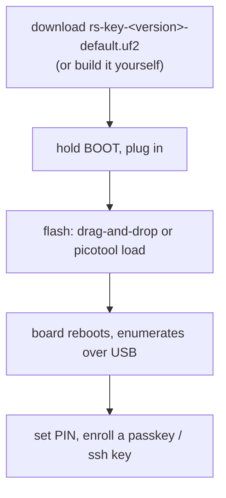

# Quick start

From zero to a working security key in about ten minutes.

> This is experimental firmware with no security audit and no secure element.
> It's fine for trying things out and for credentials you can afford to lose.
> See the [threat model](threat-model.md) before using it for anything real.



## What you need

- An RP2350 board (tested: Waveshare RP2350-One; any RP2350 with USB works)
- A USB cable

That is the whole list. You only need a toolchain if you want to build the
firmware yourself instead of downloading it.

No board yet? The [emulator](testing.md#without-a-board--the-emulator) runs the
same applet code on your machine — enough to drive the protocol suites, and with
`--display`, to try the trusted screen's Approve/Deny ceremony with a mouse.

## 1. Get the firmware

Download the newest `rs-key-<version>-default.uf2` from the
[releases page](https://github.com/TheMaxMur/RS-Key/releases/latest). Take
`2mb`, `16mb` or `display` instead if that is your board;
[releases.md](releases.md) has the table of all fourteen images, the cosign
signature check, and the reproducibility check.

Every published image is a **touch build**: FIDO operations (registering,
logging in) require a press of the presence button, BOOTSEL by default.

<details>
<summary>Or build it yourself</summary>

You need [Nix](https://nixos.org/download/) with flakes enabled; the dev shell
provides the toolchain, `picotool` and the host tools. Without Nix: rustup +
`rustup target add thumbv8m.main-none-eabihf` + picotool ≥ 2.0, and the Python
deps from `flake.nix`.

```sh
nix develop                                  # first run downloads the toolchain
cargo build --release -p firmware
scripts/pt.sh target/thumbv8m.main-none-eabihf/release/firmware firmware-pt.elf
picotool uf2 convert firmware-pt.elf -t elf firmware.uf2
```

`pt.sh` embeds the partition table that keeps the USB bootloader out of the key's
storage — `cargo build` cannot, since it is added after linking
([build.md](build.md#the-partition-table)). `nix build .#firmware` does it for
you.

Set `PRESENCE_PIN=<gpio>` for a dedicated presence button instead of BOOTSEL.
For a no-touch build (needed by the automated test suites, or if your board is
hard to reach) add `--features no-touch`. All build knobs: [build.md](build.md).

</details>

## 2. Flash

1. Hold the **BOOT** button while plugging the board in (or hold BOOT, tap
   RESET). A mass-storage drive named `RP2350` appears.
2. Flash it, either way (`firmware.uf2` here is whichever `.uf2` you got in
   step 1):
   - **Drag-and-drop:** `cp firmware.uf2 /Volumes/RP2350/` (macOS) or copy it to
     the mounted drive on Linux.
   - **picotool (more reliable: it verifies and skips the mass-storage layer):**
     `picotool load -v firmware.uf2 && picotool reboot`.

   The `RP2350` drive is a *fake* FAT volume the bootrom emulates. It only
   understands the UF2 blocks written to it, not a real filesystem. On some
   machines the OS's mass-storage layer breaks that (macOS resource-fork sidecar
   files and Spotlight, buffered or reordered writes, the board rebooting the
   instant the last block lands), so the copy errors or silently does nothing.
   `picotool load` speaks the bootrom's PICOBOOT protocol directly, so reach for
   it whenever the drive never appears or the copy fails.
3. The board reboots itself and enumerates as `RS-Key Security Key`. (The
   default build uses the project's own USB identity, VID:PID
   `0x1209:0x0001` from pid.codes; the PC/SC reader name contains "RS-Key".
   For a build that presents the YubiKey USB identity so `ykman`/Yubico
   Authenticator auto-recognize it, build the opt-in `VIDPID=Yubikey5`
   flavor; see [build.md](build.md).)

Check it (optional, needs the host tools from the dev shell or `tools/`):

```sh
rsk status        # FIDO getInfo + secure-boot + backup state, over USB
ykman info        # needs the opt-in VIDPID=Yubikey5 build: YubiKey 5A, firmware 5.7.4, 6 apps
```

On Linux, the CCID half (OpenPGP/PIV/OATH) needs `pcscd` + a polkit rule
first. See [linux.md](linux.md). FIDO works as soon as the udev rules are in
place.

Or from a GUI, with no terminal at all:
**[PicoForge](https://github.com/librekeys/picoforge)** (third-party, from the
librekeys project) shows the same state on one screen — identity and firmware
build, FIDO2 info, storage use, LED settings, boot mode — with sections for
passkeys, PIV, OpenPGP, OTP slots, the audit journal, backup, soft-lock and
attestation. It writes the same `phy` record `rsk hw` writes, over the interface
documented in
[protocol.md §11](protocol.md#11-integration-notes-for-picoforge). It is not part
of this repo and ships on its own schedule.

![PicoForge on its Device Overview page, reading a freshly flashed RS-Key: a sidebar of sections (Home, Passkeys, Accounts, Slots, PIV, OpenPGP, Audit, Backup, Lock, Attestation, Configuration, Security, Offboard) and four cards — Device Information (serial number, firmware "RS-Key build 0x0872", VID:PID 1209:0001, manufacturer and product name "RS-Key Security Key", storage 2 of 1536 KB, 4 MB flash chip), FIDO2 Information (AAGUID, U2F_V2 and FIDO 2.0 / 2.1 / 2.3, PIN "Not Set", resident keys supported, minimum PIN length 4, 256 remaining credentials), LED Configuration (GPIO 16, 30 s presence touch timeout) and Security Status (boot mode Development, debug enabled, secure lock pending)](images/picoforge-overview.png)

That is a board straight out of step 2, so the screen reads the way yours will:
the identity is the default `1209:0001`, no PIN is set yet (that is step 3), and
the boot mode is still `Development`. [production.md](production.md) is what turns
the last one into a locked-down key — irreversibly, so read it first.

## 3. Set a PIN (recommended)

```sh
rsk fido set-pin
```

Without the host tools, your browser does the same job: it offers to set a PIN
the first time you register a passkey.

Browsers and `ssh-keygen` will prompt for it when enrolling. 8 wrong attempts
lock the PIN until a reset. Standard security-key behaviour.

## 4. Enroll something

**A passkey:** go to any WebAuthn site (or https://webauthn.io to try),
register a security key, touch the button when the LED asks.

**An SSH key:**

```sh
ssh-keygen -t ed25519-sk -f ~/.ssh/id_ed25519_sk    # touch twice, enter PIN
ssh-copy-id -i ~/.ssh/id_ed25519_sk you@server
ssh -i ~/.ssh/id_ed25519_sk you@server              # one touch to log in
```

The `id_ed25519_sk` file is a *handle*, not a key. It is useless without the
board. Copy it to other machines you ssh from.

> macOS note: Apple's `/usr/bin/ssh` has no FIDO support. Use Homebrew
> OpenSSH (`brew install openssh`, then the absolute path
> `/opt/homebrew/opt/openssh/bin/ssh` or put it first in `PATH`).
> Details: [guides/ssh.md](guides/ssh.md).

## 5. Back up your identity (optional but wise)

```sh
rsk backup export --scheme bip39          # 24 words, write them down
rsk backup finalize                       # seals the export window
```

The words recover your deterministic FIDO identity (ssh-sk logins, 2FA
registrations) onto a fresh board with `rsk backup restore`. Anyone who has the
words can recreate that identity on their own board, so store them like cash.
They do **not** cover resident passkeys, OpenPGP or PIV keys. See
[guides/seed-backup.md](guides/seed-backup.md).

## Where next

- [Feature guides](guides/fido2.md): OpenPGP with gpg, PIV, OATH codes, OTP
  slots, soft-lock, LED colors
- [production.md](production.md): fuse the master key into OTP + enable
  secure boot (irreversible, read first)
- [threat-model.md](threat-model.md): what this device protects
  against
