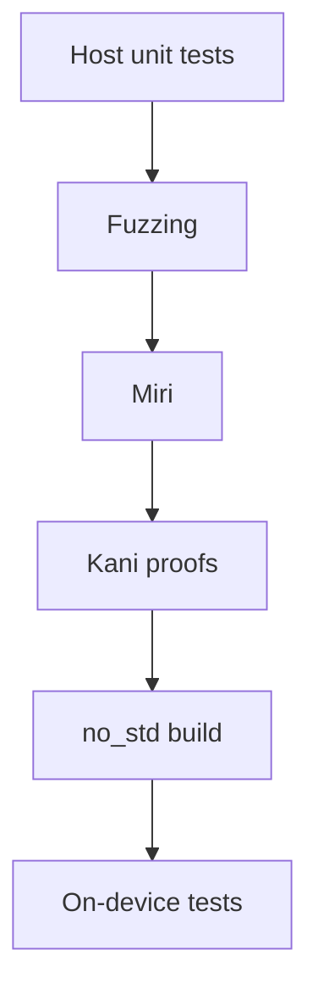
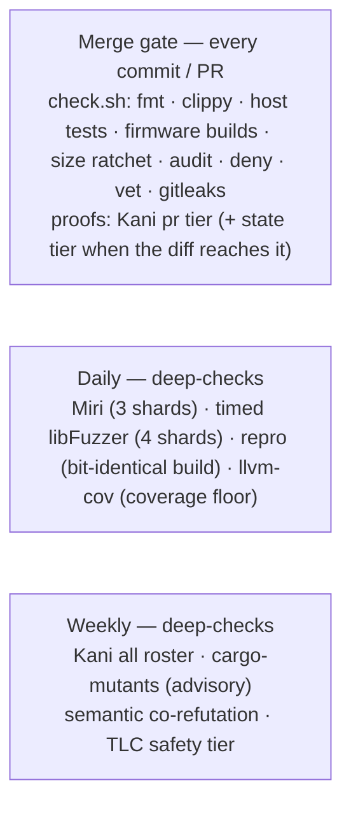

# Testing

Several layers, fastest first. The protocol and applet crates are
hardware-agnostic on purpose (only `firmware` touches the HAL), so everything
except board bring-up is tested and fuzzed on the host. The device is reserved
for end-to-end integration.

| Layer | What it checks | Where |
|---|---|---|
| Host unit tests | parsers, state machines, applets, crypto, the display flow (~1500 tests) | `#[cfg(test)]` in each crate |
| Fuzzing | the same logic under adversarial bytes | `fuzz/` |
| Miri | the fuzz targets' logic under the UB checker | `fuzz/tests/miri.rs` |
| Kani proofs | bounded model checking — every input, not a sample | `#[cfg(kani)]` in the crates |
| `no_std` build | the crates still link for the device | default `thumbv8m` target |
| On-device tests | real USB + flash on the board | `tests/*.py` |



Top to bottom: fast and host-only, tapering to slow and needs-a-board.

## The one command

```sh
nix develop -c ./scripts/check.sh
```

runs fmt, clippy (embedded **and** host targets, `-D warnings`), rustdoc over
every workspace (also `-D warnings`, so a broken intra-doc link fails the gate,
private items included — but only links in `///` and `//!`: a name in a plain
`//` comment is not parsed, and rots unseen), all host tests, both firmware
builds (touch + no-touch), the rsk-wipe build, a firmware flash-size ratchet
(the shipping image must stay under a ceiling that hugs its current size, well
below the 2560K code region), `cargo-audit`, `cargo-deny`, `cargo-vet` and
`gitleaks`.
Green check.sh is the bar for every commit.

## Host tests

`cargo test` must target the host explicitly (the workspace defaults to
`thumbv8m`):

```sh
nix develop -c cargo test --workspace --exclude firmware --exclude rsk-wipe \
    --target aarch64-apple-darwin
```

(The two excludes are the whole of the exclusion: they are the only workspace
members not under `crates/`, and both are thumbv8m-only. `HOST_TARGET` env
overrides the triple in `check.sh`, which selects the same way — this used to be
a hand-written 24-crate `-p` list written out nine times over four files, and
it had rotted to 16 crates here, 20 on the nightly coverage row and 12 in
`nix flake check`. `scripts/roster_gate.py` now holds every copy of the
selection to that pair, and finds the copies rather than being told where they
are.) Crypto tests pin NIST/RFC vectors; applet tests drive full protocol flows
(register → assert, PIN lockout ladders, OpenPGP import → sign → verify against
`RustCrypto`, PIV generate → attest → parse with `x509-parser`).

`rsk-display` is the odd one: its subject is a *screen*, and it is tested by
giving the flow a panel that records what was drawn, a touch pad that reads back
a scripted sequence of samples, and a board whose backlight, wake button and
presence flags are plain fields. The panel and the touch controller are type
parameters and the rest sits behind `Hooks`, so the gestures that carry the
security — the hold that approves a ceremony, the retry ladder behind the PIN
pad, the auto-lock a host must not be able to postpone — run on the host at the
same code the board runs. `embassy-time`'s `std` feature supplies the clock, so
the deadlines and debounces are the real ones (see `crates/rsk-display/src/tests.rs`).

## Fuzzing

Every parser **and every applet's full dispatch** has a `cargo-fuzz` target.
30+ of them: APDU, BER-TLV, CTAPHID reassembly (+ round-trip property), CCID
framing, all the FIDO command surfaces (CBOR dispatch, credentials,
credMgmt, U2F, extensions, large blobs, the vendor backup/lock commands,
half that corpus runs soft-locked), OpenPGP dispatch + the EC/RSA crypto
parsers, OATH/OTP/PIV/management/rescue dispatch, the keyboard frame codec,
the phy TLV codec (parse∘serialize round-trip is an asserted invariant), the
PIN protocols, AEADs, the DRBG, ML-DSA (both parameter sets: attacker-shaped
verify decode, plus a keygen→sign→verify property that a one-bit tamper must
break) / ML-KEM decoding, the FIDO post-quantum credential path (the
`(alg, curve)` box codec + `CredKey` dispatch → sign / COSE-AKP encode), the
trusted-display `Label` sanitizer (attacker rpId / account text must stay
printable ASCII, no bidi / homoglyph escape, and the confirm screen must
render without panic), and the seed-blob format/migration state machine.

Most targets drive one applet from a fresh state. Four are **stateful**. They
replay an attacker-chosen *sequence* against persistent state, hunting the
multi-step seams a fresh-state target can't reach (both real bugs of this
class, the largeBlobs overflow and the mgmt write→read mismatch, were
multi-step):

- `cross_applet` wires the real `Dispatcher` to the OpenPGP / Management /
  OATH / OTP / PIV set over a single shared `Fs`: SELECT switches, command
  chaining and the file system persist across APDUs. State leaking between
  applets, a SELECT mid-chain, FID collisions. (GENERATE is skipped, as on
  device the RSA prime search is fast-pathed off the dispatcher.)
- `fido_session` replays a CTAPHID_CBOR message sequence against one
  `FidoState` + `Fs` with an all-permissions token armed and a resident
  credential provisioned. PIN/token state, the credential store, large blobs
  and the journal persist across commands. `now_ms` advances over the
  token-timeout edges. A mid-sequence reset wipes the store under the
  session's feet. getInfo must still succeed after anything.
- `fs_ops` drives put / read / delete / meta ops / reboot
  (`into_storage`→`scan`) over one image against a `HashMap` shadow model:
  every read checks the full-length-returned / copy-clamped contract (the
  mgmt bug was a caller missing it), `meta_add` is checked against the exact
  `META_MAX` boundary, and the live key set must equal the model's after any
  prefix of operations.
- `power_cut` is the torture extension of `fs_ops`: the same op-sequence
  shadow model, but over the on-device storage stack itself — `rsk-store`,
  the two `sequential-storage` partitions with their counter-FID routing and
  caches — on a mock NOR flash whose power can be cut after any byte of any
  write or erase. It tortured a hand-written mirror of that stack until the
  backend moved into a crate; the mirror had drifted (no `last_error`, no
  `compact`, a missing counter FID), which is the argument for not having one. Once a cut fires, a
  dead-latch fails every further mutation (a dead device cannot keep
  writing), the stack is rebuilt with fresh caches over the surviving bytes,
  and the model checks atomicity (the torn op reads as old or new, never
  garbage; a torn `delete` never leaves the value gone but its metadata
  alive), durability (every committed file reads back exactly; a spurious
  "absent" is the on-device "seed lost" disaster), and the key set. Cuts
  landing inside the next mount's own repair are survived by dying again. A
  dedicated input class also runs the real FIDO reset on that same store,
  checks `ResetNeverWeakensSurvivingState` after boot-time seed provisioning,
  then mounts a second time to cross the reboot boundary again.

```sh
nix develop .#fuzz -c cargo fuzz list
nix develop .#fuzz -c cargo fuzz run <target> -- -max_total_time=60
```

The fuzz workspace is separate (nightly + libfuzzer), but check.sh lints it on
stable — the `clippy (fuzz)` row, `--all-targets` against the host target — so a
shared type change that breaks a target fails the gate rather than the next
nightly. The instrumented build still needs the nightly shell:
`nix develop .#fuzz -c cargo fuzz build`. House rule: new attacker-facing parser
or dispatch surface ⇒ new fuzz target in the same change.

**Miri** runs every target's logic once more as plain tests under the UB
checker, reporting undefined behavior instead of panics (`fuzz/tests/miri.rs`;
the `MIRIFLAGS` policy is set by the `.#fuzz` shell):

```sh
nix develop .#fuzz -c cargo miri test --manifest-path fuzz/Cargo.toml
```

Neither suite gates a commit. CI runs both daily in the `deep-checks`
workflow: the Miri suite, plus a timed libFuzzer pass over every target with
the corpus carried between runs, crash artifacts uploaded. A separate
`fuzz-coverage` job then measures per-target region/line coverage over that
accumulated corpus (`scripts/fuzz-coverage.sh`, run it the same way locally),
writing a summary table and uploading a per-target HTML report. A
`for t in $(cargo fuzz list)` word list reports green when the list is empty, so
both loops floor the roster first — `FUZZ_TARGET_FLOOR` in the workflow and the
same number in the script. Lower it only in the commit that removes a target.

Coverage says which *lines* a corpus reached. `scripts/fuzz-dimensions.py` says
which **inputs** it explored, for `power_cut`: how much of the storage was
invalid before init, how many operations and distinct FIDs an exec drove, how
many times the power went, how many erases and bytes the store spent. It replays
a corpus with `RSK_POWER_CUT_STATS=1` and prints one log-bucket row per axis.

```sh
nix develop .#fuzz -c ./scripts/fuzz-dimensions.py fuzz/corpus/power_cut
```

It gates nothing and is not in CI — there is no coverage floor anywhere in this
tree, and a reporter that looks like a gate is worse than none.

## Kani proofs

Where a fuzzer samples inputs, [Kani](https://model-checking.github.io/kani/)
(a bounded model checker over CBMC) checks **every** input up to a stated
bound: no panic, no overflow, no out-of-bounds access, and the asserted
invariants hold. The harnesses live next to the unit tests as
`#[cfg(kani)] mod proofs` and cover the small, total, attacker- or
crypto-critical helpers, where a proof genuinely beats a sample:

- `rsk-sdk`: BER-TLV walk over arbitrary bytes — every yielded value is a
  sub-slice of the input, and successive values neither overlap nor run
  backwards; `format_len` round-trip for every `u16`; APDU case-1..4 parsing
  over every buffer up to the bound; and the **dispatcher over every *pair* of
  raw APDUs** up to six bytes each — the one harness here that applies a
  sequence to a stateful object, because command chaining's three audit
  findings each needed two commands to express. It pins that the applet is
  never handed a body from a command it did not itself terminate, that a
  dropped chain leaves no bytes behind, that a secure-messaging class reaches
  no applet, and that a SELECT for a registered AID always arrives. It is also
  the tree's only `cfg(kani)` change to production source; the shrink and its
  reasoning are in `applet_kani.rs`.
- `rsk-fs`: the `EF_META` record-walk (`rebuild_meta`) over arbitrary (corrupt)
  blobs — nothing written past the length it reports, and the old record for the
  rebuilt fid is **gone** from the output, which is what `meta_delete` and
  `meta_add`'s replace both mean. Stated by feeding the output back through the
  same function rather than by a second decoder, which would only prove two
  copies of one walk agree.
- `rsk-rsa-asm`: `mod_small` proven *functionally* (`== v % m`, every
  dividend up to 2 bytes and every modulus) and panic-free / `< m` for every
  input up to 8 bytes; the `IncrementalSieve` residue invariant
  (`res[i] == cand mod p_i` after a step, verdict identical to the flat
  sieve) for every seed, plus the concrete-seed twin that keeps that invariant
  from holding over a sieve which never steps.
- `rsk-crypto`: the `base64url` length helpers (`encoded_len` / `decoded_len`)
  panic-free (no overflow/underflow) and mutually inverse for every length up
  to 64 KiB; `encode∘decode == id` for every input up to 9 bytes (every
  `len % 3` tail, with and without preceding full chunks); `decode` panic-free
  over every byte string up to 8 chars and writing exactly the length it
  reports, never a byte past it.
- `rsk-rescue`: the `phy` device-configuration record: `parse` total over
  every byte string up to 12 bytes, always materializing an interface mask and
  always yielding a record that serializes back into `PHY_MAX_SIZE` (the
  read-modify-write the rescue interface performs); `overlay` never turning a
  stored field back into "absent", and leaving a field whose tag the host blob
  never mentions exactly as it was — the merge's own promise, and the
  data-loss one; `serialize∘parse == id` for every `PhyData` (every
  field-presence combination and value, product strings up to 4 bytes), modulo
  the documented missing-ENABLED_USB_ITF→ALL normalization.
- `rsk-device`: the presence-scope arbitration — one physical button, four
  transports. Over a symbolic interleaving of button samples and host cancels,
  a touch wait ends `Cancelled` only for the transport that owns it (so a CCID
  or on-panel wait cannot be cancelled at all), is advertised as pending to that
  transport and no other, and one unbroken hold satisfies at most one ceremony.
  Those are `NoCrossTransportTouchConsumption`'s `TouchCancel` and `TouchConfirm`
  clauses; the arbitration was lifted out of `firmware/src/presence.rs` so a
  harness could reach it, since no `cargo kani -p` builds a thumbv8m binary.
- `rsk-fido`: the tree's only **state-sequence** proofs. The others each check
  one call; these drive a symbolic four- to five-operation sequence over the
  real `FidoState` and check an invariant after every step — a pinUvAuthToken
  dies on each invalidation and only a fresh issuance brings one back
  (`NoTokenAfterInvalidation`, asserted both on the state the call sites read
  and on the real `verify_cm_token` with a replayed genuine MAC), and a
  credentialManagement enumerate walk is servable only to the channel whose
  *Begin* opened it (`NoAuthorizationBypass`). The names are the ones
  `formal/RSKeySecurityState.tla` uses, so one property can be traced model →
  code → harness by grep. Phase 6 adds four one-step induction harnesses over
  the reset's security-visible concrete projection: initialization and every
  begin/delete/advance/abort/finish/power-cut step preserve
  `ResetNeverWeakensSurvivingState` and its three independently named clauses.

Kani is **not** in nixpkgs and its setup downloads a prebuilt CBMC bundle, so
this is the one deliberately non-nix tool (install once, outside the dev
shell):

```sh
cargo install --locked kani-verifier --version 0.67.0 && cargo kani setup
./scripts/kani.sh pr       # the fast tier — what every pull request runs
./scripts/kani.sh state    # rsk-fido + rsk-fs, the security-state sequences
./scripts/kani.sh all      # every harness — the roster, and the local command
./scripts/kani.sh light1   # one of the three weekly shards of "all but heavy"
./scripts/kani.sh light2
./scripts/kani.sh light3
./scripts/kani.sh heavy    # rsk-rescue alone, in its own job
```

`scripts/kani.sh` owns the tier → crate table and nothing else does, and it
floors the number of harnesses each tier has to come back with — a roster that
selects nothing prints a summary and exits 0, the same shape as a `cargo test`
name filter that matches no test. `scripts/kani_gate.py` reads that table back
with `--tiers` and fails the merge gate on a crate that carries a
`#[kani::proof]` and is on no tier.

It also reads back every `kani::cover!`, because **Kani does not fail a harness
on one nothing satisfies**: 0.67.0 has no `--fail-uncoverable`, so an
unsatisfiable or unreachable cover prints "N of M cover properties satisfied"
and the run still reports SUCCESSFUL. Since a cover is what says a guarded
assertion was reached at all, that made every "vacuity guard" in the tree a
comment. The row groups Kani's per-check verdicts by harness and source location
and fails on a cover no execution reaches — *grouped*, not off that summary line,
because one `cover!` becomes several CBMC properties wherever the enclosing MIR
branches on something the condition re-tests, and the copies on the contradicting
arms are dead by construction. `rebuild_meta_any_blob` is the worked example: its
`!with_new && …` cover is reported twice, UNSATISFIABLE on the `with_new` arm and
SATISFIED on the other, and the summary line says "2 of 3" over a cover that is
genuinely reached. Reading the summary would have failed a correct harness and
sent someone to repair it.

That grouping is why `scripts/kani.sh` refuses `--jobs`. Extra arguments go
through to `cargo kani`, and parallel harnesses would interleave `Checking
harness` with another one's checks, filing every verdict under whichever printed
last. On the pinned 0.67.0 that cannot actually happen: `--jobs` there *requires*
`--output-format=terse` and refuses the combination otherwise, and a terse run
carries no per-check listing at all — which the row already fails on, by name. So
the refusal buys a message that says which flag and why, one step before a run
that would otherwise die half an hour later on a confusing one. It is also the
thing that has to be revisited if a later Kani lets the two combine, because then
the interleaving becomes real and grouping by harness stops being safe.

The split is by measured cost, not by guess (kani 0.67.0, 18-core Apple Silicon
under load, 2026-08-13; "solve" excludes compilation, which dominates a cold
run):

| Tier | Crates | Harnesses | Covers | Solve | Slowest harness |
|---|---|---|---|---|---|
| `pr` | 13 | 56 | 28 | 208 s | `rsk-piv::set_protected_total_and_invariant`, 47 s |
| `state` | 2 | 24 | 26 | ~10 min | `rsk-fido::…_at_call_site`, ~7 min (9.3 GiB peak) |
| `all` | 17 | 82 | 48 | ~1 h 45 | `rsk-rescue::serialize_parse_roundtrip`, 27 m 42 s |
| `light1` | 4 | 27 | 23 | not yet run | `rsk-fido::…_at_call_site`, ~7 min (9.3 GiB peak) |
| `light2` | 5 | 27 | 8 | not yet run | `rsk-rsa-asm`'s division spec and sieve |
| `light3` | 7 | 23 | 16 | not yet run | `rsk-mldsa`'s rounding round-trips |
| `heavy` | 1 | 5 | 1 | ~55 min | `rsk-rescue::serialize_parse_roundtrip`, 55 min (11.1 GB peak) |

`pr` and `state` are measured runs. `all` has never been run end to end here:
its cover count is the two measured tiers plus `rsk-rescue`'s one, so
**`FLOOR_all` is a number no run has reached**.

None of the six figures in the Harnesses and Covers columns is kept by hand, and
neither are `kani.sh`'s `FLOOR_*`/`COVERS_*`. `scripts/kani_gate.py` counts the
tree's `#[kani::proof]` and `kani::cover!` per tier — comments stripped, since two
`*_kani.rs` files discuss `kani::cover!` in prose — and fails the merge gate on
any of the four copies that disagrees, in either direction. They *had* been kept
by the instruction "raise it in the commit that adds one", and `FLOOR_all` drifted
to 64 against a tree of 65: one harness could have gone missing under a floor that
still passed.

`pr` passes `--harness-timeout 5m`, five times its slowest harness. That cap is
the tripwire on the tier assignment: a fast-tier harness that grows past it
fails the pull request instead of quietly making every one of them wait, and the
answer is to move its crate to the slow list, never to raise the cap.

A harness that trips its cap ends the whole row, and it ends it *above* the floor
checks: `cargo kani` exits 1, `pipefail` makes that the pipeline's, and the script
stops at the `tee`. Both measured on kani 0.67.0, 2026-08-13. That matters for
`TIMEOUT_all=30m`, because the harness it is really about —
`serialize_parse_roundtrip` — verified in **27 m 42 s** here, an 8% margin, on an
18-core Apple Silicon under load. The `~80 min` this page carried for it is not
reproduced; if it is right for a slower runner then the daily row has been failing
on a correct harness, and `FLOOR_all` and `COVERS_all` have never been read. The
`~1 h 45` in the Solve column above still includes the old figure and no one has
re-composed it.

Pin the version — a verdict belongs to the tool that gave it, and an unpinned
install is not the one CI runs. `--harness-timeout` is experimental (hence the
`-Z`) and applies per harness, not per run: one that stops converging is failed
after half an hour and the rest still run, so a verdict comes back at all
instead of the run hanging on it.

The proofs are bounded, and the bound is the honest fine print. A 16- to
20-byte symbolic buffer reaches every branch of the TLV/APDU parsers; bigger
inputs are the fuzzers' job. Big loops (a full modexp, Baillie–PSW) are out of
CBMC's reach by design and stay covered by the differential tests and on-device
KATs.

For a sequence proof the bound is the sequence, and three more walls stand behind
it. **Cost:** one HMAC-SHA-256 evaluation over concrete bytes costs CBMC ~130 s,
so a harness that drives a real MAC-checking gate can afford it once at the end,
never once per step. **Codegen:** a harness that reaches p256's field arithmetic
aborts in codegen — Kani 0.67.0 panics on `crypto-bigint 0.7.5`'s
`UintRef::lowest_u64` (*"BinaryOperation Expression does not typecheck Plus …
FlexibleArray"*), upstream
[kani#2683](https://github.com/model-checking/kani/issues/2683) — whose
`ConstantIndex` path `main` fixed in
[#4681](https://github.com/model-checking/kani/pull/4681), in no release, and
without closing the issue. It is the *build profile* that selects that path, not
the dependency: the crash needs a MIR `ConstantIndex`, which every `opt-level`
but `0` produces (swept 0/1/2/3/s/z), so
`[profile.dev.package.crypto-bigint] opt-level = 0` removes it — measured, and
**this tree deliberately does not carry that override**, because the wall behind
it stands anyway. Merely *holding* a `Ctx` never triggers it either: Kani
codegens what a harness reaches, not what its types mention. **Reach:** behind
the ICE sits `cmov 0.5.4`'s `asm!` backend, reached via `ctutils`, which Kani
cannot model on either host target — it answers `VERIFICATION: FAILED` on an
unsupported reachable construct (measured), so the path is closed loudly, never
by a silent pass. Hence three of the four token gates are represented by the
state predicates they read rather than invoked. Each harness names what it does
not prove.

The sharpest bound is on *functional division* specs. Proving
`mod_small == v % m` makes the solver equate two division circuits
(`mod_small`'s byte-wise Horner reduction against one wide `%`), which is the
shape resolution-based SAT handles worst: it discharges in ~100 s at a 2-byte
dividend, but the cost climbs steeply per added byte and a full `u32` dividend
(4 bytes) does not converge (it ran ~30 min without a verdict; the early
`SATISFIABLE` lines are Kani's reachability covers, not the property). So
`mod_small`'s exact value is pinned exhaustively at 2 bytes
(`mod_small_matches_value`), its panic-freedom and range over the full 8
(`mod_small_in_range`), and the full-width semantics by the 32-byte BigUint
differential test plus the division-free `IncrementalSieve` proof. The earlier
instinct, "never spec a division functionally", was half right: avoid it at
*wide* dividends; at a narrow width it is the strongest evidence there is.
House rule: a small total helper in a parsing or arithmetic hot path gets a
proof harness sized to what CBMC can swallow: functional where it converges,
structural (`< m`, panic-free) where it doesn't, or relational against a
division-free reformulation. Anything bigger gets a fuzz target.

CI runs the tiers above, from this same script (rustup-based, version pinned,
`~/.kani` cached — Kani is the one tool outside the nix shell). `ci.yml`'s
`proofs` job runs `pr` on any change under `crates/`, and adds `state` when the
diff reaches `rsk-fido`, `rsk-fs`, `rsk-store` or `rsk-wipe` — the surface those
sequence proofs are about (`scripts/ci-scope.sh`, `PROOFS` / `PROOFS_STATE`,
both covered by its `--self-test`). `deep-checks.yml`'s weekly `kani` job runs the
three `light*` shards and `heavy`, one runner each, which together are `all`.

`scripts/kani_gate.py` is in the merge gate and holds the tiers to their word:
the `all` tier must be exactly the crates carrying a `#[kani::proof]` less the
exclusion below, every other tier a non-empty subset of it, every tier both run
by a CI row and written on this page, and no workflow or page may hand-write a
`cargo kani … -p …` roster of its own. That guard exists because the row named
"prove every harness" was running 29 of 49, and because commenting the `run:`
line out once left the file's other copies agreeing with each other over a job
that proved nothing. Its own mutation table is `scripts/test_kani_gate.py`.

One crate is deliberately off the tiers. `rsk-bench`'s `summarize` sorts
`samples[warmup..]`, whose length is symbolic, so CBMC unwinds it unbounded and
returns no verdict — not in 5 minutes, and not with `--default-unwind 5`. The
exclusion and its reason live in that guard, next to the roster it belongs to.

## The security-state model (TLA+)

`formal/RSKeySecurityState.tla` models the authenticator's security state
machine — PIN retries, the pinUvAuthToken and its permissions, which transport
owns the touch, which channel owns a stateful walk, the reset window, the
persistent gate records, and the position at which power is lost inside a
multi-write flash sequence. TLC checks six named invariants exhaustively at
small constants; the names are the ones the `rsk-fido` Kani harnesses use, so
one property reads model → code → harness by grep.

It exists because Kani proves a property over *one call* and RS-Key's dangerous
defects have lived in *orderings*. It is a **design artefact, not a proof of the
firmware**: a green run is a statement about the model. `formal/README.md` is
its scope statement — what it covers, where it departs from the firmware **and
in which direction**, the mutation experiment that keeps its invariants
falsifiable, and the counterexamples it has produced on the shipped tree. Read
that before quoting a result from it.

```sh
nix develop            # exports TLA2TOOLS_JAR; the JVM comes with it
cd formal && ./gen-configs.sh && ./run-tlc.sh safety   # the tier CI runs
```

`safety` is the nine shipped models, their 71 mutation switches, floors and the vacuity check —
`deep-checks.yml`'s weekly `formal` row, which also fires on any push touching
`formal/`. `liveness` is the temporal half and is not in CI: it needs a 12g
heap. `all` is both. Tier membership lives in `formal/run-tlc.sh`.

The emulator CI also records raw security-state snapshots from the real
`21_pin_webauthn` suite and replays them against `RSKeySecurityState`. R4a
independently computes β from the raw fields; R4b compares the implementation's
untrusted `abstract_token()` hint with the canonical TLA+ γ. The gate floors the
trace at 10 commands, 20 B steps and 12 distinct actions, reports model actions
not reached by traffic, and keeps one β mutation plus one α-only mutation RED.
See `formal/README.md` for the exact boundary and claim.

Phase 5 adds a narrower but connected refinement pilot for the token lifecycle.
Its A relation and domains are exported by computation into Rust, TLC checks
B→A, Kani checks bounded C→A obligations, and the emulator carries raw outcomes
through a consensus validator. See [Token refinement pilot](token-refinement.md)
for the exact InitC/wf boundary and the reset evidence table.

Phase 6 closes that pilot's reset/reboot seam for
`ResetNeverWeakensSurvivingState`. The bounded C→B projection uses the shipped
reset classifier, the existing `rsk-fs` torn-delete rules compose underneath
it, the `power_cut` target runs the real reset over byte-cuttable flash, and a
destructive HIL script performs the same check across physical USB power loss.
See [Cross-reset refinement pilot](reset-refinement.md) for the abstraction
boundary, measurements, and the still-required per-board HIL witness.

The companion co-refutation run asks whether production tests reject those
same semantic defects. The original phase-2 baseline is fixed at 28 rows:
26 are killed by code-level harnesses, two are unreachable by construction,
and none remains a gap. Its generated table is in `formal/README.md`; ordinary
`check.sh` rejects drift, while the full 67-entry live roster runs weekly:

```sh
python scripts/comutate.py --lint
python scripts/comutate.py run
python scripts/comutate.py run --write-readme  # full run, then refresh 28 rows
```

## Formal claims — what is and is not verified

This is the paragraph to quote, and it is deliberately narrow. Everything in it
is measured; nothing in it is an aspiration.

> **RS-Key is not formally verified.** Two narrow, bounded layers exist. With
> **Kani** (a bounded model checker) the tree proves specific properties of
> parsers, codecs, file metadata and arithmetic helpers — over all inputs *up to
> a stated bound*, not over all inputs — and three proofs about short
> *sequences* of security-state transitions on the real `FidoState`: a
> `pinUvAuthToken` retired by `stopUsingPinUvAuthToken`, a reroll, an
> `authenticatorReset`, a power cycle or its own usage timer never authorizes
> again, and a `credentialManagement` enumerate walk is servable only to the
> channel whose *Begin* opened it. Those hold for every four- or five-operation
> sequence from one starting state; longer sequences, other starting states and
> the flash-backed persistent grant are outside them. Four more harnesses prove
> initialization and one-step preservation of a finite reset projection across
> reset phases, abort and reboot; the complete `FidoState` and byte-level flash
> are linked by unit tests and sampled power-cut fuzz, not by that proof. On top
> of that sits a
> **TLA+ model** of the authenticator's security state. TLC checks six named
> invariants exhaustively over 60,020,016 states at small constants. **That
> is a result about the model, not about the firmware binary**: it is only as
> good as the model's fidelity to the code. Citations and co-refutation are
> maintained by hand; a bounded emulator trace also checks raw C-state → B and
> α(C) = γ(B) at recorded boundaries, but says nothing about unrecorded runs. Every
> invariant has been shown to be breakable by an injected defect, so none of
> them is a check that cannot fail — and the model has already produced two
> counterexamples on the shipped tree, both fixed and co-refuted since.

The hedging is load-bearing, and the tree's own history is why. The model's
green run once rested on an abstraction that made it **narrower** than the
firmware — a power cut left the device permanently seedless, where the real one
regenerates the seed on every boot — so a class of reachable states was never
explored at all. A green result over an unfaithful model proves nothing, and
only a hand review found it. Hand-maintained fidelity is the weak link here, and
saying so is part of the claim rather than a footnote to it.

## On-device tests

Numbered, self-contained scripts under `tests/`, run from the dev shell
against a flashed board:

```sh
nix develop -c python tests/10_fido_getinfo.py
nix develop -c python tests/80_piv.py
nix develop -c python tests/75_seed_backup.py --pin <your PIN>
```

- Most need the **no-touch build** (`--features no-touch`): they cannot
  press the button. If the board runs secure boot, sign the test build too.
- **One key attached, or name the one you mean.** A board built `VIDPID=Yubikey5`
  answers on the same `1050:0407` as a real YubiKey, so a first match over the HID
  enumeration can run the suite against the wrong device and report its answers as
  your failures. `tests/_device.py` breaks the tie on the `RSK` marker, in the HID
  product string and in the PC/SC reader name alike, and stops the run instead of
  guessing when that is not enough. Name a target with `RSK_TEST_SERIAL=rs-key-0001`
  (or `RSK_TEST_PATH`, when two boards answer to the same serial), and over CCID with
  `RSK_TEST_READER=<part of the reader name>`; every run prints the device it picked.
- **The destructive and reboot-polling suites want that marker.** `80` and `90`
  rewrite the card, and `14`, `51` and `76` ask "is the board back yet?" of a reader
  a real YubiKey would answer just as well (`51` probes Yubico's own management AID).
  Those five refuse an unmarked reader rather than accept a lone stranger, so a build
  whose `USB_PRODUCT` drops the marker has to name its reader with `RSK_TEST_READER`.
- Version assertions follow `FW_VERSION` (default 5.7.4, [build.md](build.md)). An
  image built with an override needs the same value in the test environment:
  `FW_VERSION=1.4.0 python tests/31_openpgp_select.py`.
- Numbering: `0x` transport smoke, `1x` FIDO basics, `2x` FIDO full,
  `3x/4x/5x` OpenPGP, `6x` PQC, `7x` management/OATH/OTP/backup/lock,
  `8x` PIV/rescue, `9x` OTP-fuse migration.
- Tests that reboot the device do it hands-free over CCID and wait for
  re-enumeration; tests are idempotent where the applet allows it and say so
  in their docstring when they are destructive (resets).
- **A factory reset needs you at the desk.** On a screenless build the firmware
  honours `authenticatorReset` only within 10 s of a USB attach, and a warm reboot
  does not reopen that window ([protocol.md](protocol.md)). So the eleven suites
  that reset (`22`–`27`, `60`, `61`, `63`–`65`) prompt for a physical
  unplug/replug and send the reset the moment the key re-enumerates. The prompt
  lives in `tests/replug.py`, shared by both transports (`reset` for the
  raw-CTAPHID scripts, `reset_fido2` for the python-fido2 ones); its docstring is
  the reference. On a trusted-display build the prompt is redundant — that build
  is exempt from the window.
- `tests/27_reset_window.py` exercises the window itself: reset immediately after
  the replug (expects `CTAP2_OK`), then again past 10 s (expects
  `0x30 NOT_ALLOWED`). It needs the `no-touch`, non-`display` image and it wipes
  FIDO state.
- `tests/28_ctap_spec_alignment.py` covers the CTAP 2.1 spec-alignment surface the
  per-command suites do not reach: CTAPHID channel allocation and `CTAPHID_LOCK`,
  the `uv`/`pinUvAuthParam` precedence rule, `makeCredUvNotRqd`, the largeBlobs
  parameter validation, `setMinPINLength` overflow, the rpId-scoped
  `credentialManagement` token, and the U2F gate under `alwaysUv`. It neither resets
  nor replugs, but it does need `--pin`, and it toggles `alwaysUv` on and back off —
  so start it with `alwaysUv` off, which it checks.
- `tests/54_sram_residue.py` measures what the reboot scrub is *for*, in two steps.
  `control` asks whether this board's SRAM can be read back at all: it drops to
  BOOTSEL through the presence-gated reboot, reads a window of `.text` (which both
  proves `picotool save -r` works and pins the ELF to the image actually running),
  then checks main SRAM for the RAM-resident asm and `SMALL_PRIMES` table that live
  in `.data` — known byte-for-byte from the file, so the control is *a priori* and
  needs no key. `residue` then generates an RSA key on-card and hunts a factor of
  its modulus, reported per region (the main stack between `_stack_end` and
  `_stack_start`, core1's stack, `.bss`, `.data`) with a zero assertion on each
  static the reboot claims to scrub. Neither reports "clean" from a dump that
  proves nothing: an all-zero read is equally consistent with a working scrub, with
  the platform clearing SRAM, and with picoboot refusing to serve it. The last two
  are separated by writing a pattern through picoboot and reading it back, so the
  exit code says which — `0` as expected, `1` expectation or setup failed, `2`
  INCONCLUSIVE, `3` settled without the scan. Run `residue` on a build *without*
  the scrub (`--expect present`) before trusting an `absent` result; a lone
  `absent` run is how audit run-34 #3 found a "HW-VERIFIED" claim resting on
  520 KiB of zeros. Measured 2026-08-05 on RP2350 A4 (secure boot off): the
  platform clears main SRAM across the drop, so there is nothing to recover.
  Both subcommands leave the board in BOOTSEL, so reflash afterwards, and
  `residue` overwrites the OpenPGP signature key.
- The FIDO PIN is never guessed: destructive PIN tests take `--pin`
  explicitly.

## The vendored upstream suites

Two other ecosystems' own conformance suites live in
[third_party/](https://github.com/TheMaxMur/RS-Key/tree/main/third_party) —
pico-fido's and pico-openpgp/Gnuk's — and `tests/third_party.py` runs them against
RS-Key:

```sh
nix develop -c python tests/third_party.py openpgp   # over the emulator's card socket
nix develop -c python tests/third_party.py fido      # needs a board, or --usbip
```

No assertion in those directories is edited. The run is steered from outside by a
pytest plugin that supplies the power cycle the CTAP 2.1 §6.6 reset window needs,
names every deliberate divergence as a strict `xfail`, and deselects the modules
that exercise a vendor extension RS-Key does not implement. Both lists carry a
spec citation per entry, and `strict` means a divergence that gets fixed *fails*
the run instead of staying listed for ever — which is how the last refresh caught
one that upstream had corrected.

The one thing repaired in place is a suite's own harness: a test that raises in
its own Python before a byte reaches the device measures nothing, so listing it
would record only that it is broken. Those edits are marked at the site and in
[third_party/README.md](https://github.com/TheMaxMur/RS-Key/blob/main/third_party/README.md).

Running an upstream corpus shows conformance on the cases it covers; it is not a
security audit.

## Without a board — the emulator

`tools/emu` runs the applet crates on the host and serves CTAPHID and APDUs over
TCP, so the suites above can run with no hardware attached:

```sh
nix develop -c cargo run --manifest-path tools/emu/Cargo.toml \
  --target "$HOST" -- --store ./emu.store
nix develop -c python tests/emu.py tests/11_fido_makecredential.py
```

`tests/emu.py` puts a fake `hid` module and a fake `smartcard` package in front of
the target script and points the power-cycle helper at the emulator's replug
opcode, so no test file changes and neither hidapi nor pyscard need be installed.
**42 of the 52 suites pass**, FIDO and card alike (two want `--pin`, one wants
`--yubico`; a 43rd needs an enrolled `ed25519-sk` key and skips without one); the
other 9 are refused by name with their reason and exit 77 — they need raw USB,
python-fido2, or hardware, and `tools/emu/README.md` lists which is which. The
store underneath is the device's own (`crates/rsk-store`) over a mock NOR flash
with the board's geometry, so the suites run against a log-structured ring that
migrates and reclaims — not a map that overwrites in place. A harness that cannot
tell "does not apply here" from "broken" hides the second one, which is the whole
reason the refused suites are named rather than left to fail somewhere in the
middle — and the reason the two that want `--pin` are refused the same way when it
is not given, rather than dying in argparse where a sweep reads them as broken.
`--touch` prompts for every presence on the terminal (and prints what a
trusted display would have shown); `--trace` logs each command and its status.

One command runs everything that needs no board — the suites above plus the
vendored OpenPGP conformance suite, each against a fresh flash image:

```sh
nix develop -c ./scripts/emu-suites.sh
```

That is what CI runs (`.github/workflows/emulator.yml`), on pull requests and
nightly. It is the answer to the oldest gap in this table: `tests/*.py` were
hand-run against a flashed key, so nothing caught a *test* that had rotted — and
several had.

`--usbip` goes further: it serves the USB/IP protocol, so a Linux host's
`vhci_hcd` attaches the emulator as a genuine USB device — `/dev/hidraw*`, a
PC/SC reader, something a browser can talk to. What enumerates there is the
device's own stack (the same `embassy_usb::Builder`, the same `rsk-usb`
transports, over a driver written against URBs), so the descriptors and the
interface order are the real ones. The suites this shim refuses for wanting raw
USB — `02_usb_interfaces`, `61`/`65` (python-fido2's own transport),
`73_otp_keyboard`, `77_otp_touch_wait` — run there instead, as ordinary hardware
suites with nothing faked, and so does the pico-fido conformance suite. Needs
Linux and root; the emulator itself can stay on a Mac, because USB/IP is
network-transparent. See `tools/emu/README.md`.

`scripts/usbip-suites.sh` is that run in one command, and it is what CI calls:

```sh
nix develop -c ./scripts/usbip-suites.sh   # Linux only
```

A GitHub-hosted runner cannot supply `vhci_hcd` — it cannot load a module, and
has no reliable `/dev/kvm` either — so the script boots a QEMU guest that can
(`nix build .#usbip-vm`, defined in `nix/usbip-vm.nix`) and attaches the
emulator to it over the network. The emulator itself stays outside the guest:
it is a TCP peer, not a device, which keeps the guest a fixed appliance —
kernel, `usbip`, `pcscd`, Python — that a firmware change cannot invalidate.
There is no KVM, so everything inside runs on software emulation; budget minutes,
not seconds.

What it buys is the run these suites otherwise never get: they are hand-run
against a flashed board, so nothing catches a *test* that has rotted. What it
cannot stand in for is the hardware under the applet layer — no secure boot, no
OTP, no fuses — and the flash is a mock: the log structure and the `--power-cut`
injector are real, the medium's wear and partial-erase physics are not. The USB
stack is real under `--usbip` and absent otherwise, so a plain run proves nothing
about enumeration or interface order. The applet wiring
*is* shared (`crates/rsk-device`), so a routing or gating bug does show up here;
what is still written twice is the worker's sequencing and the board's own
`firmware/src/{main,worker,presence,led}.rs`
([tools/emu/README.md](https://github.com/TheMaxMur/RS-Key/tree/main/tools/emu)
lists the gaps). A green emulator run is a protocol result, not a device result.

## Latency harness

Timing a crypto primitive from the host is noisy. On the RP2350 the hot working
set (the variable-base P-256 scalar multiply is ~34 KB) overflows the 16 KB XIP
cache, so which cache lines evict depends on where the linker placed the code.
Steady-state EC latency then swings ±~30 ms from an innocent code move, and a
host-timed mean over a few USB round-trips reports that swing as a regression.

`rsk bench` measures on the device instead. The `bench` firmware feature adds a
vendor command (like `keygen-bench`, never shipped) that times a primitive with
the RP2350's own timer, so there is no USB jitter, and returns a robust summary:
a `median` and `MAD` over the warm samples plus a separate `cold` first sample
(the ~1.4x cold-cache op right after a power-cycle). The summary is computed
on-device by the Kani-proved `rsk-bench` crate, so the number is not re-derived
host-side.

```sh
# build + flash a bench image (it is a --features bench build, so never ship it)
cargo build --release -p firmware --features bench,no-touch
# then, from the dev shell or the venv that has pyscard:
rsk bench ecdh                 # variable-base P-256 ECDH (the layout-sensitive one)
rsk bench sign                 # P-256 comb sign (the getAssertion hot path)
rsk bench ratchet              # the HKDF-SHA512 key-derivation ratchet
```

To A/B two builds without the cross-session trap that faked a "-33%" during the
0.14 EC migration: measure one build with `--save a.json`, flash the other,
measure with `--save b.json`, then `rsk bench --compare a.json b.json` prints
whether the median moved by more than the pooled noise. Always compare in one
sitting; comparing raw numbers across sessions or builds reads cache-layout luck
as a real change.

## FIDO conformance

RS-Key is run against the **FIDO Alliance Conformance Tools** (v1.8.5.1), the
same protocol test suites the FIDO certification programs are built on, and
passes them clean:

| Suite | Result |
|---|---|
| CTAP2.3 (`profile_featureful` — the strictest profile) | **235 / 0** |
| U2F 1.1 / 1.2 | **55 / 0** |

A green run exercises the full CTAP2/U2F wire surface: makeCredential /
getAssertion validation and `up`/`uv` privacy, clientPIN protocols 1 and 2
(including the force-PIN-change and PIN-policy edge cases), credential
management, large blobs, `authenticatorConfig` (`alwaysUv`, `setMinPINLength`,
enterprise attestation), CTAPHID framing + `CANCEL`, and U2F register /
authenticate with batch attestation.

Two honest caveats:

- **This is a self-run pass, not a "FIDO Certified" mark.** Those are the
  publicly available conformance tools (the same ones a lab uses), so a clean
  result is strong evidence the protocol behaviour is spec-correct, but RS-Key
  is not listed in the FIDO Metadata Service and claims no certification. That
  is a deliberate non-goal (membership + a lab + fees, not a code change). See
  [AAGUID & metadata](guides/aaguid-metadata.md).
- **The full enterprise-attestation suite needs a conformance-only build.** It
  asserts against the suite's own test RP ID, which a build flag
  (`ea-conformance-rpid`) whitelists; the shipping build does **not** bake it in
  ([build options](build.md)). Everything else runs on the normal firmware.

As with any corpus, this shows conformance on the cases the tools cover. It is
not a security audit.

## Real-world interop

Protocol conformance is necessary but not sufficient: a response can be
spec-arguable yet still trip a strict third-party parser. The layer above
drives the *real* consumer software (`gpg`, `ssh`, libfido2, `ykman`,
OpenSC, browsers) and records whether the device works end to end. The
`ykman` and Yubico Authenticator cells gate on the "Yubico YubiKey" reader
name, so they run against the opt-in `VIDPID=Yubikey5` interop flavor (never
distributed); the default RS-Key build (0x1209:0x0001) does not expose itself
to them. The sweep `tests/interop/run.py` automates the read-only CLI cells;
the full matrix (including the GUI/ceremony cells) lives in
[interop.md](interop.md). It is how the `ykman openpgp info` GET DATA `6E`
wrapper bug was caught: every protocol test passed, only the real ykman
parser rejected the reply.

For the same reason, the matrix carries an untested row for
[Telesma](https://github.com/go-ctap/app) and its `go-ctap/ctap` client stack:
every FIDO cell above reads the device through libfido2 or python-fido2, so a
divergence both of them tolerate is invisible here. It is the cheapest available
third reader of our CTAP replies, and the only one that claims 2.3.

## CI parity

`check.sh` is plain bash over the Nix dev shell. A CI job is
`nix develop -c ./scripts/check.sh` plus the `proofs` job — `scripts/kani.sh`,
which cannot join `check.sh` because Kani is not in the dev shell — plus, on a
runner with the board attached, the `tests/` scripts. The scheduled
`deep-checks` workflow runs on two cadences. Daily: the Miri and fuzz commands
from this page, both sharded across runners, a `repro` job that builds the
hermetic firmware twice and requires bit-identical outputs
([build.md](build.md#nix-build-hermetic-no-dev-shell)), and an `llvm-cov` job
that floors host-crate line coverage. Weekly, on Sunday: the full Kani roster,
one runner per tier, an advisory `cargo-mutants` sweep, the semantic
co-refutation roster and TLC's formal safety tier. No hidden state.



## Refactor metrics (advisory)

`scripts/metrics.sh` is reconnaissance, **not** a gate. Run it to decide
*where* to refactor. It reports the heaviest functions by cognitive/cyclomatic
complexity (rust-code-analysis), firmware size by crate and function
(cargo-bloat), and generic monomorphization (cargo-llvm-lines). The tools are
pulled ad-hoc via `nix shell nixpkgs#…`, so they never join the pinned dev
shell or a shipping build:

```sh
nix develop -c ./scripts/metrics.sh            # applet handlers by default
nix develop -c ./scripts/metrics.sh crates/rsk-piv/src
```

Read the cognitive column, not cyclomatic: a high cyclomatic with a low
cognitive is a flat serializer (a long `match` that just encodes), not a
refactor target.

The same signal has a ratcheted, automated sibling. `scripts/complexity_gate.sh`
runs inside `check.sh`, on every pull request, and fails if any crate-library
function crosses a
cognitive-complexity ceiling (`COGNITIVE_CEILING`), catching a new hotspot the
day it lands. Lower the ceiling as the peak falls; raise it only for a justified
growth, in the same commit. `firmware/` is out of scope: it is embedded glue plus
the trusted-display UI state machines, whose complexity is a separate concern.
