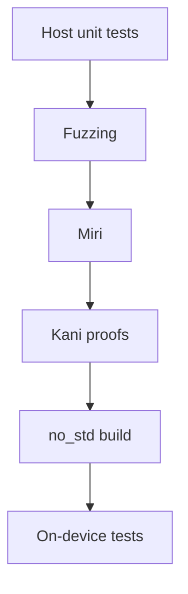
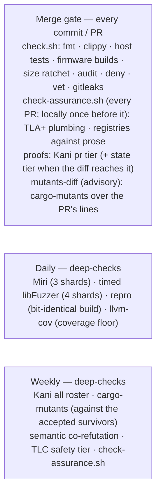

# Testing

Several layers, fastest first. The protocol and applet crates are
hardware-agnostic on purpose (only `firmware` touches the HAL), so everything
except board bring-up is tested and fuzzed on the host. The device is reserved
for end-to-end integration.

The [testing roadmap](testing-roadmap.md) describes the planned expansion of
these checks using SQLite's methods, with separate completion criteria for
coverage, failures, semantic oracles, configurations and the delivered image.

| Layer | What it checks | Where |
|---|---|---|
| Host unit tests | parsers, state machines, applets, crypto, USB transports, the display flow | `#[cfg(test)]` in each crate |
| Fuzzing | the same logic under adversarial bytes | `fuzz/` |
| Miri | the fuzz targets' logic under the UB checker | `fuzz/tests/miri.rs` |
| Kani proofs | bounded model checking — every input, not a sample | `#[cfg(kani)]` in the crates |
| `no_std` build | the crates still link for the device | default `thumbv8m` target |
| On-device tests | real USB + flash on the board | `tests/*.py` |


```mermaid
flowchart TD
    u["Host unit tests"] --> f["Fuzzing"] --> m["Miri"] --> k["Kani proofs"] --> n["no_std build"] --> d["On-device tests"]
```

Top to bottom: fast and host-only, tapering to slow and needs-a-board.

## The two commands

```sh
nix develop -c ./scripts/check.sh            # every commit
nix develop -c ./scripts/check-assurance.sh  # once, before opening a pull request
```

The first runs fmt, clippy (embedded **and** host targets, `-D warnings`), rustdoc over
every workspace (also `-D warnings`, so a broken intra-doc link fails the gate,
private items included — but only links in `///` and `//!`: a name in a plain
`//` comment is not parsed, and rots unseen), all host tests, both firmware
builds (touch + no-touch), the rsk-wipe build, a firmware flash-size ratchet
(the shipping image must stay under a ceiling that hugs its current size, well
below the 2560K code region), `cargo-audit`, `cargo-deny`, `cargo-vet` and
`gitleaks`.
Green check.sh is the bar for every commit; green check-assurance.sh is the bar
for a pull request.

The second is the gate's other layer: the TLA+ plumbing (generated
configurations, citations, scopes, verdicts, the trace and token refinements)
and the registries held against the prose (assurance, build matrix, threat
model, platform assumptions, evidence, bounds, published counts and claims, the
release manifest), with their own tables. It goes red only when a model, a
registry, a generated page, or code they cite or count moves, so it runs once
before a pull request rather than on every commit. CI runs the two as separate
jobs on every pull request, and the second weekly as well.

Two of those rows hold the crate tiers of
[architecture.md](architecture.md#crates) rather than a dependency's licence or
CVEs. `cargo-deny`'s `[bans]` stanza is the enforcing one: an applet that names
another applet, or any crate but `rsk-crypto` that names one of the four
hash/signature backends, is a banned edge and the row exits 2. The
`-D unused-wrapper` flag fails it the other way too, when an allowlisted edge is
gone and its entry has quietly become decoration. The `crate graph` row
regenerates `docs/images/crate-graph.svg` from the manifests and fails when the
committed drawing has drifted from them; its mutation table is
`scripts/test_crate_graph.py`.

## Host tests

`cargo test` must target the host explicitly (the workspace defaults to
`thumbv8m`):

```sh
nix develop -c cargo test --workspace --exclude firmware --exclude rsk-wipe \
    --target aarch64-apple-darwin
```

(The two excludes are the whole of the exclusion: they are the only workspace
members not under `crates/`, and both are thumbv8m-only. `HOST_TARGET` env
overrides the triple in `check.sh`, which selects the same way — this used to be
a hand-written 24-crate `-p` list written out nine times over four files, and
it had rotted to 16 crates here, 20 on the nightly coverage row and 12 in
`nix flake check`. `scripts/roster_gate.py` now holds every copy of the
selection to that pair, and finds the copies rather than being told where they
are.) Crypto tests pin NIST/RFC vectors; applet tests drive full protocol flows
(register → assert, PIN lockout ladders, OpenPGP import → sign → verify, PIV
generate → attest → parse with `x509-parser`).

The USB tests also execute `Ccid::run` and `CtapHid::run` over scripted
endpoints, with the real host time driver. They check fragmented requests,
power-transition resets, receive and transmit timeouts, CCID time extensions,
CTAPHID keepalives and CANCEL ownership, pipelined requests, and buffer wiping.
The fixtures live in `crates/rsk-usb/src/ccid_transport_tests.rs` and
`crates/rsk-usb/src/ctaphid_transport_tests.rs`; they do not test a physical USB
controller or host enumeration.

A default-profile measurement on 2026-10-04 raised line coverage over the four
production USB modules from 311/740 (42.03%) to 698/740 (94.32%). The standard
CI workspace selection rose from 35237/39585 (89.02%) to 35627/39591 (89.99%);
its line-coverage floor remains 80%. Test helpers and the verification-only
`transport_assurance.rs` are absent from the USB subtotal. These are line
measurements, not branch coverage.

A later default-profile run on the same date reached 38379/39591 lines
(96.94%) and 3244/3272 functions (99.14%), with the same workspace selection
and exclusions: 3064 unique tests passed, plus one isolated-process repeat,
with five existing ignored cases. The added cases exercise backup and recovery
exits, local PIN/PUK flows, passkey pagination and deletion, applet browsing and keygen, rendering errors, corrupt
records, storage failures and protocol output limits. AES, the SHA-512 core,
RSA sieve module, PIV public-info and X.509 modules, FIDO largeBlob-extension
module and SDK TLV module each reached 100% lines in that report.

The workspace is still below 100%; genuine untested paths remain alongside
defensive exits and verification helpers. Some returns cannot be reached while
their constructor invariants hold: `TxFrames` bounds both copies by the message
remainder, and Scene's encoder never writes the unknown opcodes its decoder
rejects with `unreachable!()`. LLVM's standard summaries also retain uncovered
instances of some generic code whose merged source-line counters are positive.
No exclusions or floors were changed to remove these rows.

### Branch and condition measurements

The pinned nightly can also measure branches. A default host baseline on
2026-10-04 recorded 6509/7646 outcomes (85.13%) before the new LargeBlobs and
broadcast-continuation cases. It retained the same 38379/39591 source lines
and 3244/3272 functions as the earlier line report. These raw workspace totals
include verification helpers; they are not a production-only core subtotal.

Rustc `1.98.0-nightly` (`61d7280f3`, LLVM 22.1.6) rejects native MC/DC
instrumentation. `cargo-llvm-cov` 0.8.5 still lists `--mcdc`, but its presence
does not make the compiler accept it. The compiler's `condition` option
records additional Boolean operands that `--branch` misses outside branch
conditions. It does not establish an MC/DC percentage. The calibration and
remaining scope are recorded in the [testing roadmap](testing-roadmap.md#phase-1-establish-trustworthy-coverage-measurements).

The [journal slice](testing-roadmap.md#2026-10-06-journal-decisions-and-compound-byte-cuts)
adds refused fold commits, sparse wrapping windows, checkpoint output limits and
combined byte-cut/recovery histories over `SeqStorage`. Its raw default Mac report
records 38511/39623 lines and 6934/7975 condition outcomes. Source-bound raw maps
and the full residual index remain local; no core-wide MC/DC claim follows.

A second probe executed all arms of a three-way `match`, both exits of `?`,
and empty/nonempty `for` loops. It reached 16/16 lines and 20/20 regions, but
recorded zero branch outcomes, even in condition mode. Thus the branch totals
describe instrumented outcomes, not every control-flow edge. A 0/0 subtotal
does not prove that a module contains no decisions, and 100% instrumented
branches does not establish exhaustive coverage of its propagated errors.

Use the existing nightly shell and an isolated build directory for each mode:

```sh
nix develop .#fuzz
HOST_TARGET=$(rustc -vV | sed -n 's/^host: //p')
OUT=target/coverage-decisions
mkdir -p "$OUT"

CARGO_TARGET_DIR="$OUT/branch-build" cargo llvm-cov --branch \
    --target "$HOST_TARGET" --workspace --exclude firmware --exclude rsk-wipe \
    --json --output-path "$OUT/branch.json" -- --test-threads=1

export CARGO_TARGET_DIR="$OUT/condition-build"
export RUSTFLAGS='-Z coverage-options=condition'
cargo llvm-cov --target "$HOST_TARGET" \
    --workspace --exclude firmware --exclude rsk-wipe \
    --json --output-path "$OUT/condition.json" -- --test-threads=1
cargo llvm-cov report --branch --target "$HOST_TARGET" \
    --html --output-dir "$OUT/condition-html"
cargo llvm-cov report --target "$HOST_TARGET" \
    --lcov --output-path "$OUT/condition.lcov"
```

The condition run intentionally omits `--branch`, which would select the
weaker compiler mode. On `report`, `--branch` displays the already recorded
outcomes without rebuilding. Retain rustc/LLVM versions, source revision and
working diff, feature closure, raw counters and warnings alongside the reports.
Compare configurations separately; generic instances and merged source
locations answer different questions. Neither this report nor the stable
CI line floor measures the embedded binary or native MC/DC.

The reports and calibration controls for the first slice are local ignored
artifacts in `target/coverage-decisions-20261004/`. The condition run passed
3068 unique tests plus the isolated-process repeat, with five ignored cases:
38384/39591 lines (96.95%) and 6790/7975 condition outcomes (85.14%). LargeBlobs
reached 48/48 instrumented outcomes (100%), and CTAPHID reached 89/94 (94.68%). The remaining
five CTAPHID outcomes are failures of checked copies bounded by the report,
message or nonce length; they remain in the raw denominator.

The ClientPIN/store slice in `target/coverage-clientpin-store-20261004/`
initially passed 3075 unique tests plus the isolated-process repeat. An eighth
regression reproduced a forced-PIN-change bypass on a verifier read fault and
passed after the fix (`bcdDevice` `0x0A8C`). Its final report is retained in
`target/coverage-clientpin-store-fix-20261004/`: 3076 unique tests plus the
repeat, five ignored cases, 38398/39598 lines (96.97%) and 6797/7975 outcomes
(85.23%). The condition-outcome denominator remains comparable to the first
condition run; the fix adds seven executable lines. ClientPIN reached 215/234 outcomes (91.88%),
and `rsk-store/src/lib.rs` reached 14/14 outcomes and 88/88 lines. These are
instrumented file subtotals; they do not establish exhaustive control-flow
coverage or coverage of the vendored storage backend. Three semantic controls
survived the old package suites and failed the new refusal/state assertions.
The [testing roadmap](testing-roadmap.md#clientpin-and-store-slice) records the
fault scope and limitations. Fuzz coverage is unchanged by this host-test slice.

The next eight cases recorded 38399/39598 lines (96.97%) and 6805/7975 condition
outcomes (85.33%), with 3084 unique tests plus the child-process repeat and the
same five ignored cases. ClientPIN reached 222/234 outcomes and CCID 32/34.
The [next slice](testing-roadmap.md#further-clientpin-and-recovery-decisions)
records runtime policy, migration and repeated recovery faults, its two semantic
controls and the bounded CCID header proof. Fs retains its raw 82/88 outcomes;
merging generic branch coordinates does not replace that summary. The local
reports are in `target/coverage-decisions-next-20261004/`.

Eleven credential-codec and management cases passed 3095 unique tests plus the
child-process repeat, with five ignored cases. A fresh condition build recorded
38411/39598 lines (97.00%) and 6819/7975 outcomes (85.50%). Credential codecs
reached 150/180 outcomes and credential management 126/147. The
[credential slice](testing-roadmap.md#credential-codec-and-combined-recovery-slice)
records authenticated malformed bodies, unchanged records across interrupted
recovery, two semantic controls and a bounded request-ordering proof. Its raw
reports are in `target/coverage-credentials-20261004/`; fuzz coverage is unchanged.

Eleven OATH and OpenPGP PIN cases passed 3106 unique tests plus the child repeat,
with five ignored cases. A fresh condition directory recorded 38419/39598 lines
(97.02%) and 6830/7975 outcomes (85.64%). OATH reached 436/488 outcomes and
OpenPGP PIN 173/202. The [PIN persistence slice](testing-roadmap.md#oath-and-openpgp-pin-persistence-decisions)
records retry write/read-back faults, malformed stored records, preserved DEK
copies and two compiled controls that fail on unintended authorization. Its
bounded Kani header proof reached all four cover scenarios and failed the owner
assertion when that guard was removed. Raw reports are in
`target/coverage-pins-20261004/`; fuzz coverage is unchanged.

Four PIV reference cases passed 3110 unique tests plus the child repeat, with
five ignored cases. The fresh condition report recorded 38420/39598 lines
(97.03%), 6831/7975 outcomes (85.66%) and unchanged function coverage. The
[PIV slice](testing-roadmap.md#piv-reference-persistence-and-state-proof-covers)
checks short retry read-back, refused retry restoration and verifier writes,
and malformed verifier lengths through all four reference APDU paths. A
compiled control that treats an empty read-back as complete survived the prior
default suite and failed the new refusal assertion. The Kani state runner proved
32 harnesses and reached 39 source covers with its existing ceilings. Reports
are in `target/coverage-piv-state-20261005/`; fuzz coverage is unchanged.

Twelve PIV private-operation and handshake cases passed 3122 unique tests plus
the child repeat, with five ignored cases. A fresh condition build recorded
38429/39598 lines (97.05%), 6842/7975 outcomes (85.79%) and unchanged function
coverage. GENERAL AUTHENTICATE reached 86/90 outcomes (95.56%). The
[authentication slice](testing-roadmap.md#piv-private-operations-and-handshake-decisions)
checks PIN and touch policies, sealed-curve binding, short responses and
single/mutual challenge separation through APDUs. Three compiled controls
survived the prior default PIV suite and failed the new assertions. Reports are
in `target/coverage-piv-auth-20261005/`; fuzz coverage and the proof roster are
unchanged.

Ten OTP command-decision cases passed 3132 unique tests plus the child repeat,
with five ignored cases. The fresh default-host build recorded 38430/39598
lines (97.05%), 6856/7975 condition outcomes (85.97%) and unchanged 3244/3272
function coverage (99.14%). OTP's root reached 233/270 outcomes (86.30%),
up from 219/270. The [OTP slice](testing-roadmap.md#otp-command-decisions)
checks mode/status bodies, touch results, both SWAP bounds and storage refusal
ordering. Four compiled controls survived the previous default OTP suite and
failed the new cases. Reports are in `target/coverage-otp-decisions-20261005/`;
fuzz coverage and the proof roster are unchanged.

Ten OTP recovery cases passed 3142 unique tests plus the child repeat, with
five ignored cases. A fresh condition build recorded 38444/39598 lines (97.09%),
6870/7975 outcomes (86.14%) and unchanged function coverage. OTP's root reached
246/270 outcomes (91.11%) and 603/616 lines; its record codec gained one outcome
and one line. The [recovery slice](testing-roadmap.md#otp-recovery-and-counter-boundaries)
checks repeated boot faults, fused-key loss between operations, the counter
ceiling and defensive public-APDU lengths. Three compiled controls survived
the prior OTP suite and failed the new assertions. Both existing counter Kani
harnesses verified, reaching four source covers. Reports are in
`target/coverage-otp-recovery-20261005/`; fuzz coverage is unchanged.

Five OTP transport and plaintext-record cases passed 3147 unique tests plus
the child repeat, with five ignored cases. A fresh condition build recorded
38445/39598 lines (97.09%), 6873/7975 outcomes (86.18%) and unchanged function
coverage. HID reached 34/38 outcomes and the record codec 19/20. The
[HID and record slice](testing-roadmap.md#otp-hid-transmission-and-plaintext-record-bounds)
checks every response length, replacement boundaries, malformed records,
scratch wiping and recovery. Four compiled controls survived the prior OTP
suite and failed the new tests. Reports are in
`target/coverage-otp-hid-record-20261005/`; fuzz coverage is unchanged and no new
Kani solve is claimed.

JSON/LCOV export succeeded. Both HTML exports warned about 27 mismatched
records, including the fresh condition directory. Reusing the previous build
directory for the credential slice reported 113 mismatches; rebuilding in an
empty directory restored 27 and reproduced the same coverage totals. LLVM's `-dump` diagnostic
identified four SDK functions at hash zero: `Sw::sw1`, `Sw::to_bytes`,
`Apdu::is_basic_class` and `Apdu::is_served_over_ccid`. Their matching named
records also have positive execution counts in JSON. This identifies the
affected owners. On 2026-10-05 an isolated full-workspace comparison reproduced
all 27 warnings and removed them by withholding `inline` on those four methods
only under `cfg(coverage)`. Every raw total and SDK file summary stayed identical;
the ordinary partitioned firmware's loadable bytes also stayed identical.
The original reports retain their warnings. New coverage builds use the
workaround, without excluding any source or changing the compiler pin.
Reports and the byte comparison are in `target/testing-completion-20261005/`.
This resolves the observed macOS warning, not the unsupported MC/DC or
unmeasured-profile limitations. Seventeen ARM Linux profile exports retain six
additional hash-zero mappings for `Apdu::is_secure_messaging`. A separate ARM
Linux full-workspace `fido-conformance` comparison removed all six by applying
the same attribute to that method, with identical raw totals and SDK summaries.
New coverage builds include the fifth method; the older reports remain intact.
None of these local reports is release evidence.

The existing metrics runner now reproduces these measurements by firmware
feature closure. Run it in the pinned nightly shell; the output directory must
be new so that a failed run cannot inherit an older report:

```sh
COVERAGE_PROFILE=display,strong-pin COVERAGE_OUT=target/coverage-display-strong \
  nix develop .#fuzz -c ./scripts/metrics.sh --coverage
```

With no profile it measures the default workspace. It retains the diff from
`HEAD` including staged changes, hashes the declared build inputs and saves
new untracked inputs under `untracked/`. The report stays incomplete if its
input hashes differ at the end.
Its manifest also records the applied Rust flags. Older measurements retain
their original provenance limits.

It derives the host feature arguments from `firmware/Cargo.toml`, records the
compiler, target, revision, source diff, metadata and command exits, and retains
raw JSON, LCOV and HTML.
Condition counters remain distinct from MC/DC. Zero executed tests, an empty
report or a failed command cannot produce a completed manifest. Tests of the
actual shell entry exercise those exits and metadata diagnostics on stderr.
The scheduled coverage job retains its existing default 80% line floor and
adds these reports: default daily, individual profiles on Sunday or manual runs.
The workflow changes are local and have not been executed on GitHub.

The [2026-10-07 continuation](testing-roadmap.md#2026-10-07-pin-boundaries-boot-decisions-and-ordinary-release-images)
passes 3253 unique default host cases plus the child repeat and records
38530/39623 lines, 6971/7975 condition outcomes and 3248/3275 functions.
It retains all 1004 raw missing outcomes, extends six OpenPGP command/recovery
byte-cut histories and checks thirteen ordinary release-flavour images.
Separate image controls exercise strict-up presence and strict-config refusal;
the display image has build evidence only. The roadmap retains source-bound
reports, unsupported MC/DC and timing-calibration limits.

The later [PIV cache and boot-repair continuation](testing-roadmap.md#2026-10-07-piv-cache-identity-and-boot-repair-failures)
passes 3268 unique cases plus the child repeat and records 6980/7975 condition
outcomes, retaining 995 raw residuals. It reproduces and fixes stale public-key
metadata after PIV key replacement, exercises ten semantic controls through the
host-test gate row and passes both full gates. The roadmap distinguishes LLVM's
38541/39627 function-group line summary from LCOV's 38327/39047 file-line union,
with a local calibration for overlapping closures and generic instantiations.

The separate nightly corpus replay completed all 52 fuzz targets. Unioning
their LCOV line records for repository sources reached 20568/32545 lines
(63.20%), up from 16828/32545 (51.71%). This scope includes vendored sources
and omits fuzz harnesses, external dependencies and standard-library sources;
it is neither the host-unit scope nor an average of per-target percentages.
The timed campaigns executed 99077751 inputs without a crash. The expanded
display-label target renders 32 view variants, checks pixel bounds and panel
error propagation, and compares retained replay and DMA bytes with direct
rendering. The rescue target also replays fused and faulted boots, including
failed fuse read-back and denied presence. OATH compares full and truncated
HMAC responses for SHA-1/256/512, advances HOTP, round-trips password-safe
fields through RENAME, and checks both wrong and correct access-code proofs.
Six compiled mutations were caught:
removing RSA sieve cleanup left candidate bytes, and either weakening of the
largeBlob write preconditions admitted an unauthorised overwrite. Dropping
Scene replay failed the pixel comparison, and the real `fuzz-all.sh` CI runner
exited 1 on its display shard; the restored baseline passed. Omitting the
rescue LOCK58 read-back check reported success over an unchanged fake fuse
row: the rescue CI shard exited 1, and the restored baseline exited 0. Allowing
a wrong OATH access-code proof failed the new VALIDATE oracle through its CI
shard; the original source was restored byte-for-byte and the baseline passed.

| Mutation | Observed failure |
|---|---|
| Remove RSA sieve scrubbing | Candidate bytes remain after cleanup |
| Weaken either largeBlob write conjunction | A write without every required permission overwrites the buffer |
| Omit retained Scene replay | Direct and retained pixels differ; the CI fuzz row reports `display_label` as crashing |
| Omit rescue fuse read-back | LOCK58 reports success without the complete latch; the CI fuzz row reports `rescue_apdu` as crashing |
| Permit a wrong access-code proof | VALIDATE accepts an invalid proof; the CI fuzz row reports `oath_apdu` as crashing |

Each mutation below compiled and failed its transport test on 2026-10-04.
The unmodified USB suite passed all 88 tests.

| Mutation | Observed failure |
|---|---|
| Remove CCID `reset_card` | Power transitions call no reset; two are expected |
| Remove the CCID request wipe | APDU bytes remain in `rx` after the reply |
| Remove the CCID response wipe | Response bytes remain in `tx` after sending |
| Remove CTAPHID `reset_app_selection` | Three INIT requests call no reset |
| Bypass the channel lock | A stranger receives PING instead of CHANNEL_BUSY |
| Ignore the CANCEL channel | A stranger aborts the active touch wait |
| Read during a processing wait | The pipelined second CBOR request disappears |
| Preserve TYPE_INIT in the vendor callback | The handler receives `0xC0` instead of `0x40` |

A command that writes can be put through a **cut sweep**: run it once per cut point
— the flash refuses everything past the k-th mutation — reboot on the same medium,
and read what survived. `rsk_fs::cut::sweep` holds the loop, k grows
until the command completes, and the oracle is the command's own, since only it knows
what it owns: setPIN leaves no PIN or a whole one with the old grant revoked, a
two-fragment large-blob write leaves an array that still hashes to its own trailer,
setMinPINLength leaves the old floor or the new one and never a forced PIN change
over a live grant, the vendor ATT_CLEAR never leaves the attestation key without
its chain (a key with no chain is what made every later U2F REGISTER answer
`6F00`), and credMgmt's updateUserInformation never changes a credential behind
an unmoved store-state tag. The loop asserts that some
budget tore the command and some let it finish, so one that stopped reaching the
command reads as vacuous rather than as a pass. The `power_cut` fuzz target below
does this to the storage stack; these do it to a command, where the ordering between
two records lives.

RSA has no second implementation in the tree to check itself against — the `rsa`
crate that used to serve as one left with RUSTSEC-2023-0071 — so its ground
truth is frozen instead: `crates/rsk-rsa/src/vectors.rs` holds OpenSSL
signatures and ciphertexts under three fixed keys, and every signature the card
produces is compared to them byte for byte. `scripts/rsa_vectors.py` regenerates
that file from python-cryptography; run it inside `nix develop`.

ML-DSA's ground truth is NIST's own. `third_party/acvp/` holds every ACVP-Server
case `rsk-mldsa` can express — the external interface, pure, μ computed inside:
75 keyGen, 90 sigGen (deterministic and hedged) and 45 sigVer across ML-DSA-44,
-65 and -87, one line of hex each. The host tests read them with `include_str!`,
so a missing file fails the build instead of running zero cases, and each test
asserts its count. keyGen is checked on `sk` as well as `pk`, because sigGen
signs from the vector's own `sk` and nothing else sees the `K` the seed
expansion derives. `scripts/acvp_vectors.py` rewrites the files from the pinned
ACVP-Server commit, byte for byte.

RSA's second opinion is Wycheproof's, whose cases are written to break an
implementation. `third_party/wycheproof/` holds its PKCS#1 v1.5 decryption cases
for RSA-2048, -3072 and -4096 — bad padding in every position, `c` at 0, n − 1
and n, cryptograms short, long and prepended — and its signing cases from
RSA-1024 to -4096. All 201 decryption cases run through both PSO:DECIPHER arms
behind the padding indicator a host sends: a valid one must give its message
back, an invalid one must be answered `6581`, which is what a YubiKey 5.8.0
answers every such shape. All 152 signing cases the card can hold (e = 65537)
run through both private operations, byte for byte: the asm CRT signer OpenPGP
signs with, fed the DigestInfo a host sends, and the software one a legacy key's
PSO:DECIPHER takes, fed the same PKCS#1 v1.5 block.

The `rsk-crypto` tests also replay 496 Wycheproof cases: AES-256-GCM at the
card's fixed key/nonce/tag widths, full-width HMAC-SHA1/SHA256/SHA512 tags and
HKDF-SHA256/SHA512. Valid vectors must match the output bytes; forged GCM and
HMAC tags must fail authentication, and HKDF lengths above 255 hash blocks
must return `BadLength`. The generator records every excluded group.

Key agreement gets the same treatment. Wycheproof's ECDH cases for P-256, P-384,
P-521, secp256k1 and brainpoolP256r1/P384r1 (points off the curve, compressed,
empty and of the wrong width, shared secrets that start with zero bytes) and its
X25519 cases (low-order and non-canonical peers included) run through
`PrivKey::ecdh`, 4058 in all. Wycheproof has no bare-point file for secp256k1 or
brainpool, so the script takes the point out of each case's SubjectPublicKeyInfo
and drops the cases whose SPKI is itself the fault (its ASN.1, curve parameters
spelled out or swapped), which a card never parses. A valid case must give its
shared secret at the field's width. A refusal must be the one a YubiKey 5.8.0's
OpenPGP makes: `6A80` (`BadPoint`) for anything but `04 ‖ x ‖ y` at the field's
width, compressed points included, and `6581` (`RejectedPoint`) for such a point
off the curve or an X25519 peer that agrees to all zeros. The other X25519 cases
agree as RFC 7748 computes them.
`scripts/wycheproof_vectors.py` rewrites the files from the pinned commit.

Fixed vectors cannot say which imported `(p, q, e)` a key assembly *refuses*, so
that half is settled by a differential against `rsa` 0.9.10 in a throwaway crate
**outside** the workspace — `rsk-rsa` by path with `test-util`, plus
`rsa = "=0.9.10"` — because the crate must not come back into any lockfile the
SCA rows read. Rebuild it whenever the key assembly moves. Two things it teaches
about itself: the comparison has to be *reachable* (a first attempt gated it
behind `ra.is_ok() || ra.is_err()`, which is always true, and reported zero
mismatches over zero comparisons — falsify each arm by perturbing one side), and
upstream cannot be asked about an unbalanced key at all, because its CRT
recombination is `while m.is_negative() { m += p }` and for `q ≫ p` that does not
return.

`rsk-display` is the odd one: its subject is a *screen*, and it is tested by
giving the flow a panel that records what was drawn, a touch pad that reads back
a scripted sequence of samples, and a board whose backlight, wake button and
presence flags are plain fields. The panel and the touch controller are type
parameters and the rest sits behind `Hooks`, so the gestures that carry the
security — the hold that approves a ceremony, the retry ladder behind the PIN
pad, the auto-lock a host must not be able to postpone — run on the host at the
same code the board runs. `embassy-time`'s `std` feature supplies the clock, so
the deadlines and debounces are the real ones (see `crates/rsk-display/src/tests.rs`).

## Fuzzing

Every parser **and every applet's full dispatch** has a `cargo-fuzz` target.
30+ of them: APDU, BER-TLV, CTAPHID reassembly (+ round-trip property), CCID
framing, all the FIDO command surfaces (CBOR dispatch, credentials,
credMgmt, U2F, extensions, large blobs, the vendor backup/lock commands,
half that corpus runs soft-locked), OpenPGP dispatch + the EC/RSA crypto
parsers, OATH/OTP/PIV/management/rescue dispatch, the keyboard frame codec,
the phy TLV codec (parse∘serialize round-trip is an asserted invariant), the
PIN protocols, AEADs, the DRBG, ML-DSA (all three parameter sets: attacker-shaped
verify decode, plus a keygen→sign→verify property that a one-bit tamper must
break) / ML-KEM decoding, the FIDO post-quantum credential path (the
`(alg, curve)` box codec + `CredKey` dispatch → sign / COSE-AKP encode), the
trusted-display `Label` sanitizer (attacker rpId / account text must stay
printable ASCII, no bidi / homoglyph escape, and the confirm screen must
render without panic), and the seed-blob format/migration state machine.

The CCID target varies response capacity, including buffers shorter than the
header, and exercises XfrBlock refusals and both APDU range parsers. Its
framing oracle checks response length, slot status, sequence echo and untouched
buffer tails. `fuzz/fuzz_targets/ccid_frame.rs` is shared by libFuzzer and Miri;
the three sibling tests raise the Miri roster floor from 48 to 51.

OTP HID also shares its RX/TX oracle with Miri. Independent response histories
exercise load, poll and replacement without needing a valid RX CRC first.
Assertions check CRC bytes, sequence, padding, the pending end marker and
unchanged output after exhaustion. Four sibling tests raise the roster to 55.

| Mutation, checked on 2026-10-04 | Shared-oracle failure |
|---|---|
| Remove the short-output guard | The reported response length exceeds capacity |
| Replace the echoed sequence with zero | The response loses the request's `bSeq` |

Most targets drive one applet from a fresh state. Four are **stateful**. They
replay an attacker-chosen *sequence* against persistent state, hunting the
multi-step seams a fresh-state target can't reach (both real bugs of this
class, the largeBlobs overflow and the mgmt write→read mismatch, were
multi-step):

- `cross_applet` wires the real `Dispatcher` to the OpenPGP / Management /
  OATH / OTP / PIV set over a single shared `Fs`: SELECT switches, command
  chaining and the file system persist across APDUs. State leaking between
  applets, a SELECT mid-chain, FID collisions. (GENERATE is skipped, as on
  device the RSA prime search is fast-pathed off the dispatcher.)
- `fido_session` replays a CTAPHID_CBOR message sequence against one
  `FidoState` + `Fs` with an all-permissions token armed and a resident
  credential provisioned. PIN/token state, the credential store, large blobs
  and the journal persist across commands. `now_ms` advances over the
  token-timeout edges. A mid-sequence reset wipes the store under the
  session's feet. getInfo must still succeed after anything.
- `fs_ops` drives put / read / delete / meta ops / reboot
  (`into_storage`→`scan`) over one image against a `HashMap` shadow model:
  every read checks the full-length-returned / copy-clamped contract (the
  mgmt bug was a caller missing it), `meta_add` is checked against the exact
  `META_MAX` boundary, and the live key set must equal the model's after any
  prefix of operations.
- `power_cut` is the torture extension of `fs_ops`: the same op-sequence
  shadow model, but over the on-device storage stack itself — `rsk-store`,
  the two `sequential-storage` partitions with their counter-FID routing and
  caches — on a mock NOR flash whose power can be cut after any byte of any
  write or erase. It tortured a hand-written mirror of that stack until the
  backend moved into a crate; the mirror had drifted (no `last_error`, no
  `compact`, a missing counter FID), which is the argument for not having one. Once a cut fires, a
  dead-latch fails every further mutation (a dead device cannot keep
  writing), the stack is rebuilt with fresh caches over the surviving bytes,
  and the model checks atomicity (the torn op reads as old or new, never
  garbage; a torn `delete` never leaves the value gone but its metadata
  alive), durability (every committed file reads back exactly; a spurious
  "absent" is the on-device "seed lost" disaster), and the key set. Cuts
  landing inside the next mount's own repair are survived by dying again. A
  dedicated input class also runs the real FIDO reset on that same store,
  checks `ResetNeverWeakensSurvivingState` after boot-time seed provisioning,
  then mounts a second time to cross the reboot boundary again.

```sh
nix develop .#fuzz -c cargo fuzz list
nix develop .#fuzz -c cargo fuzz run <target> -- -max_total_time=60
```

The fuzz workspace is separate (nightly + libfuzzer), but check.sh lints it on
stable — the `clippy (fuzz)` row, `--all-targets` against the host target — so a
shared type change that breaks a target fails the gate rather than the next
nightly. The instrumented build still needs the nightly shell:
`nix develop .#fuzz -c cargo fuzz build`. House rule: new attacker-facing parser
or dispatch surface ⇒ new fuzz target in the same change.

**Miri** runs every target's logic once more as plain tests under the UB
checker, reporting undefined behavior instead of panics (`fuzz/tests/miri.rs`;
the `MIRIFLAGS` policy is set by the `.#fuzz` shell):

```sh
nix develop .#fuzz -c cargo miri test --manifest-path fuzz/Cargo.toml
```

Both build the **default** image, where the shipped flavours — `strict-config`,
`fips-profile`, `strong-pin`, `strict-up`, `always-uv`, `advertise-pqc` — are
compile-time off, so nothing behind one of the 67 `feature = "…"` sites they guard
in the crates this workspace builds is fuzzed at all. `FUZZ_CONFIG=flavours` builds
the `flavours` union in `fuzz/Cargo.toml` instead, and CI runs each row once per
config. The knob belongs to the two runners — a bare `cargo miri test` takes
`--features flavours` itself. The union forwards as the firmware's manifest does,
with one difference it cannot dodge: this workspace always enables
`rsk-device/display`, so two sites written `any(not(strict-config), display)` stay
compiled here where a display-less `strict-config` image drops them.

```sh
FUZZ_CONFIG=flavours nix develop .#fuzz -c ./scripts/fuzz-all.sh
```

Neither suite gates a commit. CI runs both daily in the `deep-checks`
workflow: the Miri suite, plus a timed libFuzzer pass over every target with
the corpus carried between runs, crash artifacts uploaded. A separate
`fuzz-coverage` job then measures per-target region/line coverage over that
accumulated corpus (`scripts/fuzz-coverage.sh`, run it the same way locally),
writing a summary table and uploading a per-target HTML report. A
`for t in $(cargo fuzz list)` word list reports green when the list is empty, so
both loops floor the roster first — `FUZZ_TARGET_FLOOR` in the workflow and the
same number in the script. Lower it only in the commit that removes a target.

Coverage says which *lines* a corpus reached. `scripts/fuzz-dimensions.py` says
which **inputs** it explored, for `power_cut`: how much of the storage was
invalid before init, how many operations and distinct FIDs an exec drove, how
many times the power went, how many erases and bytes the store spent. It replays
a corpus with `RSK_POWER_CUT_STATS=1` and prints one log-bucket row per axis.

```sh
nix develop .#fuzz -c ./scripts/fuzz-dimensions.py fuzz/corpus/power_cut
```

It gates nothing and is not in CI — there is no fuzz-coverage floor, and a
reporter that looks like a gate is worse than none.

## Kani proofs

Where a fuzzer samples inputs, [Kani](https://model-checking.github.io/kani/)
(a bounded model checker over CBMC) checks **every** input up to a stated
bound: no panic, no overflow, no out-of-bounds access, and the asserted
invariants hold. The harnesses live next to the unit tests as
`#[cfg(kani)] mod proofs` and cover the small, total, attacker- or
crypto-critical helpers, where a proof genuinely beats a sample:

- `rsk-sdk`: BER-TLV walk over arbitrary bytes — every yielded value is a
  sub-slice of the input, and successive values neither overlap nor run
  backwards; `format_len` round-trip for every `u16`; APDU case-1..4 parsing
  over every buffer up to the bound; and the **dispatcher over every *pair* of
  raw APDUs** up to six bytes each — the one harness here that applies a
  sequence to a stateful object, because command chaining's three audit
  findings each needed two commands to express. It pins that the applet is
  never handed a body from a command it did not itself terminate, that a
  dropped chain leaves no bytes behind, that a secure-messaging class reaches
  no applet as a command and selects only as a SELECT under `04` or `84`, and
  that a SELECT for a registered AID in any other class always arrives. Its bound is
  a `cfg(kani)` shrink of production source — the table below is the whole set —
  and it states what it stops proving where it is written, this one in
  `applet_kani.rs`.
- `rsk-fs`: the `EF_META` record-walk (`rebuild_meta`) over arbitrary (corrupt)
  blobs — nothing written past the length it reports, and the old record for the
  rebuilt fid is **gone** from the output, which is what `meta_delete` and
  `meta_add`'s replace both mean. Stated by feeding the output back through the
  same function rather than by a second decoder, which would only prove two
  copies of one walk agree.
- `rsk-rsa`: `mod_small` proven *functionally* (`== v % m`, every
  dividend up to 2 bytes and every modulus) and panic-free / `< m` for every
  input up to 8 bytes; the `IncrementalSieve` residue invariant
  (`res[i] == cand mod p_i` after a step, verdict identical to the flat
  sieve) for every seed, plus the concrete-seed twin that keeps that invariant
  from holding over a sieve which never steps.
- `rsk-crypto`: the `base64url` length helpers (`encoded_len` / `decoded_len`)
  panic-free (no overflow/underflow) and mutually inverse for every length up
  to 64 KiB; `encode∘decode == id` for every input up to 9 bytes (every
  `len % 3` tail, with and without preceding full chunks); `decode` panic-free
  over every byte string up to 8 chars and writing exactly the length it
  reports, never a byte past it.
- `rsk-phy`: the `EF_PHY` device-configuration record: `parse` total over
  every byte string up to 12 bytes, always materializing an interface mask and
  always yielding a record that serializes back into `PHY_MAX_SIZE` (the
  read-modify-write the rescue interface performs); `overlay` never turning a
  stored field back into "absent", and leaving a field whose tag the host blob
  never mentions exactly as it was — the merge's own promise, and the
  data-loss one; `serialize∘parse == id` for every `PhyData` (every
  field-presence combination and value, product strings up to 4 bytes), modulo
  the documented missing-ENABLED_USB_ITF→ALL normalization.
- `rsk-device`: the presence-scope arbitration — one physical button, four
  transports. Over a symbolic interleaving of button samples and host cancels,
  a touch wait ends `Cancelled` only for the transport that owns it (so a CCID
  or on-panel wait cannot be cancelled at all), is advertised as pending to that
  transport and no other, and one unbroken hold satisfies at most one ceremony.
  Those are `NoCrossTransportTouchConsumption`'s `TouchCancel` and `TouchConfirm`
  clauses; the arbitration was lifted out of `firmware/src/presence.rs` so a
  harness could reach it, since no `cargo kani -p` builds a thumbv8m binary.
- `rsk-fido`: the tree's only **state-sequence** proofs. The others each check
  one call; these drive a symbolic four- to five-operation sequence over the
  real `FidoState` and check an invariant after every step — a pinUvAuthToken
  dies on each invalidation and only a fresh issuance brings one back
  (`NoTokenAfterInvalidation`, asserted both on the state the call sites read
  and on the real `verify_cm_token` with a replayed genuine MAC), and a
  credentialManagement enumerate walk is servable only to the channel whose
  *Begin* opened it (`NoAuthorizationBypass`). The names are the ones
  `formal/RSKeySecurityState.tla` uses, so one property can be traced model →
  code → harness by grep. Phase 6 adds four one-step induction harnesses over
  the reset's security-visible concrete projection: initialization and every
  begin/delete/advance/abort/finish/power-cut step preserve
  `ResetNeverWeakensSurvivingState` and its three independently named clauses.

### What a proof no longer sees

Some of that production source means something different under Kani than in the
shipped build: an array cut to 16 so CBMC does not bit-blast 3 KiB, a file id
aliased into a 24-bit map. Each such shrink narrows every proof over it, so each
one says beside itself what it stops proving — and eight `cfg(not(kani))`
compile-time assertions carry the part of that shape a shrunk proof no longer
can, about the width that ships.

| Crate | Source | Kani-only item |
|---|---|---|
| `rsk-device` | `ccid.rs` | `const _` |
| `rsk-device` | `ccid.rs` | `const _` |
| `rsk-device` | `ccid.rs` | `const _` |
| `rsk-device` | `ccid.rs` | `const _` |
| `rsk-device` | `ctap.rs` | `const _` |
| `rsk-fs` | `fs.rs` | `FID_PRESENT_BYTES` |
| `rsk-fs` | `fs.rs` | `const _` |
| `rsk-fs` | `lib.rs` | `EF_META` |
| `rsk-openpgp` | `lib.rs` | `const _` |
| `rsk-sdk` | `applet.rs` | `CHAIN_BUF_SIZE` |
| `rsk-sdk` | `applet.rs` | `FRAME_BODY` |
| `rsk-sdk` | `applet.rs` | `RESP_BUILD` |
| `rsk-sdk` | `applet.rs` | `RESP_CHAIN_CAP` |
| `rsk-usb` | `ctaphid.rs` | `CTAP_MAX_MESSAGE` |
| `rsk-usb` | `ctaphid.rs` | `const _` |

`scripts/shrink_gate.py` derives that table from the crates and fails the merge
gate on either direction — a shrink that arrives unrostered, and a row whose item
has gone away — and on one that carries no reason above it. The rows are names
only, deliberately: the values and the reason live in the code, and copying either
here would give them a second place to rot — which is what the sentence above did
until now. It said "one of four in the tree" and named three of them, having twice
stayed green while a new shrink arrived, and `rsk-sdk` shrinks two constants rather
than the one it was counted for.

Kani is **not** in nixpkgs and its setup downloads a prebuilt CBMC bundle, so
this is the one deliberately non-nix tool (install once, outside the dev
shell):

```sh
cargo install --locked kani-verifier --version 0.67.0 && cargo kani setup
./scripts/kani.sh pr       # the fast tier — what every pull request runs
./scripts/kani.sh state    # rsk-fido + rsk-fs, the security-state sequences
./scripts/kani.sh all      # every harness — the roster, and the local command
./scripts/kani.sh light1   # one of the three weekly shards of "all but heavy"
./scripts/kani.sh light2
./scripts/kani.sh light3
./scripts/kani.sh heavy    # rsk-phy alone, in its own job
```

`scripts/kani.sh` owns the tier → crate table and nothing else does, and it
floors the number of harnesses each tier has to come back with — a roster that
selects nothing prints a summary and exits 0, the same shape as a `cargo test`
name filter that matches no test. `scripts/kani_gate.py` reads that table back
with `--tiers` and fails the merge gate on a crate that carries a
`#[kani::proof]` and is on no tier.

It also reads back every `kani::cover!`, because **Kani does not fail a harness
on one nothing satisfies**: 0.67.0 has no `--fail-uncoverable`, so an
unsatisfiable or unreachable cover prints "N of M cover properties satisfied"
and the run still reports SUCCESSFUL. Since a cover is what says a guarded
assertion was reached at all, that made every "vacuity guard" in the tree a
comment. The row groups Kani's per-check verdicts by harness and source location
and fails on a cover no execution reaches — *grouped*, not off that summary line,
because one `cover!` becomes several CBMC properties wherever the enclosing MIR
branches on something the condition re-tests, and the copies on the contradicting
arms are dead by construction. `rebuild_meta_any_blob` is the worked example: its
`!with_new && …` cover is reported twice, UNSATISFIABLE on the `with_new` arm and
SATISFIED on the other, and the summary line says "2 of 3" over a cover that is
genuinely reached. Reading the summary would have failed a correct harness and
sent someone to repair it.

That grouping is why `scripts/kani.sh` refuses `--jobs`. Extra arguments go
through to `cargo kani`, and parallel harnesses would interleave `Checking
harness` with another one's checks, filing every verdict under whichever printed
last. On the pinned 0.67.0 that cannot actually happen: `--jobs` there *requires*
`--output-format=terse` and refuses the combination otherwise, and a terse run
carries no per-check listing at all — which the row already fails on, by name. So
the refusal buys a message that says which flag and why, one step before a run
that would otherwise die half an hour later on a confusing one. It is also the
thing that has to be revisited if a later Kani lets the two combine, because then
the interleaving becomes real and grouping by harness stops being safe.

The split is by measured cost, not by guess — but a row is not one reading, and
its two halves must not be read as if they were. **Crates, Harnesses and Covers
are the current tree's counts**, derived from source by `scripts/kani_gate.py`
and held against `scripts/kani.sh`'s floors in both directions; they move the day
a harness lands, and no run stands behind them. **Solve, Wall, Peak and Slowest
harness are a measurement**, of one run of the command above the table, taken on
2026-08-26 under kani 0.67.0 on the maintainer's 18-core Apple M5 Pro (48 GB,
macOS 27) with nothing else on the machine. Nothing re-checks those four:
`kani_gate.py` reads a row's Crates, Harnesses and Covers cells and stops there,
so a tier that has gained harnesses since keeps the timing it was given before
them, and only a fresh measurement moves it. "Solve" is the sum of Kani's own
per-harness `Verification Time` and so excludes compilation; "Wall" is the whole
command with it. "Peak" is the tier's `maximum resident set size` under
`/usr/bin/time -l` — the largest single CBMC process, not the sum of them:

| Tier | Crates | Harnesses | Covers | Solve | Wall | Peak | Slowest harness |
|---|---|---|---|---|---|---|---|
| `pr` | 13 | 70 | 58 | 229 s | 251 s | 2.8 GiB | `rsk-usb::no_buffer_overrun_after_any_single_frame`, 39 s |
| `state` | 2 | 32 | 39 | 1341 s | 1365 s | 15.3 GiB | `rsk-fido::…_at_call_site`, 6 m 06 s |
| `all` | 17 | 102 | 87 | 3735 s | 3770 s | 19.0 GiB | `rsk-phy::serialize_parse_roundtrip`, 19 m 07 s |
| `light1` | 4 | 35 | 38 | 528 s | 538 s | 9.3 GiB | `rsk-fido::…_at_call_site`, 5 m 35 s |
| `light2` | 5 | 29 | 12 | 1289 s | 1300 s | 8.9 GiB | `rsk-rsa::sieve_step_keeps_residues`, 17 m 38 s |
| `light3` | 7 | 33 | 36 | 162 s | 176 s | 2.4 GiB | `rsk-usb::no_buffer_overrun_after_any_single_frame`, 36 s |
| `heavy` | 1 | 5 | 1 | 1785 s | 1788 s | 19.9 GiB | `rsk-phy::serialize_parse_roundtrip`, 18 m 35 s |

On 2026-10-05 the `pr` runner verified its current 70 harnesses and reached all
58 source covers, with 418 seconds of solving. Three OTP additions cover TX
load/replacement bounds, one RX report and plaintext record reads. Their CRC
and slot-domain abstractions are stated in the [testing roadmap](testing-roadmap.md#otp-hid-fuzz-oracle-and-copy-proofs).
The table's wall, peak and weekly timings remain the older readings below.

> **`state` is the one row re-measured after the authorization slice, and it
> more than doubled.** Three new `credmgmt_kani.rs` harnesses drive a real
> `pinUvAuthParam` through `verify_cm_token`, and an HMAC-SHA-256 evaluation is
> what a bounded proof pays for at this call site: measured, a harness whose only
> content is two of them costs 233 s on its own. Solving went 546 → 1341 s and
> the peak 9.3 → **15.3 GiB**, over what a hosted `ubuntu-latest` has. `state` is
> a CI step (`ci.yml`, gated on `proofs_state`), and **the margin is negative
> before the OS is counted**: the measured peak is 16 418 144 256 bytes and a
> `ubuntu-latest` runner is advertised at 16 GB — 16 000 000 000 bytes — so the
> single largest CBMC process is already 418 MB over the machine's whole RAM,
> with the kernel, the runner agent and cargo still to fit. Three ways out, and
> the one that is **cheapest to reverse is the first**: a larger `runs-on:` label
> is one line, moves no floor and re-measures nothing. Shrinking a `cfg(kani)`
> constant across `rsk-fido` (`CredMgmtState::rp_index` alone is 1 KiB of
> symbolic struct) changes every existing proof's domain, owes each one a "what
> stops being proved", and cannot be undone without re-measuring the ratchets a
> second time. Moving the crate to a weekly-only tier is one commit but takes
> `rsk-fido` out of PR-time proof coverage, which is a gate weakening rather than
> a scheduling change. The other six rows were NOT re-measured; their harness and
> cover counts moved with the ratchets and their timings are the 2026-08-26
> reading.

Every tier came back at exactly the floor it carried that day: the four weekly
shards ran separately in the same session and checked the same harness names as
`all` did, compared name by name out of the four logs against `all`'s own
listing, for 3763 s of solving against `all`'s 3735 s. That count was the `all`
roster **of the 2026-08-26 tree: 89 names**. The same tier is **today's
`FLOOR_all` of 102** — the `all` row above, thirteen harnesses later — and the four
weekly floors still sum to it, because the shards partition the crates and
`kani.sh` refuses to run when they stop. The count adds up; the *solving* does
not, which is what 3763 s against 3735 s says. So `FLOOR_all` and `COVERS_all`
are numbers a run has reached, and the reading they have reached is the 89 —
moving it onto the 102 takes a fresh run of the four shards.

Two figures this page carried are refuted by that run rather than confirmed.
`rsk-phy`'s tier peaks at **19.9 GiB** against the 11.1 GB recorded for the
harness alone while it still lived in `rsk-rescue` — not a like-for-like pair,
and not a close one either, wrong in the direction that makes `heavy`'s own job
more necessary rather than less. And `light3`'s slowest harness is not
`rsk-mldsa`'s rounding round-trips: all four of those together take 3.7 s, and
the shard's cost is `rsk-usb` at 54 s and `rsk-led` at 36 s. So the three shards
are balanced 528 : 1289 : 162 s, and the crate placed in `light3` to weigh it
down weighs nothing. Left as it is on purpose — re-balancing moves harnesses between
shards and every shard floor with them, which is a change to make deliberately
and not as a side effect of measuring.

**Where each of these has actually run.** The four weekly shards are the CI half.
`deep-checks.yml` run 32621720655, the Sunday cron of 2026-08-23, took `light1`
20 m 33 s, `light2` 54 m 52 s, `light3` 4 m 59 s and `heavy` 1 h 33 m 41 s on
hosted `ubuntu-latest` runners, all four inside the 6 h job cap — and only one of
the four is a reading of the roster above. That run was `main` at `06813cc1`,
where `FLOOR_all` was 66 against today's `FLOOR_all` of 102, `light1` carried 17
harnesses against today's `FLOOR_light1` of 35 and `light2` 21 against today's
`FLOOR_light2` of 29. A run that proved 17 of `light1` is not evidence for a
`light1` floor of 35.

By *cost* it reads better than by count, and the two answers should not be
conflated. Every harness the three shards have gained since is in one crate each
— `rsk-fido` 3 → 14 in `light1`, `rsk-fs` 5 → 13 in `light2`, `rsk-usb` 3 → 9 in
`light3` — and the single harness that dominates any of them,
`rsk-rsa::sieve_step_keeps_residues` at 82% of `light2`, was in that run already.
So the times are better evidence than the floors are. `heavy` needs no such
correction at all: 5 harnesses and 1 cover then and now, over a proof file
`189f24c` moved byte-identical. It is also the job that died twice while this
split was being drawn, which makes its 1 h 33 m 41 s the figure that mattered.
The three `light*` floors still owe a reading, and the next Sunday cron is the
first that can give them one.

`all` is the maintainer's half and stays off CI by arithmetic: one job costs what
the four cost between them, which on this machine is 3770 s of wall clock against
their 3802 s. It runs where the table says.

None of the fourteen figures in the Harnesses and Covers columns is kept by hand, and
neither are `kani.sh`'s `FLOOR_*`/`COVERS_*`. `scripts/kani_gate.py` counts the
tree's `#[kani::proof]` and `kani::cover!` per tier — comments stripped, since two
`*_kani.rs` files discuss `kani::cover!` in prose — and fails the merge gate on
any of the four copies that disagrees, in either direction. They *had* been kept
by the instruction "raise it in the commit that adds one", and `FLOOR_all` drifted
to 64 against a tree of 65: one harness could have gone missing under a floor that
still passed.

`pr` passes `--harness-timeout 5m`. That cap is
the tripwire on the tier assignment: a fast-tier harness that grows past it
fails the pull request instead of quietly making every one of them wait, and the
answer is to move its crate to the slow list, never to raise the cap.

A harness that trips its cap ends the whole row, and it ends it *above* the floor
checks: `cargo kani` exits 1, `pipefail` makes that the pipeline's, and the script
stops at the `tee`. Both measured on kani 0.67.0, 2026-08-13. That is why `all`
and the four weekly tiers now cap at `6h`, the runner's own ceiling: there a cap
that fires costs the row its floors, so it reports nothing rather than reporting
a slow proof. The 30-minute cap it replaced had an 8% margin over
`serialize_parse_roundtrip` at 27 m 42 s and none at all against the ~80 min a
hosted runner once recorded; the harness takes 18 m 35 s on the machine above.

Pin the version — a verdict belongs to the tool that gave it, and an unpinned
install is not the one CI runs. `--harness-timeout` is experimental (hence the
`-Z`) and applies per harness, not per run: one that stops converging is failed
after half an hour and the rest still run, so a verdict comes back at all
instead of the run hanging on it.

The proofs are bounded, and the bound is the honest fine print. A 16- to
20-byte symbolic buffer reaches every branch of the TLV/APDU parsers; bigger
inputs are the fuzzers' job. Big loops (a full modexp, Baillie–PSW) are out of
CBMC's reach by design and stay covered by the differential tests and on-device
KATs.

For a sequence proof the bound is the sequence, and three more walls stand behind
it. **Cost:** one HMAC-SHA-256 evaluation over concrete bytes costs CBMC ~130 s,
so a harness that drives a real MAC-checking gate can afford it once at the end,
never once per step. **Codegen:** a harness that reaches p256's field arithmetic
aborts in codegen — Kani 0.67.0 panics on `crypto-bigint 0.7.5`'s
`UintRef::lowest_u64` (*"BinaryOperation Expression does not typecheck Plus …
FlexibleArray"*), upstream
[kani#2683](https://github.com/model-checking/kani/issues/2683) — whose
`ConstantIndex` path `main` fixed in
[#4681](https://github.com/model-checking/kani/pull/4681), in no release, and
without closing the issue. It is the *build profile* that selects that path, not
the dependency: the crash needs a MIR `ConstantIndex`, which every `opt-level`
but `0` produces (swept 0/1/2/3/s/z), so
`[profile.dev.package.crypto-bigint] opt-level = 0` removes it — measured, and
**this tree deliberately does not carry that override**, because the wall behind
it stands anyway. Merely *holding* a `Ctx` never triggers it either: Kani
codegens what a harness reaches, not what its types mention. **Reach:** behind
the ICE sits `cmov 0.5.4`'s `asm!` backend, reached via `ctutils`, which Kani
cannot model on either host target — it answers `VERIFICATION: FAILED` on an
unsupported reachable construct (measured), so the path is closed loudly, never
by a silent pass. Hence three of the four token gates are represented by the
state predicates they read rather than invoked. Each harness names what it does
not prove.

The sharpest bound is on *functional division* specs. Proving
`mod_small == v % m` makes the solver equate two division circuits
(`mod_small`'s byte-wise Horner reduction against one wide `%`), which is the
shape resolution-based SAT handles worst: it discharges in ~100 s at a 2-byte
dividend, but the cost climbs steeply per added byte and a full `u32` dividend
(4 bytes) does not converge (it ran ~30 min without a verdict; the early
`SATISFIABLE` lines are Kani's reachability covers, not the property). So
`mod_small`'s exact value is pinned exhaustively at 2 bytes
(`mod_small_matches_value`), its panic-freedom and range over the full 8
(`mod_small_in_range`), and the full-width semantics by the 32-byte BigUint
differential test plus the division-free `IncrementalSieve` proof. The earlier
instinct, "never spec a division functionally", was half right: avoid it at
*wide* dividends; at a narrow width it is the strongest evidence there is.
House rule: a small total helper in a parsing or arithmetic hot path gets a
proof harness sized to what CBMC can swallow: functional where it converges,
structural (`< m`, panic-free) where it doesn't, or relational against a
division-free reformulation. Anything bigger gets a fuzz target.

CI runs the tiers above, from this same script (rustup-based, version pinned,
`~/.kani` cached — Kani is the one tool outside the nix shell). `ci.yml`'s
`proofs` job runs `pr` on any change under `crates/`, and adds `state` when the
diff reaches `rsk-fido`, `rsk-fs`, `rsk-store` or `rsk-wipe` — the surface those
sequence proofs are about (`scripts/ci-scope.sh`, `PROOFS` / `PROOFS_STATE`,
both covered by its `--self-test`). `deep-checks.yml`'s weekly `kani` job runs the
three `light*` shards and `heavy`, one runner each, which together are `all`.

`scripts/kani_gate.py` is in the merge gate and holds the tiers to their word:
the `all` tier must be exactly the crates carrying a `#[kani::proof]` less the
exclusion below, every other tier a non-empty subset of it, every tier both run
by a CI row and written on this page, and no workflow or page may hand-write a
`cargo kani … -p …` roster of its own. That guard exists because the row named
"prove every harness" was running 29 of 49, and because commenting the `run:`
line out once left the file's other copies agreeing with each other over a job
that proved nothing. Its own mutation table is `scripts/test_kani_gate.py`.

One crate is deliberately off the tiers. `rsk-bench`'s `summarize` sorts
`samples[warmup..]`, whose length is symbolic, so CBMC unwinds it unbounded and
returns no verdict — not in 5 minutes, and not with `--default-unwind 5`. The
exclusion and its reason live in that guard, next to the roster it belongs to.

## The security-state model (TLA+)

`formal/RSKeySecurityState.tla` models the authenticator's security state
machine — PIN retries, the pinUvAuthToken and its permissions, which transport
owns the touch, which channel owns a stateful walk, the reset window, the
persistent gate records, and the position at which power is lost inside a
multi-write flash sequence. TLC checks eight security invariants exhaustively at
the firmware's own PIN-retry constants — `Shipped.cfg`'s INVARIANTS block names
nine, and `TypeOK` is the one no mutant targets. Four of the eight are also Kani
harness names — three in `rsk-fido`, `NoCrossTransportTouchConsumption` in
`rsk-device` — so those four read model → code → harness by grep.

It exists because Kani proves a property over *one call* and RS-Key's dangerous
defects have lived in *orderings*. It is a **design artefact, not a proof of the
firmware**: a green run is a statement about the model. `formal/README.md` is
its scope statement — what it covers, where it departs from the firmware **and
in which direction**, the mutation experiment that keeps its invariants
falsifiable, and the counterexamples it has produced on the shipped tree. Read
that before quoting a result from it.

```sh
nix develop            # exports TLA2TOOLS_JAR; the JVM comes with it
cd formal && ./gen-configs.sh && ./run-tlc.sh safety   # the tier CI runs
```

<!-- run-count-tlc-roster:start -->
<!-- Generated by scripts/run_count_gate.py --write; do not edit. -->
`safety` is the nine shipped models, the 108 mutation switches that have a
configuration family of their own (110 `Bug*` switches exist;
`BugDeadTokenAuthorized`, `BugRecordWriteBeforeRearm` have none), floors and
the vacuity check.
<!-- run-count-tlc-roster:end -->

That tier is `deep-checks.yml`'s weekly `formal` row, which also fires on any
push touching `formal/`. `liveness` is the temporal half and is not in CI: it
needs a 12g heap. `all` is both. Tier membership lives in `formal/run-tlc.sh`.

<!-- run-count-tlc-measured:start -->
<!-- Generated by scripts/run_count_gate.py --write; do not edit. -->
Both tiers are measured runs, not sums. On 2026-10-01, on the Apple M5 Pro (18
cores) of the Kani table above at the default `WORKERS=2`, `safety` came back
over **262 configurations in 8774 s — 26 GREEN, 236 RED, and not one row that
missed what `floors.txt` asks of it**; `liveness` took **2809 s** for its 4, at
the heap that file gives each of them.
<!-- run-count-tlc-measured:end -->

Every number in that paragraph is counted out of `formal/runs.toml`, which keeps
the runner's own matrix per tier; `scripts/run_count_gate.py` writes the
paragraph and refuses a run-count typed anywhere else on this page. CI has the
`safety` half: `deep-checks.yml` run 32684551258 discharged it in 1 h 14 m 47 s
against a 120-minute cap.

> **That cap is the thing to watch, and the margin shrank once already.**
> `safety` was 2003 s here before the token-less `makeCredential` widening, and
> `Shipped.cfg` alone went 48 679 968 distinct to the count the generated
> paragraph above prints — which is why what it costs now is not typed here.
> The CI figure was measured on that older tree, so scaling it by the ratio
> between the two local readings is the only projection available, and it
> leaves the row minutes of headroom rather than the three quarters of an hour
> it used to have. Nothing has timed out — that is a projection off one local
> ratio, not a measurement of the runner — but the next model widening should
> re-measure the CI row before assuming it fits. `liveness` has no CI row and is
> the maintainer's, and
`Liveness_Full.cfg` is nobody's yet — `floors.txt` reserves it a 24 GB heap that
no run has asked for.

The emulator CI also records raw security-state snapshots from the real
`21_pin_webauthn` suite and replays them against `RSKeySecurityState`. R4a
independently computes β from the raw fields; R4b compares the implementation's
untrusted `abstract_token()` hint with the canonical TLA+ γ. The gate floors the
trace at 10 commands, 20 B steps and 12 distinct actions, reports model actions
not reached by traffic, and keeps one β mutation plus one α-only mutation RED.
See `formal/README.md` for the exact boundary and claim.

Phase 5 adds a narrower but connected refinement pilot for the token lifecycle.
Its A relation and domains are exported by computation into Rust, TLC checks
B→A, Kani checks bounded C→A obligations, and the emulator carries raw outcomes
through a consensus validator. See [Token refinement pilot](token-refinement.md)
for the exact InitC/wf boundary and the reset evidence table.

Phase 6 closes that pilot's reset/reboot seam for
`ResetNeverWeakensSurvivingState`. The bounded C→B projection uses the shipped
reset classifier, the existing `rsk-fs` torn-delete rules compose underneath
it, the `power_cut` target runs the real reset over byte-cuttable flash, and a
destructive HIL script performs the same check across physical USB power loss.
See [Cross-reset refinement pilot](reset-refinement.md) for the abstraction
boundary, measurements, and the still-required per-board HIL witness.

The companion co-refutation run asks whether production tests reject those
same semantic defects.

<!-- run-count-comutate-roster:start -->
<!-- Generated by scripts/run_count_gate.py --write; do not edit. -->
The original phase-2 baseline is fixed at 31 rows, and the full 103-entry live
roster runs weekly.
<!-- run-count-comutate-roster:end -->

Which of those rows a code-level harness kills, and which are unreachable by
construction, is the generated table in `formal/README.md` and is not restated
here; `check-assurance.sh` rejects a stale copy of it.

```sh
python scripts/comutate.py --lint
python scripts/comutate.py run
python scripts/comutate.py run --write-readme  # full run, then refresh its table
```

## Formal claims — what is and is not verified

This is the paragraph to quote, and it is deliberately narrow. Everything in it
is measured; nothing in it is an aspiration.

> **RS-Key is not formally verified.** Two narrow, bounded layers exist. With
> **Kani** (a bounded model checker) the tree proves specific properties of
> parsers, codecs, file metadata and arithmetic helpers — over all inputs *up to
> a stated bound*, not over all inputs — and three proofs about short
> *sequences* of security-state transitions on the real `FidoState`: a
> `pinUvAuthToken` retired by `stopUsingPinUvAuthToken`, a reroll, an
> `authenticatorReset`, a power cycle or its own usage timer never authorizes
> again, and a `credentialManagement` enumerate walk is servable only to the
> channel whose *Begin* opened it. Those hold for every four- or five-operation
> sequence from one starting state; longer sequences, other starting states and
> the flash-backed persistent grant are outside them. Four more harnesses prove
> initialization and one-step preservation of a finite reset projection across
> reset phases, abort and reboot; the complete `FidoState` and byte-level flash
> are linked by unit tests and sampled power-cut fuzz, not by that proof. On top
> of that sits a
> **TLA+ model** of the authenticator's security state.
> <!-- run-count-shipped-row:start -->
> <!-- Generated by scripts/run_count_gate.py --write; do not edit. -->
> TLC checks 11 named invariants exhaustively over 108 618 956 distinct states at
> the firmware's own PIN-retry constants.
> <!-- run-count-shipped-row:end -->
> **That is a result about the model, not about the
> firmware binary**: it is only as good as the model's fidelity to the code.
> Citations and co-refutation are maintained by hand; a bounded emulator trace
> also checks raw C-state → B and α(C) = γ(B) at recorded boundaries, but says
> nothing about unrecorded runs. Every
> invariant has been shown to be breakable by an injected defect, so none of
> them is a check that cannot fail — and the model has already produced two
> counterexamples on the shipped tree, both fixed and co-refuted since.

The hedging is load-bearing, and the tree's own history is why. The model's
green run once rested on an abstraction that made it **narrower** than the
firmware — a power cut left the device permanently seedless, where the real one
regenerates the seed on every boot — so a class of reachable states was never
explored at all. A green result over an unfaithful model proves nothing, and
only a hand review found it. Hand-maintained fidelity is the weak link here, and
saying so is part of the claim rather than a footnote to it.

## On-device tests

Numbered, self-contained scripts under `tests/`, run from the dev shell
against a flashed board:

```sh
nix develop -c python tests/10_fido_getinfo.py
nix develop -c python tests/80_piv.py
nix develop -c python tests/75_seed_backup.py --pin <your PIN>
```

- Most need the **no-touch build** (`--features no-touch`): they cannot
  press the button. If the board runs secure boot, sign the test build too.
- **One key attached, or name the one you mean.** A board built `VIDPID=Yubikey5`
  answers on the same `1050:0407` as a real YubiKey, so a first match over the HID
  enumeration can run the suite against the wrong device and report its answers as
  your failures. `tests/_device.py` breaks the tie on the `RSK` marker, in the HID
  product string and in the PC/SC reader name alike, and stops the run instead of
  guessing when that is not enough. Name a target with `RSK_TEST_SERIAL=rs-key-0001`
  (or `RSK_TEST_PATH`, when two boards answer to the same serial), and over CCID with
  `RSK_TEST_READER=<part of the reader name>`; every run prints the device it picked.
- **The destructive and reboot-polling suites want that marker.** `80` and `90`
  rewrite the card, and `14`, `51` and `76` ask "is the board back yet?" of a reader
  a real YubiKey would answer just as well (`51` probes Yubico's own management AID).
  Those five refuse an unmarked reader rather than accept a lone stranger, so a build
  whose `USB_PRODUCT` drops the marker has to name its reader with `RSK_TEST_READER`.
- Version assertions follow `FW_VERSION` (default 5.8.0, [build.md](build.md)). An
  image built with an override needs the same value in the test environment:
  `FW_VERSION=1.4.0 python tests/31_openpgp_select.py`.
- Numbering: `0x` transport smoke, `1x` FIDO basics, `2x` FIDO full,
  `3x/4x/5x` OpenPGP, `6x` PQC, `7x` management/OATH/OTP/backup/lock,
  `8x` PIV/rescue, `9x` OTP-fuse migration.
- Tests that reboot the device do it hands-free over CCID and wait for
  re-enumeration; tests are idempotent where the applet allows it and say so
  in their docstring when they are destructive (resets).
- **A factory reset needs you at the desk.** On a screenless build the firmware
  honours `authenticatorReset` only within 10 s of a USB attach, and a warm reboot
  does not reopen that window ([protocol.md](protocol.md)). So the eleven suites
  that reset (`22`–`27`, `60`, `61`, `63`–`65`) prompt for a physical
  unplug/replug and send the reset the moment the key re-enumerates. The prompt
  lives in `tests/replug.py`, shared by both transports (`reset` for the
  raw-CTAPHID scripts, `reset_fido2` for the python-fido2 ones); its docstring is
  the reference. On a trusted-display build the prompt is redundant — that build
  is exempt from the window.
- `tests/27_reset_window.py` exercises the window itself: reset immediately after
  the replug (expects `CTAP2_OK`), then again past 10 s (expects
  `0x30 NOT_ALLOWED`). It needs the `no-touch`, non-`display` image and it wipes
  FIDO state.
- `tests/28_ctap_spec_alignment.py` covers the CTAP 2.1 spec-alignment surface the
  per-command suites do not reach: CTAPHID channel allocation and `CTAPHID_LOCK`,
  the `uv`/`pinUvAuthParam` precedence rule, `makeCredUvNotRqd`, the largeBlobs
  parameter validation, `setMinPINLength` overflow, the rpId-scoped
  `credentialManagement` token, and the U2F gate under `alwaysUv`. It neither resets
  nor replugs, but it does need `--pin`, and it toggles `alwaysUv` on and back off —
  so start it with `alwaysUv` off, which it checks.
- `tests/54_sram_residue.py` measures what the reboot scrub is *for*, in two steps.
  `control` asks whether this board's SRAM can be read back at all: it drops to
  BOOTSEL through the presence-gated reboot, reads a window of `.text` (which both
  proves `picotool save -r` works and pins the ELF to the image actually running),
  then checks main SRAM for the RAM-resident asm and `SMALL_PRIMES` table that live
  in `.data` — known byte-for-byte from the file, so the control is *a priori* and
  needs no key. `residue` then generates an RSA key on-card and hunts a factor of
  its modulus, reported per region (the main stack between `_stack_end` and
  `_stack_start`, core1's stack, `.bss`, `.data`) with a zero assertion on each
  static the reboot claims to scrub. Neither reports "clean" from a dump that
  proves nothing: an all-zero read is equally consistent with a working scrub, with
  the platform clearing SRAM, and with picoboot refusing to serve it. The last two
  are separated by writing a pattern through picoboot and reading it back, so the
  exit code says which — `0` as expected, `1` expectation or setup failed, `2`
  INCONCLUSIVE, `3` settled without the scan. Run `residue` on a build *without*
  the scrub (`--expect present`) before trusting an `absent` result; a lone
  `absent` run is how audit run-34 #3 found a "HW-VERIFIED" claim resting on
  520 KiB of zeros. Measured 2026-08-05 on RP2350 A4 (secure boot off): the
  platform clears main SRAM across the drop, so there is nothing to recover.
  Both subcommands leave the board in BOOTSEL, so reflash afterwards, and
  `residue` overwrites the OpenPGP signature key.
- The FIDO PIN is never guessed: destructive PIN tests take `--pin`
  explicitly.

## The vendored upstream suites

The parser robustness corpus in `third_party/corpus/` adds Google CTAP2,
OpenSK and CanoKey inputs to the existing fuzz targets. The `fuzz targets alive`
row replays it without mutations; the fuzz and coverage runners also seed their
corpus directories from it. Each adaptation and source revision is recorded in
`third_party/corpus/README.md`. These inputs carry no expected response codes.

Three other ecosystems' own conformance suites live in
[third_party/](https://github.com/TheMaxMur/RS-Key/tree/main/third_party) —
pico-fido's, pico-openpgp/Gnuk's and Yubico's `ykman` and `python-fido2` device tests — and
`tests/third_party.py` runs them against RS-Key:

```sh
nix develop -c python tests/third_party.py openpgp   # over the emulator's card socket
nix develop -c python tests/third_party.py ykman     # the same, emulator started --yubico
nix develop -c python tests/third_party.py fido      # needs a board, or --usbip
nix develop -c python tests/third_party.py python-fido2 # isolated USB/IP guest
```

ykman's suite covers PIV, OATH, OpenPGP, OTP and the management applet over CCID,
through ykman's own library and CLI. Over the socket it sees no HID, so its OTP-HID
and interface tests are deselected, as are the applications RS-Key has none of
(YubiHSM Auth, SCP03/SCP11). Its first run found the defects fixed in 0x09EA
(OpenPGP RSA attributes) and 0x09EB (OTP INS 03).

The selected python-fido2 modules exercise PRF (including `evalByCredential`
and registration-time evaluation), largeBlob checksums and capacity, credBlob,
credential management, algorithm negotiation, allow/exclude lists and getInfo.
The upstream fixtures run both PIN protocols. `scripts/usbip-guest.sh` runs
this suite with the real HID backend; the external plugin supplies selection,
an initial reset and the emulator's power-cycle stand-in.

No assertion in those directories is edited. The run is steered from outside by a
pytest plugin that supplies the power cycle the CTAP 2.1 §6.6 reset window needs,
names every divergence as a strict `xfail`, and deselects what RS-Key does not
implement or the runner cannot serve. Every entry carries its reason, a spec
clause or a measurement, and `strict` means a divergence that gets fixed *fails*
the run instead of staying listed for ever — which is how the last refresh caught
one that upstream had corrected.

The one thing repaired in place is a suite's own harness: a test that raises in
its own Python before a byte reaches the device measures nothing, so listing it
would record only that it is broken. Those edits are marked at the site and in
[third_party/README.md](https://github.com/TheMaxMur/RS-Key/blob/main/third_party/README.md).

Running an upstream corpus shows conformance on the cases it covers; it is not a
security audit.

## Without a board — the emulator

`tools/emu` runs the applet crates on the host and serves CTAPHID and APDUs over
TCP, so the suites above can run with no hardware attached:

```sh
nix develop -c cargo run --manifest-path tools/emu/Cargo.toml \
  --target "$HOST" -- --store ./emu.store
nix develop -c python tests/emu.py tests/11_fido_makecredential.py
```

`tests/emu.py` puts a fake `hid` module and a fake `smartcard` package in front of
the target script and points the power-cycle helper at the emulator's replug
opcode, so no test file changes and neither hidapi nor pyscard need be installed.
**42 of the 52 suites pass**, FIDO and card alike (two want `--pin`, one wants
`--yubico`; a 43rd needs an enrolled `ed25519-sk` key and skips without one); the
other 9 are refused by name with their reason and exit 77 — they need raw USB,
python-fido2, or hardware, and `tools/emu/README.md` lists which is which. The
store underneath is the device's own (`crates/rsk-store`) over a mock NOR flash
with the board's geometry, so the suites run against a log-structured ring that
migrates and reclaims — not a map that overwrites in place. A harness that cannot
tell "does not apply here" from "broken" hides the second one, which is the whole
reason the refused suites are named rather than left to fail somewhere in the
middle — and the reason the two that want `--pin` are refused the same way when it
is not given, rather than dying in argparse where a sweep reads them as broken.
`--touch` prompts for every presence on the terminal (and prints what a
trusted display would have shown); `--trace` logs each command and its status.

One command runs everything that needs no board — the suites above plus the
vendored OpenPGP conformance suite, each against a fresh flash image:

```sh
nix develop -c ./scripts/emu-suites.sh
```

That is what CI runs (`.github/workflows/emulator.yml`), on pull requests and
nightly. It is the answer to the oldest gap in this table: `tests/*.py` were
hand-run against a flashed key, so nothing caught a *test* that had rotted — and
several had.

Its last session diffs a fresh emulator against a YubiKey 5.8.0 frozen in
`tests/interop/baseline/`: getInfo, the ATR and the management DeviceInfo. A
change to what the device advertises fails the run unless a rule in
`tests/interop/divergences.py` allows it. That directory's README names the
rules that allow any value — written for a key whose state can differ.

It builds the emulator with `debug_assert!` and overflow checks on, and so does
`scripts/usbip-suites.sh` below. A plain `--release` build turns both off, and a
false assertion or a wrapped counter in an applet then answers on as if nothing
happened. Nothing in the tree branches on `cfg(debug_assertions)`, so the suites
drive the same command surface either way.

`--usbip` goes further: it serves the USB/IP protocol, so a Linux host's
`vhci_hcd` attaches the emulator as a genuine USB device — `/dev/hidraw*`, a
PC/SC reader, something a browser can talk to. What enumerates there is the
device's own stack (the same `embassy_usb::Builder`, the same `rsk-usb`
transports, over a driver written against URBs), so the descriptors and the
interface order are the real ones. The suites this shim refuses for wanting raw
USB — `02_usb_interfaces`, `61`/`65` (python-fido2's own transport),
`73_otp_keyboard`, `77_otp_touch_wait` — run there instead, as ordinary hardware
suites with nothing faked, and so does the pico-fido conformance suite. So does
OpenSC's own PKCS#11 suite, p11test (`tests/p11test/run.sh`): it reads PIV and
OpenPGP through `opensc-pkcs11.so`, as ssh and a browser do, and diffs each result
against the reference beside it. A YubiKey 5.8.0 provisioned the same way answers PIV
identically; its OpenPGP differs only where RS-Key keeps RSA-1024 and MSE. Needs
Linux and root; the emulator itself can stay on a Mac, because USB/IP is
network-transparent. See `tools/emu/README.md`.

`scripts/usbip-suites.sh` is that run in one command, and it is what CI calls:

```sh
nix develop -c ./scripts/usbip-suites.sh   # Linux only
```

A GitHub-hosted runner cannot supply `vhci_hcd` — it cannot load a module, and
has no reliable `/dev/kvm` either — so the script boots a QEMU guest that can
(`nix build .#usbip-vm`, defined in `nix/usbip-vm.nix`) and attaches the
emulator to it over the network. The emulator itself stays outside the guest:
it is a TCP peer, not a device, which keeps the guest a fixed appliance —
kernel, `usbip`, `pcscd`, Python — that a firmware change cannot invalidate.
There is no KVM, so everything inside runs on software emulation; budget minutes,
not seconds.

What it buys is the run these suites otherwise never get: they are hand-run
against a flashed board, so nothing catches a *test* that has rotted. What it
cannot stand in for is the hardware under the applet layer — no secure boot, no
OTP, no fuses — and the flash is a mock: the log structure and the `--power-cut`
injector are real, the medium's wear and partial-erase physics are not. The USB
stack is real under `--usbip` and absent otherwise, so a plain run proves nothing
about enumeration or interface order. The applet wiring
*is* shared (`crates/rsk-device`), so a routing or gating bug does show up here;
what is still written twice is the worker's sequencing and the board's own
`firmware/src/{main,worker,presence,led}.rs`
([tools/emu/README.md](https://github.com/TheMaxMur/RS-Key/tree/main/tools/emu)
lists the gaps). A green emulator run is a protocol result, not a device result.

### The image itself — `--image`

The picoem pin includes an ARM Linux build fix: affinity helpers are compiled
only on the x86_64 hosts supported by its threaded runtime. ARM hosts use the
serial emulator. The local `9513634a` commit has passed picoem-common and
rp2350-emu tests and Clippy on macOS arm64 and ARM Linux. It is not yet published;
local consumers need that commit in their Cargo Git cache.

`--image <elf>` closes most of that gap: the same ports serve the firmware ELF,
cold-booted through the real bootrom on an emulated RP2350
([picoem](https://github.com/TheMaxMur/picoem), pinned in `tools/emu/Cargo.toml`),
with the USB controller, OTP, the QMI and its NOR flash, the SHA-256 block and the
TRNG modelled in `tools/emu/src/image/`. A host controller inside the emulator
enumerates the image and carries the sockets over its endpoints, so what answers
is the board's `main.rs`, worker, USB stack and flash driver, not a second copy:

```sh
nix develop -c cargo build --release -p firmware --features no-touch
nix develop -c cargo run --release --manifest-path tools/emu/Cargo.toml \
  --target "$HOST" -- --image target/thumbv8m.main-none-eabihf/release/firmware \
  --store ./image.store
```

Over the `tests/emu.py` sessions of `scripts/emu-suites.sh` it passes the same 54
suites the applet backend passes and refuses the same 11 (bcdDevice 0x0A88), in
about three times its wall time. Time is held to the wall clock, so the §6.6
window and the keepalives keep their meaning; one busy core runs at about the
board's speed, two slower (an RSA-2048 keygen: 13.6 s, the board's ~4.3 s). Presence and identity are the image's own: a no-touch build, and a
`VIDPID=Yubikey5` build for the Yubico session. `--store` is the whole flash, with
the OTP beside it. What it still is not is silicon: every model goes as deep as
the bootrom and the image reach, no deeper. `tools/emu/README.md` has the rest.

The picoem pin's empty-`PULL` batching was compared on 2026-10-02 using two
independent release builds, `d83e668` and `4b1953f`, and the same partitioned
`bcdDevice 0x0A8B` no-touch ELF. Three 10-second idle samples per build reduced
median CPU use from 68.7% to 22.4% of one macOS arm64 host core. Every sample
ended with a successful GetInfo, with unchanged capabilities; the updated
build answered in 15–17 ms. This is an idle-cost measurement, not a speedup of
the firmware's commands. PIO differential tests compare the bulk advance with
individual system clocks, including divider rewrites, FIFO wake-up, side-set,
counter wrapping and the fallback for other stalls and active machines.

`tools/emu/image_assurance.py` drives image-only checks through an opt-in
`--inspect-port` on loopback: per-command SP high-water, whole-SRAM searches for
known OATH, FIDO, PIV, OpenPGP and OTP secret material,
release-to-current persistent-flash upgrades and cuts
at selected cycles or program bytes. Each cut leaves a snapshot before recovery;
the runner opens it in a new process and checks the credential again. Native and
image backends also run the same deterministic OATH/OpenPGP transcript. Planted
SRAM leaks and incompatible-image fixtures falsify the actual assertions.
The operations matrix checks PIN-token lifetime, imported EC/Ed25519/RSA keys,
RSA-2048/3072/4096 generation in PIV and OpenPGP with a participating core1 and
128/192/256-byte factor scans after wind-down,
HMAC pads and AES keys. It verifies signatures and decipher/ECDH results with
host implementations; ML-DSA uses dilithium-py. Live session secrets are checked
at their revocation point, rather than required to disappear after every reply.
Seed-backup commands additionally check encrypted export, replacement and
restore, certificate binding and signatures after reboot, rejection of the old
resident credential and a damaged load tag, and persistent sealing of export.
Known seed and MSE-key patterns must be absent after completed and refused
commands; a planted seed residue falsifies the same scan.
Core1's tail remains inside the stack measurement; its timeout follows emulated
time, with a separate host progress bound. Every RSA size has a planted-factor
control and independent verification of a signature from the generated key.
The [image laboratory instructions](../tools/emu/README.md#image-laboratory)
describe the commands and limits, including why stack paint alone lies when
the firmware sweeps its dead stack. `scripts/image-suites.sh` builds a partitioned
no-touch image and runs the basic, stack, operations and power-cut scenarios;
the emulator workflow's `image` job runs it on pull requests and nightly.
Release upgrades still need an explicit old-image fixture. These checks are
evidence about the emulator's fault model, not analog flash cells.

`tools/emu/image_picoboot.py` adds a privileged, isolated Linux run with real
`picotool` over USB/IP into the A4 ROM loader. It verifies SRAM/flash transfers,
full firmware reload and reboot, preserved OATH state, refreshed USB/IP
descriptors, the KV partition's write refusal, and raw/ECC OTP persistence and
refused bit clearing. It selects only its owned `vhci_hcd` device and unbinds
that device's mass-storage driver during the session. Host regressions hold
control and data completions until the final ACK, preserve BOOTSEL during
transport handover, and exercise metadata refresh after each boot mode.
See [the PICOBOOT runner](../tools/emu/README.md#picoboot-through-usbip) for
setup and retained evidence. The emulator workflow's `usb` job runs PICOBOOT
and MSC in its isolated NixOS guest, with a host-built partitioned no-touch
image and picoem's hash-checked A4 ROM. `scripts/usbip-suites.sh` runs the same
path locally on Linux and keeps
reports and logs on success or failure; CI uploads that evidence without
virtual flash or OTP contents. These runs are separate from the `image` job
and do not validate physical OTP fuses.
`tools/emu/image_msc.py` leaves the owned kernel mass-storage driver active,
reads the ROM's FAT16 directory and files, checks coexistence with `picotool`,
refuses a damaged UF2 sector and reloads the complete UF2 through the virtual
block device. Every payload and unchanged bytes outside the image are checked;
OATH must survive reboot and a cold boot. This covers SCSI block I/O without
mounting FAT. Shared-bus timing and fairness regressions prevent concurrent
endpoint pipes from sending overlapping packets or starving each other;
double-buffer status keeps both completions until the CPU acknowledges them.
Twenty alternating `picotool info` and MSC reads invalidate the owned block
device's cache each time. The picoem pin isolates Non-secure RCP accesses from
Secure state, preventing interrupted BootROM memory routines from corrupting
Secure buffer-validation counters.

## Latency harness

Timing a crypto primitive from the host is noisy. On the RP2350 the hot working
set (the variable-base P-256 scalar multiply is ~34 KB) overflows the 16 KB XIP
cache, so which cache lines evict depends on where the linker placed the code.
Steady-state EC latency then swings ±~30 ms from an innocent code move, and a
host-timed mean over a few USB round-trips reports that swing as a regression.

`rsk bench` measures on the device instead. The `bench` firmware feature adds a
vendor command (like `keygen-bench`, never shipped) that times a primitive with
the RP2350's own timer, so there is no USB jitter, and returns a robust summary:
a `median` and `MAD` over the warm samples plus a separate `cold` first sample
(the ~1.4x cold-cache op right after a power-cycle). The summary is computed
on-device by the Kani-proved `rsk-bench` crate, so the number is not re-derived
host-side.

```sh
# build + flash a bench image (it is a --features bench build, so never ship it)
cargo build --release -p firmware --features bench,no-touch
# then, from the dev shell or the venv that has pyscard:
rsk bench ecdh                 # variable-base P-256 ECDH (the layout-sensitive one)
rsk bench sign                 # P-256 comb sign (the getAssertion hot path)
rsk bench ratchet              # the HKDF-SHA512 key-derivation ratchet
```

To A/B two builds without the cross-session trap that faked a "-33%" during the
0.14 EC migration: measure one build with `--save a.json`, flash the other,
measure with `--save b.json`, then `rsk bench --compare a.json b.json` prints
whether the median moved by more than the pooled noise. Always compare in one
sitting; comparing raw numbers across sessions or builds reads cache-layout luck
as a real change.

## FIDO conformance

The latest complete run against the **FIDO Alliance Conformance Tools**
(v1.8.5.1) was on **2026-10-04**, with firmware `bcdDevice 0x0A8B`,
`ea-conformance-rpid` and physical presence enabled, the full feature enterprise
profile and all categories selected: **250 passed / 4 failed / 70 pending**,
in **685.92 seconds**. The official enterprise test certificate was installed.
The earlier no-touch run on 2026-10-02 reached **245 passed / 9 failed /
70 pending**, in **736.90 seconds**.
The installed tool and its assertions were unchanged. The earlier run on
2026-06-20, with `bcdDevice 0x0776`, reported:

| Suite | Result |
|---|---|
| CTAP2.3 (`profile_featureful` — the strictest profile) | **235 / 0** |
| U2F 1.1 / 1.2 | **55 / 0** |

The CTAP2.3 tool has 324 cases, with 89 pending in the June run. Optional
capabilities, transport and profile settings decide which cases execute, so
compare the case IDs, failures and pending reasons as well as the pass count.
The native Rust conformance tests, the pico-fido pytest corpus and the Go
CTAP2.3 runner are separate suites; their totals cannot update this table.

The Go catalog's `uvm P-1`, `pin-complexity-policy P-1/P-2` and
`authenticator-config P-6` were marked not applicable in the 2026-09-29
coverage map. They now have independent dispatcher tests in
`crates/rsk-fido/src/conformance/policy.rs`: no makeCredential options,
RP-scoped true and false policy outputs, enabling complexity and reset.
Additional cases check signed extension bytes, internal and external PIN
methods, getNextAssertion, wrong input types and preservation of RP hashes.
The tests exercise the public protocol; the private Go runner is not vendored.

The private Go runner was replayed over TCP on 2026-10-02 with all 295 cases
selected, the featureful enterprise profile and no exclusions. Its catalog
identifies the official source as v1.9.1; this is a separate execution from
the installed official v1.8.5.1 application:

| Emulator setup | Passed | Failed | Skipped |
|---|---:|---:|---:|
| Native, original runner, no enterprise test certificate | 218 | 7 | 70 |
| Native, fixed runner, no enterprise test certificate | 221 | 4 | 70 |
| Native, fixed runner, official enterprise test certificate and test RP ID | 223 | 2 | 70 |
| Firmware image, fixed runner, official enterprise test certificate and test RP ID | 223 | 2 | 70 |

The firmware-image replay used the partitioned `bcdDevice 0x0A8B` touch ELF
and picoem `4b1953f9`, with virtual BOOTSEL presses over loopback. All 295
case verdicts match the native replay. Before the emulator entropy fix,
Reset P-1 failed because each boot replayed the same TRNG stream: two resets
from a PIN-wrapped store could recreate the deleted credential seed. Each
cold or warm boot now advances that stream, while `--seed` reproduces the
whole boot sequence. `tests/22_config_reset.py` checks that a non-resident
credential works before reset and returns `NO_CREDENTIALS` afterward; the
old image emulator fails that assertion and the fixed image and native
backends pass. These runs use local emulated flash and do not update the
official hardware result above.

Three failures came from the runner: Generic P-1 compared randomized encrypted
GetInfo fields with metadata placeholders, and Resident Key P-2/P-3 reused an
RP across cases whose credentials accumulate. The fixes retain the encrypted
fields' length and presence checks and give each resident-key case a fresh RP
without resetting the group between cases. Enterprise Attestation P-2/P-3
pass with the official suite's test key and certificate provisioned on the
emulator. The two remaining failures are MakeCred-Resp P-04 and Metadata P-27,
the accepted empty-root differences described below. Unit tests, `go vet`
and race tests passed for the runner changes; its dependency now matches the
TCP transport API. The private suite and its assertions remain outside this
repository.

A separate `largeblob-ext` emulator replay on the same date also reached
**223 passed / 2 failed / 70 skipped**, with all 295 cases selected. Its
metadata declares `largeBlob` instead of `largeBlobKey` and omits the classic
large-blob array API. The matching profile has `featureful = false` and
`largeBlobEnabledByDefault = true`, with delayed presence enabled. Eleven
`largeBlob` cases pass, while six `largeBlobKey` cases, four classic array
cases and ClientPIN2 F-3 become inapplicable. This extends the cases exercised
across builds; it does not increase a single run's pass count or establish
featureful-profile parity.

Current metadata declares `basic_full` with a per-device self-signed `x5c`
leaf and an empty `attestationRootCertificates` list. The official tool's
MakeCred-Resp P-04 and Metadata P-27 require an anchor; Metadata P-36 also
requires the exact MDS legal boilerplate when `legalHeader` is present. The
October 4 run still used RS-Key's custom header; all three metadata files now
use the expected standard text. The metadata suite checks it as P-36, including
a changed-header control. A subsequent official Metadata-group rerun reached
**25 passed / 1 failed / 11 pending** in **0.07 seconds**: P-36 passed, and P-27
remained the only failure. This separate run does not change the recorded 250/4
complete result. See [AAGUID & metadata](guides/aaguid-metadata.md)
for the attestation design and [the roadmap](roadmap.md) for the parity target.

A green run exercises the full CTAP2/U2F wire surface: makeCredential /
getAssertion validation and `up`/`uv` privacy, clientPIN protocols 1 and 2
(including the force-PIN-change and PIN-policy edge cases), credential
management, large blobs, `authenticatorConfig` (`alwaysUv`, `setMinPINLength`,
enterprise attestation), CTAPHID framing + `CANCEL`, and U2F register /
authenticate with batch attestation.

Two honest caveats:

- **This is a self-run pass, not a "FIDO Certified" mark.** Those are the
  publicly available conformance tools (the same ones a lab uses), so a clean
  result is strong evidence the protocol behaviour is spec-correct, but RS-Key
  is not listed in the FIDO Metadata Service and claims no certification. That
  is a deliberate non-goal (membership + a lab + fees, not a code change). See
  [AAGUID & metadata](guides/aaguid-metadata.md).
- **The full enterprise-attestation suite needs a conformance-only build.** It
  asserts against the suite's own test RP ID, which a build flag
  (`ea-conformance-rpid`) whitelists; the shipping build does **not** bake it in
  ([build options](build.md)). Its certificate-comparison cases also need the
  official suite's enterprise test key and certificate installed on the test
  device. Everything else runs on the normal firmware.

The nine failures in the October hardware run were:

| Cases | Observed failure | Cause / next verification |
|---|---|---|
| HID-1 P-9/P-10 | `Sequence out of order` | Passed in the subsequent official HID-group run with touch enabled. |
| HID-1 P-15 | Expected KEEPALIVE; got `undefined (0x00)` | Passed with touch enabled; the no-touch image completes Selection immediately. |
| Enterprise Attestation P-2/P-3 | `x5c` does not contain `EPBatchCertificate` | Passed in the complete October 4 touch run after importing the official test certificate. |
| MakeCred-Resp P-04; Metadata P-27 | Empty `attestationRootCertificates` | Accepted per-device attestation difference. |
| Metadata P-36 | Custom `legalHeader` | Passed in the subsequent official Metadata-group run with the standard text restored. |
| GetAssertion-Resp P-3 | Expected `0 < 0` | Non-resident credentials intentionally report `signCount = 0`. |

The old tool requires a rising counter in GetAssertion-Resp P-3. RS-Key's
non-resident credentials keep no counter state; a constant zero is allowed by
[WebAuthn §6.1.1](https://www.w3.org/TR/webauthn-3/#sctn-sign-counter).
Resident credentials and legacy U2F counters retain their separate contracts
([signature counters](guides/fido2.md#signature-counters)). The Go runner
accepts either three zeroes or a strictly increasing sequence, so its green
P-3 does not predict this official-tool result.

The same board was subsequently flashed with `ea-conformance-rpid` and touch
enabled, with no firmware source changes. Two Selection probes on the no-touch
image had completed successfully in 2 ms without keepalive. On the touch image,
two Selection and two MakeCredential probes each returned
`KEEPALIVE(UPNEEDED)` followed by `KEEPALIVE_CANCEL` when cancelled. These are
independent hardware probes; they do not replace an official HID-group rerun
or establish an increased official pass count. The subsequent official
transport-group run completed in 309.62 seconds with **16 passed / 0 failed**:
HID-1 P-9, P-10 and P-15 all passed, and P-11, P-13 and P-14 were pending.
The NFC and BLE cases were also pending. This separate run closes the three
HID failures. The subsequent complete October 4 touch run also passed those
cases and both enterprise certificate comparisons; its four remaining failures
were MakeCred-Resp P-04, GetAssertion-Resp P-3, Metadata P-27 and P-36.

On a headless hardware build, `no-touch` confirms presence but keeps the
10-second cold-power-up window for CTAP Reset. A software reboot preserves
the PIN soft lock and cannot reopen that window. An operator or a rig that
actually switches USB power must supply each requested cold power cycle.
Keep touch enabled for the official HID keepalive/cancel tests.

As with any corpus, this shows conformance on the cases the tools cover. It is
not a security audit.

## Real-world interop

Protocol conformance is necessary but not sufficient: a response can be
spec-arguable yet still trip a strict third-party parser. The layer above
drives the *real* consumer software (`gpg`, `ssh`, libfido2, `ykman`,
OpenSC, browsers) and records whether the device works end to end. The
`ykman` and Yubico Authenticator cells gate on the "Yubico YubiKey" reader
name, so they run against the opt-in `VIDPID=Yubikey5` interop flavor (never
distributed); the default RS-Key build (0x1209:0xF1D2) does not expose itself
to them. The sweep `tests/interop/run.py` automates the read-only CLI cells;
the full matrix (including the GUI/ceremony cells) lives in
[interop.md](interop.md). It is how the `ykman openpgp info` GET DATA `6E`
wrapper bug was caught: every protocol test passed, only the real ykman
parser rejected the reply.

The private Go runner above also exercises the `go-ctap/ctap` client stack
over TCP. The matrix still carries an untested row for the actual
[Telesma](https://github.com/go-ctap/app) application: a protocol run does not
exercise its user flows.

## CI parity

`check.sh` and `check-assurance.sh` are plain bash over the Nix dev shell.
CI runs each as its own job on every pull request (`check` and `assurance`),
plus the `proofs` job — `scripts/kani.sh`, which cannot join `check.sh` because
Kani is not in the dev shell — plus the advisory `mutants-diff` job, cargo-mutants
over the lines the pull request touches (`scripts/mutants-all.sh --in-diff`, the
same command the fix loop runs locally) — plus, on a runner with the board
attached, the `tests/` scripts. The scheduled
`deep-checks` workflow runs on two cadences. Daily: the Miri and fuzz commands
from this page, both sharded across runners, a `repro` job that builds the
hermetic firmware twice and requires bit-identical outputs
([build.md](build.md#nix-build-hermetic-no-dev-shell)), and an `llvm-cov` job
that floors host-crate line coverage. Weekly, on Sunday: individual firmware
feature-closure coverage reports, the full Kani roster with one runner per tier,
the `cargo-mutants` sweep held against the accepted
survivors in `scripts/mutants-accepted.txt`, the semantic
co-refutation roster, TLC's formal safety tier and `check-assurance.sh` again
over `main`. No hidden state.


```mermaid
flowchart TB
    a["Merge gate — every commit / PR<br/>check.sh: fmt · clippy · host tests · firmware builds · size ratchet · audit · deny · vet · gitleaks<br/>check-assurance.sh (every PR; locally once before it): TLA+ plumbing · registries against prose<br/>proofs: Kani pr tier (+ state tier when the diff reaches it)<br/>mutants-diff (advisory): cargo-mutants over the PR's lines"]
    b["Daily — deep-checks<br/>Miri (3 shards) · timed libFuzzer (4 shards) · repro (bit-identical build) · llvm-cov (coverage floor)"]
    c["Weekly — deep-checks<br/>Kani all roster · cargo-mutants (against the accepted survivors)<br/>semantic co-refutation · TLC safety tier · check-assurance.sh"]
    a ~~~ b ~~~ c
```

One more workflow reports on a pull request and is deliberately absent from
that diagram. `codeql.yml` runs GitHub's CodeQL over the Rust and Python
sources — buildless (`build-mode: none`), since `firmware/` does not build on a
host runner at all. It is advisory, not a gate: `check.sh` and
`check-assurance.sh` are still the whole bar. It runs on pull requests and on demand only, so there is no default-branch
baseline and findings surface on the PR itself.

Not over *all* of them: `.github/codeql/codeql-config.yml` keeps the test
suites, the Kani siblings, `fuzz/`, `tests/` and `third_party/` out. Those are
where the KATs and fixtures live, and a hard-coded-key query cannot tell a test
vector from a secret — measured, they were 229 of 289 first-run alerts. The
exclusion is at extraction, so a defect in a test helper is not found rather
than found and filtered.

## Refactor metrics (advisory)

`scripts/metrics.sh` is reconnaissance, **not** a gate. Run it to decide
*where* to refactor. It reports the heaviest functions by cognitive/cyclomatic
complexity (rust-code-analysis), firmware size by crate and function
(cargo-bloat), and generic monomorphization (cargo-llvm-lines). The tools are
pulled ad-hoc via `nix shell nixpkgs#…`, so they never join the pinned dev
shell or a shipping build:

```sh
nix develop -c ./scripts/metrics.sh            # applet handlers by default
nix develop -c ./scripts/metrics.sh crates/rsk-piv/src
```

Read the cognitive column, not cyclomatic: a high cyclomatic with a low
cognitive is a flat serializer (a long `match` that just encodes), not a
refactor target.

The same signal has a ratcheted, automated sibling. `scripts/complexity_gate.sh`
runs inside `check.sh`, on every pull request, and fails if any crate-library
function crosses a
cognitive-complexity ceiling (`COGNITIVE_CEILING`), catching a new hotspot the
day it lands. Lower the ceiling as the peak falls; raise it only for a justified
growth, in the same commit. `firmware/` is out of scope: it is embedded glue plus
the trusted-display UI state machines, whose complexity is a separate concern.

### Condition-outcome review, 2026-10-08

The reviewed default-host baseline contained 6997/7993 condition outcomes and
3251/3278 function groups: 996 missing outcomes and 27 unexecuted groups. These
are coverage observations. The baseline's measured Rust sources were reconstructed
from its saved commit, patch and untracked inputs and verified against all 521
recorded SHA-256 digests before comparing source coordinates.

LLVM merges each function group's maximum covered and total counts across its
instantiations. Joining witnesses at source coordinates answers a different
question. The baseline has 773 missing source outcomes; the raw 996 also includes
234 witnesses distributed across copies, offset by 19 folded outcomes and eight
duplicate exported spans: `773 + 234 - (19 - 8) = 996`. JSON does not export the
folded flags. Keep that adjustment explicit rather than attributing it to a
particular unexecuted guard, or replacing the raw percentage with the source
union. No exclusions or coverage floors were changed in this review.

The added tests exercise malformed and restored records, changing storage reads,
protocol refusals, nested display navigation and real inactivity deadlines.
Geometry and RSA results have independent oracles. The bounded ML-DSA norm
witness uses a corrupt internal precomputation; it does not establish that a
normal seed-generated key reaches that refusal. Its isolated mutation must fail
because it accepts the norm-violating candidate. Similarly, the recovery sweep
control must fail because it returns after a final read cut without the second
boot, not because its test cannot build.

The working-tree mutation sweep retains these four semantic survivors. They are
local review findings, not additions to the weekly accepted-survivor roster:

| Changed guard | Why the surviving mutation does not defeat the tested contract |
|---|---|
| `DoWriter::extend`, `failed \|= n < s.len()`, `\|=` → `&=` | For its current fixed/ROM and constructed callers, the oversized required length also refuses the response. The separate non-capacity failure for a mandatory signature counter remains necessary. |
| `DoWriter::extend`, `n < s.len()` → `n > s.len()` | The same required-length refusal covers capacity exhaustion in those callers. This does not excuse `read_flash`: the growing-record test observes its failure flag when a size probe and read disagree. |
| `DoWriter::close`, `lp < written` → `lp <= written` | The other conjunct requires `lp + n + body <= capacity`, with `n >= 1`; `pos = lp + 1 + body` then gives `written >= lp + 1`. Equality cannot enter the copy. |
| `fixed_round_supported`, `diameter > mask_side` → `>=` | The maximum cached diameter takes the independently checked geometry fallback and produces the same pixels. Rendering cost and primitive call counts are not claimed identical. |

The unviable mutations are recorded separately: invalid `||` let chains,
`Vec`/`vec!` in the `no_alloc` writer, and `Default` for `Sw`, which has no such
implementation. Their compiler failures are not behavioural kills.

The raw manifests, source-bound outcome reviews, complete baseline mapping,
27 function-group reviews, independent witnesses and mutation diagnostics are
retained in `target/sqlite-coverage-closure-20261007/`. The final closure report
separates executed outcomes, source invariants, replaced defective conditions and
semantic witnesses whose LLVM counter remains zero. Unused host helpers and
pinned-fixture error callbacks remain in the raw function totals; absence from
firmware alone is not a proof about an arbitrary test API.

The final pre-commit host snapshot recorded 7488/8003 condition outcomes
(93.56%) and 38998/39805 lines (97.97%). Its 515 raw missing outcomes include
235 source-bound reviews, one tested recovery path with a zero counter, and
279 net outcomes from aggregation and folded-span accounting. These reviews
classify the measured profile and current callers; they do not claim complete
execution of host/test-util APIs. At that snapshot, `Undead` and `FaultBackend`
methods and direct undersized private-helper calls still lacked dedicated tests.
That snapshot used bcdDevice `0x0A91`; splitting the timing refactor into its own
commit moves only the firmware build counter to `0x0A92`.

The 2026-10-08 follow-up adds 54 host tests across storage, device configuration,
FIDO, OpenPGP, PIV, OATH, RSA, ML-DSA, UI and display. They exercise fault-medium
forwarding and diagnostics, short helper buffers, inconsistent direct APDUs,
unknown algorithm and DEK targets, blocked retry resets, dimension assertions,
unsorted glyph tables, wide strip borders and encoder run limits. Conformance
oracles now also see multiple extensions, missing mandatory fields, reversed
CBOR keys and incomplete vector rows. Six duplicate test callbacks were
consolidated into shared helpers. Negative controls exercise their missing-field
failure and the malformed request made by an empty extension writer.

The frozen snapshot at `91835e3683b2` records 7546/8005 raw condition outcomes
(94.27%), 39233/39950 lines (98.21%) and 3313/3314 function groups. Every
repository function group executes. The sole zero group is the standard
library's TLS initializer alternative selected only when `needs_drop::<T>()` is
true; all five recorded TLS types contain only Copy data, so that alternative
cannot be installed for these keys. This is a type invariant, not an exclusion
based on the absence of a firmware caller.

Of the previously reviewed baseline outcome sides, 59 now execute. The remaining
source-coordinate union has 177 missing sides: 176 source invariants or fixed
profile conditions and the existing recovery witness whose merged counter stays
zero. No remaining reason relies solely on the current caller's narrower
arguments. The raw 459 missing sides reconcile as `177 + 293 - 19 + 8`: the 293
come from LLVM's maximum over function instantiations rather than a union of
executed source coordinates; 19 folded-span adjustments and eight repeated
coordinates reconcile the exported denominators. No percentage exclusions were
applied. Reports, source hashes, all 27 original function-group dispositions and
the updated 773-side baseline map are retained in
`target/callgraph-coverage-20261008/`, including `coverage-direct-final/`,
`audit-coverage-direct-final.json` and `baseline-through-direct-final.json`.
