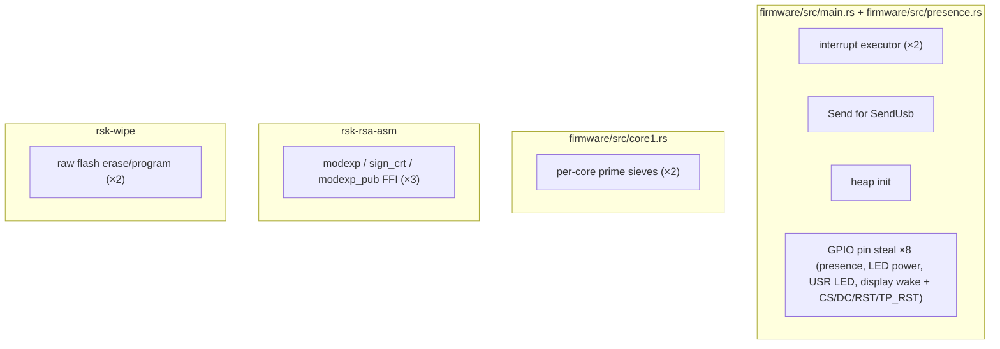

# `unsafe` audit

The firmware is `no_std` Rust. Safety of the parsers and applet logic is the
core defensive property, so every `unsafe` is enumerated here: its
justification, why a safe alternative does not work, and how the risk is
contained. Adding a new `unsafe` requires updating this page. (Safe Rust rules
out memory-corruption bugs in this code. It is not a security audit; see the
[threat model](threat-model.md).)

**Runtime sites: 19.** Twelve in the firmware proper (`main.rs` + `presence.rs`):
the interrupt-handler pair (2), the `Send` impl, the heap init, and the eight
GPIO-pin `steal`s (the presence button, the LED power-enable rail, the nuisance
USR LED, the display build's wake button, and — display builds only — the panel's
CS/DC/RST/TP_RST control lines). Two for the per-core prime sieves,
three in the RSA assembly FFI, two in the standalone flash-wipe tool.



The `unsafe` lives only in plumbing. None of it is in a parser, applet, crypto
wrapper, or the filesystem.

## Firmware (`firmware/src/main.rs`, `firmware/src/presence.rs`)

### 1–2. The high-priority interrupt executor

```rust
#[interrupt]
unsafe fn SWI_IRQ_1() {
    unsafe { EXECUTOR_HIGH.on_interrupt() }
}
```

USB and the transports run on an embassy `InterruptExecutor` so they preempt
long synchronous work (RSA keygen, flash GC) and keep the bus alive. The
handler itself is `unsafe fn` (hardware interrupt ABI). The `on_interrupt()`
contract (call only from the interrupt the executor was started on) is upheld
by construction: `EXECUTOR_HIGH.start(SWI_IRQ_1)` is the only starter and this
is the only caller.
*Safe alternative:* none; this is embassy's documented pattern for a second
executor.
*Containment:* two lines, no data touched.

### 3. `unsafe impl Send for SendUsb`

`embassy_usb::UsbDevice` is `!Send` only because it holds a list of
`&mut dyn Handler` control-request handlers. Our only stateful handler is a
zero-sized type whose state is `Sync` (critical-section-guarded statics). The
device is moved into exactly one task on the interrupt executor and never
touched from anywhere else: exclusive ownership after the move.
*Safe alternative:* none while the USB device must live on the interrupt
executor and embassy keeps the trait object `!Send`.
*Containment:* the wrapper is private, constructed once, and the invariant
(single task, single executor) is structural.

### 4. Heap initialization

```rust
unsafe { HEAP.init(core::ptr::addr_of_mut!(HEAP_MEM) as usize, HEAP_SIZE) }
```

A 128 KiB heap exists solely for the `rsa` crate's big integers (the only
allocating dependency). `init`'s contract (call once, with exclusive access
to the region) is met: it runs once at the top of `main`, on a dedicated
static buffer used by nothing else.
*Safe alternative:* none; every embedded allocator initializes this way.
*Containment:* one call, before any allocation can happen.

### 5–12. GPIO pin type-erasure (presence button, LED power rail, USR-LED-off, display wake + control pins, ×8)

```rust
let any = unsafe { AnyPin::steal(pin) };
```

Eight build-configurable GPIOs are chosen by *number* at build time rather than as
a concrete `PIN_n` type, so each must be converted to embassy's type-erased
`AnyPin`: the optional `PRESENCE_PIN=<gpio>` presence button
(`ButtonPresence::new_gpio`, `presence.rs`), the optional `LED_POWER_PIN`
enable pin driven high to power a gated LED rail (the LED block in `main.rs`),
the optional `USR_LED_PIN` driven to a nuisance onboard LED's OFF level and held
(the boot block in `main.rs`), and — display builds only — the optional
`WAKE_PIN` button that wakes the panel from display sleep **plus the panel's
CS/DC/RST/TP_RST control lines**, all by board-config number, in the panel block
of `main.rs`. `AnyPin::steal` is `unsafe` because the caller must
guarantee unique ownership of that hardware pin — a `match` over `p.PIN_0..=PIN_29`
(as the LED *data* pin uses) is impossible here, since it would double-move the
peripheral set the LED block already claims.
*Safe alternative:* none for a runtime/number-selected GPIO; the safe
constructors require a statically known pin type.
*Containment:* each is gated by pin-range validation and the single-owner
invariant from `main` — none of the presence pin, the LED-power pin, the
USR-LED pin, the wake pin, nor the four panel control pins is ever handed to
another driver, and compile-time `assert!`s reject a
build that collides `LED_POWER_PIN` or `USR_LED_PIN` with the LED data pin or a GPIO
`PRESENCE_PIN` (and refuse `USR_LED_PIN` outright on a display build, whose panel
owns those pads), rejects a `WAKE_PIN` in the LCD/touch range (`10..=18`),
**and rejects any of CS/DC/RST/TP_RST/BL colliding with each other, with the
hard-wired SPI1 (PIN_10/11/12) or I2C1 (PIN_6/7) lines, an enabled `WAKE_PIN`,
or `LED_PIN`/`LED_POWER_PIN` when their LED driver is built** — a collision
silently drives one pad from two owners at runtime, so it is checked at build time.

## Firmware dual-core keygen (`firmware/src/core1.rs`)

### 9–10. The per-core prime sieves

```rust
static mut CORE0_SIEVE: IncrementalSieve = IncrementalSieve::new();
static mut CORE1_SIEVE: IncrementalSieve = IncrementalSieve::new();
// …
let sieve = unsafe { &mut *core::ptr::addr_of_mut!(CORE1_SIEVE) }; // core1, in `search`
unsafe { (*core::ptr::addr_of_mut!(CORE1_SIEVE)).scrub() };        // core1, on the STOP edge
let sieve = unsafe { &mut *core::ptr::addr_of_mut!(CORE0_SIEVE) }; // core0, in `run_rsa_search`
```

The dual-core keygen runs one running small-prime sieve per core (each ~5 KiB
of residues, too large to live on core1's stack beside the Baillie-PSW
bignum frames, so they are `static`). Each is **single-core-exclusive**:
`CORE0_SIEVE` is taken `&mut` only inside `run_rsa_search` (core0),
`CORE1_SIEVE` only inside `search` (core1), and the two cores never touch the
same sieve. So the `&mut` never aliases and there is no cross-core race.
Each keygen calls `scrub()` through the reference before use, forcing a fresh
window; each core also scrubs its **own** sieve when its search ends, so the last
candidate — which *is* the prime that was found — does not sit here until the next
job. That end-of-search scrub deliberately stays on the owning core: `STOP` does
not wait for core1, so a scrub issued from core0 (e.g. on the reboot path) would
alias a live `&mut` while core1 is still inside `try_candidate_le`.
*Safe alternative:* none that is free. A `Mutex`/`critical-section` cell would
add a lock on a provably-uncontended access, and the sieve is reused across
jobs so it cannot be a stack local. (Edition-2024 forbids implicit `&mut` to a
`static mut`, hence the explicit `addr_of_mut!`.)
*Containment:* three call sites — two on core1 (search, end-of-search scrub), one
on core0; the partition (which core touches which sieve) is structural, and the data is non-secret (small-prime residues of
a candidate, scrubbed at the top of every keygen). A wrong residue can only let
a composite through to the strong-MR/Lucas test, which still rejects it.

## RSA assembly FFI (`crates/rsk-rsa-asm/src/lib.rs`)

### 11–13. The modexp / CRT-sign calls

On-card RSA key generation needs hundreds of modular exponentiations over
1024–2048-bit candidates. The pure-Rust path was ~7× too slow on the
Cortex-M33 (minutes per key, CCID timeouts). The crate wraps the vendored
C+ARM-assembly routines behind three `unsafe` FFI calls — `modexp_priv`
(keygen), `sign_crt` (the CRT private-key operation) and `modexp_pub` (the
public-exponent side of blinding and the fault check) — each with fully owned,
length-checked buffers on both sides.
*Safe alternative:* tried (num-bigint). Functionally correct, unusably slow.
*Containment:* both ends fail closed. Key generation is KAT-gated — a power-on
known-answer self-test must pass or it refuses to run — and every signature is
Bellcore-fault-checked (`out^e == base`) by the caller, so a miscompiled or
corrupt routine cannot emit one. Inputs/outputs are fixed-size stack buffers
zeroized after use. On the host the crate substitutes a pure-Rust fallback, so
all host tests exercise the same API safely.

## Flash wiper (`rsk-wipe/src/main.rs`)

### 14–15. Raw flash erase/program in a critical section

The wiper's entire job is to erase the flash the firmware lives on, from a
RAM-resident image. It calls the ROM flash-erase/program routines inside
`critical_section::with(|_| unsafe { ... })`: interrupts off, XIP disabled,
nothing else running.
*Safe alternative:* none; erasing the chip out from under yourself is
inherently unsafe and is the tool's purpose.
*Containment:* rsk-wipe is a separate opt-in UF2 you flash deliberately; it
never ships inside the firmware.

## Build-time (not runtime)

- `crates/rsk-rsa-asm/build.rs`: `unsafe { env::set_var(...) }` forces the
  ARM cross-compiler for the vendored C. Build scripts are single-threaded at
  that point (the call is host-side, never in the image).
- `firmware/build.rs`: `unsafe { env::set_var(k, v) }` copies the selected
  board-config file's values (`BOARD=<name>`) back into the env before the
  build reads them. Same single-threaded host-side build-script context; never
  reaches the firmware image.
- Edition-2024 *declarations*: `#[unsafe(link_section = ".start_block")]` on
  the two bootrom image-definition statics and `unsafe extern "C"` on the
  linker-symbol/FFI declaration blocks. These mark declarations the compiler
  cannot check. The symbols are addresses read via `addr_of!`, never
  dereferenced as data.

## What is *not* here

No `unsafe` in any parser, applet, crypto wrapper, or the flash filesystem.
The attacker-facing surface is entirely safe Rust, and `cargo clippy -D
warnings` plus the fuzz targets ([testing.md](testing.md)) keep it that way.
